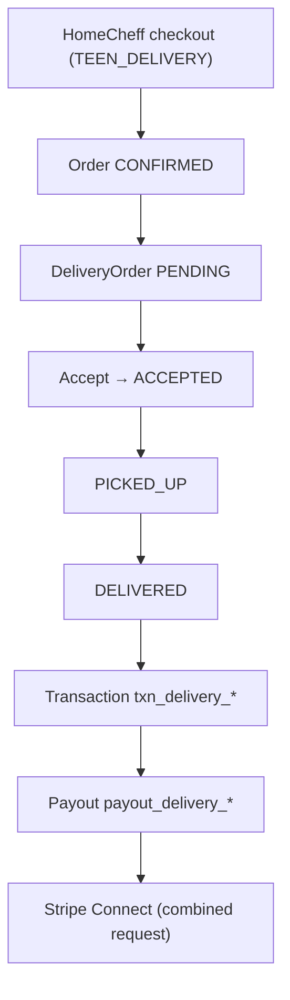

# HomeCheff Delivery Foundation (Fase 5A)

Documentatie van de bestaande bezorgarchitectuur na foundation-fixes. Geen DeliveryRequest, geen Helpers — alleen betrouwbaarheid, veiligheid en financiële correctheid.

---

## Architectuur



### Modellen

| Model | Rol |
|-------|-----|
| **Order** | Hoofdbestelling na Stripe-betaling (`CONFIRMED` → `DELIVERED`) |
| **DeliveryOrder** | Platform-bezorgopdracht, 1:1 met Order (`orderId` @unique) |
| **DeliveryProfile** | Bezorger-capabilities (leeftijd, radius, GPS, `isVerified`) |
| **Transaction** | Financiële boeking (`txn_delivery_{deliveryOrderId}`) |
| **Payout** | Bezorger-accrual (`payout_delivery_{deliveryOrderId}`, 88% van fee) |
| **PaymentEscrow** | Seller-geld vastgehouden tot `DELIVERED` (shipping/escrow-pad) |

### Bezorgpaden

| Mode | DeliveryOrder | Uitbetaling bezorger |
|------|---------------|----------------------|
| `TEEN_DELIVERY` / `DELIVERY` | Ja | 88% via Payout + Connect |
| `LOCAL_DELIVERY` | Nee (seller zelf) | Verkoper |
| `PICKUP` | Nee | — |

---

## Locatie — bron van waarheid

| Use-case | Leidende bron | Fallback |
|----------|---------------|----------|
| **Seller pickup (matching)** | `SellerProfile.lat/lng` | `User.lat/lng` |
| **Bezorger live GPS** | `DeliveryProfile.currentLat/lng` | — (max 15 min oud) |
| **Bezorger fallback** | `DeliveryProfile.homeLat/lng` | `User.lat/lng` |
| **Koper afleverpunt** | Checkout-coords → `User.lat/lng` | — |

Centrale helpers: `lib/delivery/delivery-position.ts`

- `resolveSellerCoords()` — seller anchor
- `resolveDelivererPosition()` — GPS → home → profile, met 15 min TTL

---

## Financiële flow (gecorrigeerd)

1. Checkout: bezorgkosten in Stripe metadata (`deliveryFeeCents`)
2. Webhook: `DeliveryOrder` aanmaken (`PENDING`, unassigned)
3. Bezorger levert: `POST .../update-status` `{ status: 'DELIVERED' }`
4. `ensureDeliveryPayout()` (`lib/delivery/delivery-payout.ts`):
   - Idempotent (stable IDs)
   - `Transaction` id = `txn_delivery_{deliveryOrderId}`
   - `Payout` id = `payout_delivery_{deliveryOrderId}`
   - `totalEarnings` increment op `DeliveryProfile`
5. Uitbetaling: gecombineerd via `POST /api/seller/payouts/request` (Stripe Connect verplicht)

Fee-split: **12% HomeCheff / 88% bezorger** (`lib/fees.ts`)

---

## Verificatie (gehandhaafd)

Backend gate via `assertDelivererCanAccept()` (`lib/delivery/delivery-eligibility.ts`):

- `DeliveryProfile.isVerified === true`
- `DeliveryProfile.isActive === true`
- `DeliveryProfile.age >= 15`

Endpoints: accept, assign-order, match-orders, check-availability (filter), webhook notificaties.

**Bestaande bezorgers:** zet `isVerified = true` via admin/DB voor actieve profielen:

```sql
UPDATE "DeliveryProfile" SET "isVerified" = true WHERE "isActive" = true;
```

---

## Privacy

Helpers: `lib/delivery/delivery-privacy.ts`

| Fase | Klant | Verkoper |
|------|-------|----------|
| **Vóór accept** (available) | Regio-label, geen telefoon | Regio-label, geen telefoon |
| **Na accept** (assigned) | Volledig adres + telefoon | Volledig adres + telefoon |

Geen hardcoded placeholders meer in dashboard/API responses.

---

## Statusflow

`lib/delivery/delivery-status.ts`

```
PENDING → ACCEPTED (via accept endpoint)
ACCEPTED → PICKED_UP → DELIVERED
ACCEPTED → CANCELLED → heropent als PENDING (unassigned)
PICKED_UP → CANCELLED (terminal)
```

- Geen dubbele payouts (`ensureDeliveryPayout` idempotent)
- Annulering vóór pickup: notificatie + opdracht terug in pool
- `ACCEPTED` via update-status geblokkeerd (alleen accept route)

---

## Gecorrigeerde risico's (Fase 5A)

| Risico | Fix |
|--------|-----|
| Payout FK (`orderId` als `transactionId`) | `ensureDeliveryPayout` + stable Transaction |
| Ongeverifieerde accept | `assertDelivererCanAccept` |
| Hardcoded telefoon `06-12345678` | Verwijderd; privacy phases |
| Verouderde GPS in matching | 15 min TTL + centrale resolver |
| Seller coords inconsistent | `resolveSellerCoords` |
| Dubbele payout / verkeerde earnings | Idempotent payout + earnings fix |
| Cancel zonder notificatie | `sendDeliveryCancelledNotification` |
| Cancel vóór pickup hangend | Heropen als `PENDING` |

---

## Bewust openstaande risico's

- `LOCAL_DELIVERY` vs `TEEN_DELIVERY` onderscheid alleen via Stripe metadata
- `DeliveryProfile.isVerified` vereist handmatige admin-actie voor bestaande bezorgers
- Geen automatische refund bij annulering (checkout ongewijzigd)
- `Transaction.reservationId` nullable maar niet gebruikt voor delivery
- Webhook dead-code payout-block bij pre-assigned deliverer (blijft inactive)

---

## Toekomstige fases

| Fase | Scope |
|------|-------|
| **5B — DeliveryRequest** | Bezorging los van Order (contact-only deals) |
| **5C — Assignment model** | Generiek opdracht-model (`orderId?`) |
| **5D — Helpers** | Tuinhulp, digihulp, klusjes op shared profiel |
| **5E — Ruil & wederdiensten** | Waarde-uitwisseling zonder Stripe |

---

## Gerelateerde bestanden

| Gebied | Pad |
|--------|-----|
| Payout | `lib/delivery/delivery-payout.ts` |
| Eligibility | `lib/delivery/delivery-eligibility.ts` |
| GPS / coords | `lib/delivery/delivery-position.ts` |
| Privacy | `lib/delivery/delivery-privacy.ts` |
| Status | `lib/delivery/delivery-status.ts` |
| Accept | `app/api/delivery/orders/[orderId]/accept/route.ts` |
| Status update | `app/api/delivery/orders/[orderId]/update-status/route.ts` |
| Dashboard | `app/api/delivery/dashboard/route.ts` |
| Combined payout | `lib/combinedPayouts.ts` |

Strategische visie: [HOMECHEFF_ECOSYSTEM_V3.md](./HOMECHEFF_ECOSYSTEM_V3.md)
