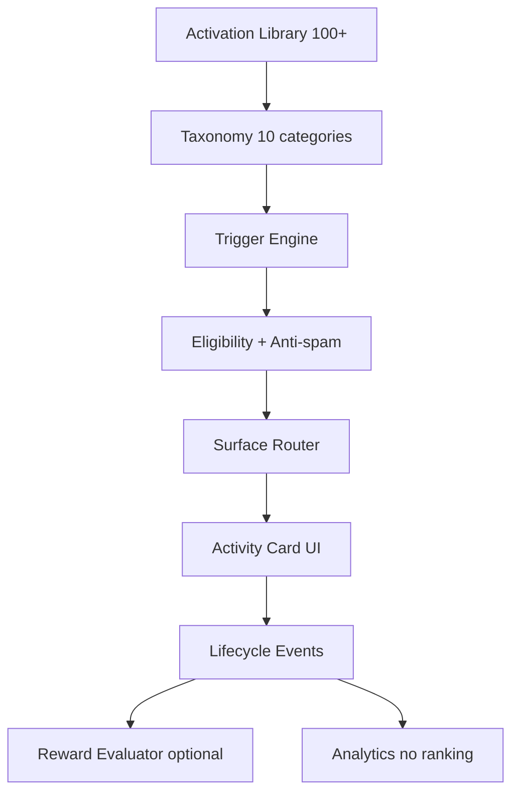

# Activation System Vision

**Phase:** 3C — Architecture only  
**Status:** Specification  
**Last updated:** 2026-07-06  
**Builds on:** Activity Cards 3B (`discovery.futureSlots.activity_cards`)

---

## North star

**HomeCheff moves people from digital intent to real-world action.**

Activations are not content units. They are **invitations to do something offline or human-to-human** — buy locally, visit a workshop, help a neighbour, become a courier, invite a club, complete a first barter.

```
Digital surface  →  Activation prompt  →  Real-world outcome  →  Trust & community growth
```

**Not the goal:**

- More scrolling
- More feed items
- More screen time
- Algorithmic “engagement” loops
- Ads disguised as tips

---

## Relationship to Activity Cards (3B)

| Layer | Role |
|-------|------|
| **Activity Card** | Lightweight UI shell in feed/sidebar/messages — max 2/session, 1 visible |
| **Activation** | Canonical concept in the library (100+) with taxonomy, triggers, lifecycle, optional reward |
| **Activation Engine** | Selects which activation(s) to surface, when, and where — **outside** ranking |

3B ships **11 activation types** as `ActivityCardContract`. 3C defines the **full activation library** and engine that 3D+ will implement incrementally.

---

## Design principles

1. **Real-world first** — Every activation must describe an offline or direct human outcome.
2. **Voluntary** — User can dismiss; no dark patterns; no guilt copy.
3. **Local** — Prefer neighbourhood, radius, and place over global virality.
4. **Trust-positive** — Completing activations may strengthen trust signals; activations must not manipulate trust scores for feed ranking.
5. **Role-aware** — Buyer, seller, courier, creator, partner see different pools.
6. **Anti-spam** — Cooldowns, session caps, category caps (inherited from 3B anti-spam).
7. **Separation of concerns** — Activations never enter `discovery.sections`, ranking profiles, or sponsored slots.

---

## Surfaces (future)

| Surface | Purpose |
|---------|---------|
| Feed insert | Primary — `futureSlots.activity_cards` |
| Desktop sidebar | Secondary stack below filters |
| Profile owner | Completion & partner onboarding |
| Post-deal / post-workshop | Lifecycle-triggered (messages, orders) |
| Push (opt-in) | Only for high-intent, time-bound activations |
| QR / share sheet | Social & partner invite flows |

**Forbidden surfaces:** Public SEO pages, guest feed, profile visitor view.

---

## Success metrics (product, not ranking)

| Metric | Meaning |
|--------|---------|
| Activation completion rate | User marked or system detected real-world outcome |
| Time-to-first-real-action | Signup → first pickup / workshop / help / listing |
| Local transaction density | Orders within radius, not GMV leaderboard |
| Repeat neighbour interactions | Same buyer–seller pairs, barter completions |
| Partner funnel | Courier / workshop host / ambassador starts |

**Explicitly excluded as activation KPIs:** DAU for scrolling, session length, feed depth.

---

## Architecture layers (3C → 3D)



---

## Boundaries

| In scope (3C arch) | Out of scope |
|--------------------|--------------|
| Taxonomy, library, triggers, lifecycle, rewards **design** | Code, schema migrations, API changes |
| Partner & viral concept catalog | Sponsored placements |
| Real-world engine spec | Recommendation engine |
| Reward **evaluation** (which reward types fit) | HCP as eligibility gate |
| Mapping 3B types → activation IDs | Ranking / trust engine changes |

---

## References

- [ACTIVATION_TAXONOMY.md](./ACTIVATION_TAXONOMY.md)
- [../audits/ACTIVATION_LIBRARY_100.md](../audits/ACTIVATION_LIBRARY_100.md)
- [../audits/REAL_WORLD_ACTIVATION_ENGINE.md](../audits/REAL_WORLD_ACTIVATION_ENGINE.md)
- [ACTIVITY_CARD_ARCHITECTURE.md](./ACTIVITY_CARD_ARCHITECTURE.md)
