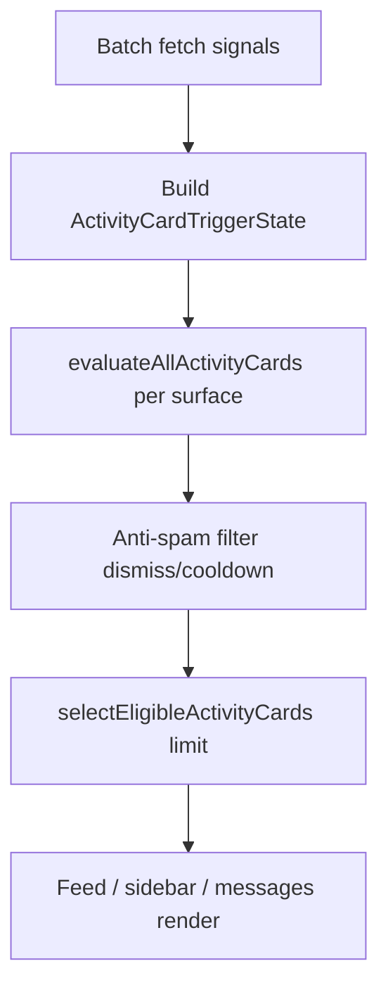

# Discovery Activity Cards Architecture

**Phase:** 3A  
**Status:** Architecture defined — **not enabled in feed** (`activity_cards.enabled: false`)

---

## Purpose

Activity Cards are **private, action-oriented prompts** that encourage real-world marketplace participation. They are explicitly **not**:

- Recommendations
- Ranked discovery content
- Public/SEO pages
- HCP-gated or HCP-incentivized prompts

They complement **Discovery Sections** (marketplace listings) without changing ranking.

---

## Module layout

```
lib/discovery/activity-cards/
├── activity-card-types.ts          # IDs, surfaces, triggers
├── activity-card-taxonomy.ts       # 24 card definitions (7 categories)
├── activity-card-triggers.ts       # Eligibility evaluation + trigger matrix
├── activity-card-visibility.ts     # Surface rules (all private)
├── activity-card-feed-integration.ts
├── activity-card-sidebar-integration.ts
├── activity-card-anti-spam.ts
├── activity-card-data-requirements.ts
└── index.ts
```

---

## Taxonomy (7 categories)

| Code | Category | Intent |
|------|----------|--------|
| A | `social_activation` | Fans, conversations, QR share, invites |
| B | `trust_activation` | Reviews, post-deal feedback |
| C | `marketplace_activation` | First offer, workshops, requests |
| D | `delivery_activation` | Delivery profile, offers, requests |
| E | `community_activation` | Inspiration, neighbor engagement |
| F | `profile_completion` | Photo, values, Stripe, workspace |
| G | `local_activation` | Location, nearby requests, local invite |

Canonical registry: `ACTIVITY_CARD_REGISTRY` in `activity-card-taxonomy.ts`.

---

## Relationship to Discovery Feed

```
/api/feed
  ├── items[]              (marketplace + inspiration)
  ├── discovery.sections   (nearby, trending, …)
  └── discovery.futureSlots
        └── activity_cards { enabled: false, insertion, specVersion: 1 }
```

Phase **3B** enables the slot and populates `cards[]` from trigger evaluation.

---

## Eligibility pipeline (3B)



---

## Forbidden signals

Activity cards **must not** use:

- `hcpPoints`, HCP badges, HCP tier
- `viewCount`, follower count as ranking
- Blended ratings
- ML / collaborative filtering

See `FORBIDDEN_ACTIVITY_CARD_SIGNALS` in `activity-card-data-requirements.ts`.

---

## References

- Trigger matrix: `docs/audits/ACTIVITY_CARD_TRIGGER_MATRIX.md`
- Visibility matrix: `docs/audits/ACTIVITY_CARD_VISIBILITY_MATRIX.md`
- Roadmap: `docs/roadmap/DISCOVERY_ACTIVITY_CARDS_ROADMAP.md`
