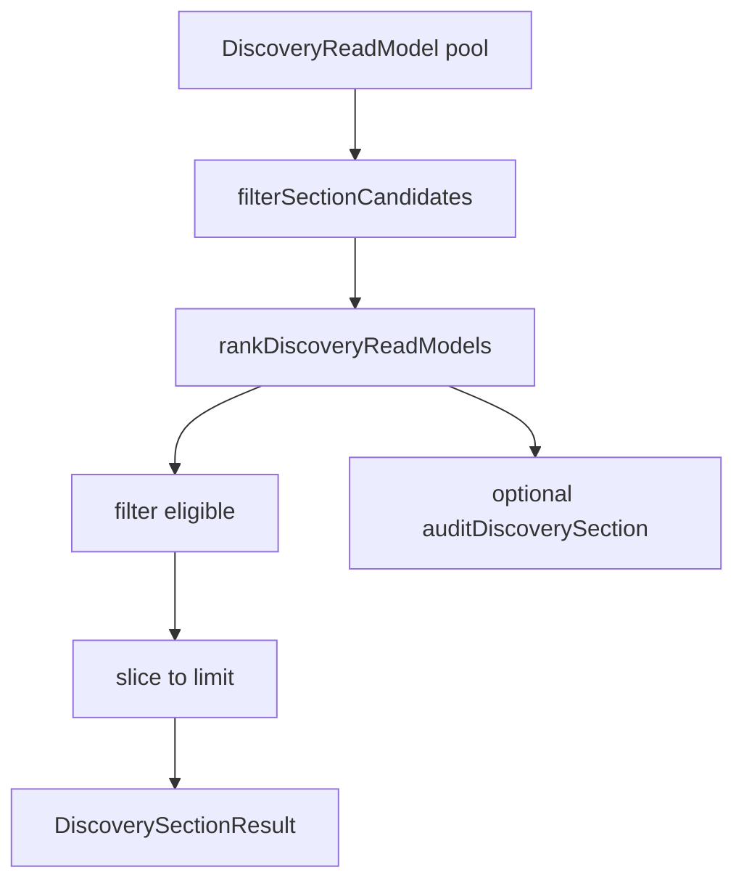

# Discovery Section Registry Architecture

**Phase:** Discovery 2D  
**Module:** `lib/discovery/sections/`

---

## Purpose

Single source of truth for discovery home sections. Each section declares **identity**, **eligibility**, **ranking profile**, **limits**, and **allowed listing kinds**. Section generation delegates sorting to the Phase 2C ranking engine — no duplicate score logic.

---

## Module layout

```
lib/discovery/sections/
├── section-types.ts      # DiscoverySectionId, DiscoverySectionDefinition, results
├── section-registry.ts   # DISCOVERY_SECTION_REGISTRY — canonical definitions
├── build-section.ts      # buildDiscoverySection, buildAllDiscoverySections
├── section-audit.ts      # auditDiscoverySection, trusted_makers distribution
└── index.ts              # public exports
```

---

## Section → profile mapping

| Section ID | Ranking profile | Default limit |
|------------|-----------------|---------------|
| `nearby` | `nearby` | 20 |
| `trusted_makers` | `trusted_maker` | 15 |
| `top_rated` | `top_rated` | 15 |
| `trending` | `trending` | 15 |
| `new_creators` | `new_creators` | 12 |

Section IDs use snake_case plural; profile IDs follow Phase 2C naming (`trusted_maker` singular).

---

## Build flow



```typescript
import { buildDiscoverySection } from '@/lib/discovery';

const nearby = buildDiscoverySection('nearby', readModels, {
  viewer: { radiusKm: 25 },
  limit: 20,
  includeAudit: true,
});
```

---

## Registry fields

Each `DiscoverySectionDefinition` contains:

- `id` — canonical section identifier
- `titleKey` — i18n key (UI not wired in 2D)
- `description` — human-readable purpose
- `rankingProfileId` — engine profile to invoke
- `defaultLimit` — max items returned
- `allowedListingKinds` — marketplace kinds (excludes INSPIRATION)
- `eligibility` — documented thresholds (mirrors `DISCOVERY_SECTION_ELIGIBILITY.md`)
- `forbiddenSignals` — signals that must not influence the section

---

## Eligibility vs ranking

**Eligibility gates** live in ranking profiles (`isEligible` on each profile). The registry **documents** thresholds for audits and docs; the engine enforces them at rank time.

Pre-filter: `filterSectionCandidates` removes disallowed `listingKind` before ranking.

---

## Auditing

`auditDiscoverySection(sectionId, readModels, viewer)` returns:

- `counts` — total / eligible / ineligible + reason breakdown
- `trustedMakers` (trusted_makers only) — tier distribution, review buckets, eligible listing ids

Run validation:

```bash
npx tsx scripts/validate-discovery-sections.ts
```

---

## Out of scope (2D)

- Personalization (`recommended_for_you`)
- API/route changes
- UI section carousels
- Schema migrations
- Legacy file removal

See `docs/audits/LEGACY_RANKING_MIGRATION_PLAN.md` for Phase 2E rollout.
