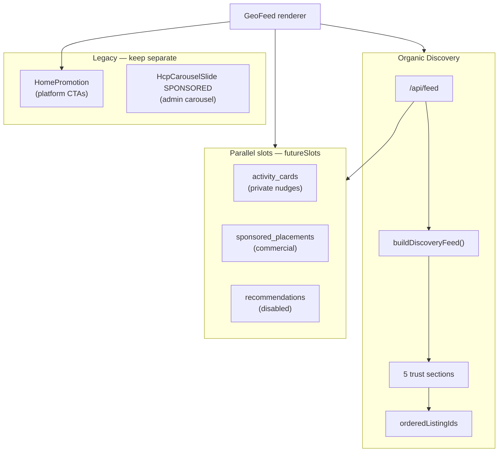
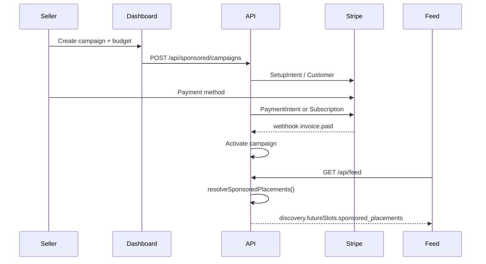

# Discovery Sponsored Placement Architecture

**Phase:** 3A-EXT  
**Status:** Architecture only — no implementation, no schema changes  
**Last updated:** 2026-07-06  
**Related:** [DISCOVERY_ACTIVITY_CARDS.md](./DISCOVERY_ACTIVITY_CARDS.md), [DISCOVERY_ANTI_GAMING.md](./DISCOVERY_ANTI_GAMING.md), [LISTING_KIND_SPEC.md](./LISTING_KIND_SPEC.md), [TRUST_TIER_SPEC.md](./TRUST_TIER_SPEC.md)

---

## Executive summary

HomeCheff Discovery needs a **paid placement layer** that is visually integrated with the feed but **architecturally isolated** from organic discovery ranking. Sponsored content must never influence section scores, `orderedListingIds`, trust tiers, or seller caps.

This document defines:

- A new **`sponsored_placements`** slot in the discovery feed contract (parallel to `activity_cards`, not a replacement)
- Surface-specific insertion rules (feed, mobile, desktop sidebar)
- Targeting (geo, category, listing kind, audience)
- Trust floors and anti-spam guardrails
- Labeling requirements (NL/EN “Gesponsord”)
- A phased monetization path: **admin pilot → self-service → Stripe billing**

**Hard boundary:** Sponsored placements are **commercial inventory**. Activity cards are **private user nudges**. Home promotions are **platform-owned CTAs**. These three systems share surfaces but must not share resolvers, ranking inputs, or dedup pools.

---

## Design principles

| Principle | Rule |
|-----------|------|
| **Ranking isolation** | Sponsored items are excluded from `buildAllDiscoverySections()`, `rankDiscoveryReadModels()`, and `orderedListingIds` overflow logic |
| **Trust integrity** | Organic sections remain trust-gated per [DISCOVERY_SECTION_REGISTRY.md](./DISCOVERY_SECTION_REGISTRY.md) |
| **Explicit labeling** | Every sponsored surface shows a visible “Gesponsord” / “Sponsored” badge — no mimicry of organic section headers |
| **No pay-to-trust** | Payment does not increase `sellerTier`, review counts, or section eligibility |
| **No pay-to-rank** | Budget, bid, or spend must not appear in `DiscoveryRankingInput` or forbidden-signal exceptions |
| **Dedup separation** | Sponsored listing IDs may not fill empty organic section slots; separate impression caps |
| **Auth-aware** | Targeting may use session context; sponsored payload never leaks private user data to advertisers in Phase 1 |

---

## Relationship to existing systems



| System | Purpose | Ranking impact | Label |
|--------|---------|----------------|-------|
| Discovery sections | Trust-based organic shelves | Yes (authoritative order) | Section title keys |
| Activity cards (3A) | Logged-in private actions | None | Card-specific CTA |
| **Sponsored placements (3A-EXT)** | Paid visibility for listings/entities | **None** | **Gesponsord** |
| HomePromotion | Platform growth (app, affiliate, jobs) | None | Aanbevolen / Gesponsord |
| HcpCarouselSlide | Gamification carousel | None | Admin-defined |

**Migration note:** Admin `HcpCarouselSlideType.SPONSORED` slides and the sidebar “Uitgelicht” placeholder are **precursors**, not the final feed product. Phase 1 pilot may reuse admin UI patterns but must emit the new contract shape.

---

## Supported advertiser categories

Sponsored placements promote **entities**, not abstract ads. Each maps to existing HomeCheff taxonomy.

| Advertiser type | Primary entity | ListingKind / source | Example placement |
|-----------------|----------------|----------------------|-------------------|
| **Makers** | Product listing | `PRODUCT` | Feed tile, sidebar spotlight |
| **Businesses** | Service / shop profile | `PRODUCT`, `SERVICE` | Sidebar “Local business” |
| **Workshops** | Workshop listing | `WORKSHOP` | Category band, event-style card |
| **Coaches** | Coaching offer | `COACHING` | Knowledge vertical band |
| **Local events** | Event entity (future) or workshop + date | `WORKSHOP` + `availabilityDate` | Time-boxed geo band |
| **Community orgs** | Organization profile (future) or curated landing | External `href` or profile | Sidebar community slot |

**Phase 1 pilot** supports only **listing-backed** promotions (`productId` / `listingId`). Event and community-org entity types are **contract-reserved** for Phase 3.

---

## 1. Feed placement slots

### Slot inventory

Sponsored content uses a dedicated **`sponsored_placements`** future slot on `DiscoveryFeedPayload`. It does **not** reuse discovery section IDs (`nearby`, `trending`, etc.).

| Slot ID | Surface | Max per session | Description |
|---------|---------|-----------------|-------------|
| `feed_inline_tile` | Mobile + desktop feed grid | 3 | Standard listing-style card in grid |
| `feed_section_band` | Mobile only | 1 | Horizontal band between organic sections (not a fake “nearby” header) |
| `feed_sticky_footer` | Mobile web | 0–1 | Reserved Phase 4 — dismissible strip |

### Position map (relative to organic rows)

Organic discovery uses section bands every **6** items on mobile (`DISCOVERY_MOBILE_ITEMS_BETWEEN_SECTIONS`). Sponsored slots are **offset** to avoid collision with activity cards (indices 5, 13, 21) and home mobile inserts (indices 1, 3, 4, 7, 8, 11, 12).

| After organic sale row # | Slot | Priority |
|--------------------------|------|----------|
| 4 | `feed_inline_tile` #1 | High — first paid slot after hero discovery |
| 9 | `feed_inline_tile` #2 | Medium |
| 16 | `feed_section_band` | High — full-width band |
| 22 | `feed_inline_tile` #3 | Low |

**Desktop feed:** Inline tiles insert at rows **5, 12, 20** in the center column grid only. No `feed_section_band` on desktop (sidebar carries band-style inventory).

### Density caps

| Cap | Value |
|-----|-------|
| Max sponsored tiles per feed session | 3 |
| Max sponsored per 10 organic listings | 1 |
| Min organic listings before first sponsored | 4 |
| Max consecutive sponsored rows | 1 |
| Max same advertiser per session | 1 |
| Max same seller per session | 1 |

---

## 2. Desktop sidebar placements

The right column (`HomeDesktopSidebar`, 320px) is the primary desktop monetization surface. Sponsored inventory is **below** reputation / pulse and **above** quick actions — never above filters.

### Sidebar slot inventory

| Slot ID | Position | Max visible | Format |
|---------|----------|-------------|--------|
| `sidebar_spotlight` | Below `CommunityPulseBar` | 1 | Large hero card (replaces “Uitgelicht” placeholder) |
| `sidebar_compact` | Below spotlight | 2 | Compact tiles (same component family as `HomeRecommendedPromotions`) |
| `sidebar_category_chip` | Optional sticky sub-band | 1 | Category-scoped promo chip (Phase 3) |

### Sidebar rules

- **Never** mix sponsored tiles into `HomeRecommendedPromotions` resolver — separate component `SponsoredPlacementSidebar`
- Sidebar sponsored count **does not** count toward feed session caps but shares **advertiser dedup** (same `campaignId` hidden if already shown in feed)
- Logged-out users: max **1** sidebar sponsored (spotlight only)
- Logged-in users: max **3** total sidebar sponsored (1 spotlight + 2 compact)

---

## 3. Mobile insertion strategy

Mobile has three competing insert systems. Resolution order is fixed:

```
1. Discovery section headers (organic)
2. Home mobile inserts (platform promos — verticals, pulse, internal promos)
3. Activity cards (private, logged-in only)
4. Sponsored placements (commercial)
5. Inspiration interleave (organic)
```

### Resolver contract

`resolveSponsoredFeedInsert(afterRowIndex, context)` returns at most one placement per index. It **must** yield to home inserts and activity cards at the same index.

### Collision matrix

| Index | Home insert | Activity card | Sponsored allowed |
|-------|-------------|---------------|-------------------|
| 1 | `verticals` | — | No |
| 3 | `pulse` | — | No |
| 4 | `promo:*` | — | No |
| 5 | — | Card slot | No |
| 7–8 | reputation / promo | — | No |
| 9+ | share / promo | 13, 21 | Yes (offset slots) |

### Short-feed behavior

When organic sale count &lt; 4:

- No inline sponsored tiles
- At most **1** sidebar-style trailing sponsored card after last organic row (mobile list mode only)
- Platform trailing promo (`resolveHomeMobileTrailingPromo`) takes priority

---

## 4. Geo targeting

### Viewer geo sources (priority)

1. Explicit feed query `lat` / `lng` or `place` (nearby scope)
2. Logged-in user profile coordinates
3. Geocoded profile `place` / `city` (distance labels only)
4. None → national targeting rules apply

### Campaign geo modes

| Mode | Behavior |
|------|----------|
| `national` | Eligible everywhere in NL; no distance sort |
| `radius` | Eligible within `radiusKm` of campaign center |
| `city` | Eligible when viewer city/place matches allowlist |
| `region` | Eligible for province / COROP region (Phase 3) |
| `polygon` | Custom geo fence (Phase 4, self-service) |

### Distance presentation

- Sponsored tiles may **display** distance when viewer geo is known
- Distance is **never** a ranking signal for sponsored selection (use campaign priority + rotation)
- Listings without resolvable coords may not use `radius` mode campaigns

### Geo anti-gaming

- Campaign center must be within 50 km of advertiser listing coords (or verified business address Phase 3)
- Max 3 active geo campaigns per advertiser

---

## 5. Category targeting

### Targeting dimensions

| Dimension | Source | Example |
|-----------|--------|---------|
| `listingKind` | `DiscoveryReadModel.listingKind` | WORKSHOP campaigns only on workshop filter |
| `marketplaceCategory` | Product taxonomy | GROW, CHEFF, DESIGN |
| `specializations` | Sub-taxonomy ids | `knowledge.cookingclass` |
| `vertical` | Feed UI slug | `cheff`, `garden`, `designer` |
| `feedScope` | `national` / `nearby` | Local bakery radius campaign |

### Contextual matching

When user applies a category filter, sponsored candidates must:

1. Match the active vertical **or** be explicitly `category: all` campaigns
2. Never show unrelated vertical sponsored (cheff campaign on garden filter = blocked)

### Negative targeting (Phase 2)

- Exclude categories
- Exclude scopes (e.g. national-only brand campaign hidden in nearby-only sessions)

---

## 6. Trust minimum requirements

Payment does not bypass trust. Sponsored listings must meet **floor** evidence — separate from section **ceiling** gates.

### Minimum gates (all campaigns)

| Gate | Requirement |
|------|-------------|
| Account standing | Not suspended, not spam-flagged |
| Listing state | `isActive === true`, public visibility |
| Identity | Verified email; seller profile complete |
| Media | ≥1 image **or** video |
| Description | ≥20 characters |
| Seller tier | ≥ **1** (Present) — same as nearby floor |

### Kind-specific floors

| Kind | Additional requirement |
|------|------------------------|
| PRODUCT / SERVICE | Valid price or contact-only order method |
| WORKSHOP / COACHING | `availabilityDate` or explicit scheduling CTA |
| Business spotlight | KVK + `companyName` on seller profile (Phase 2) |
| Community org | Manual admin approval only (Phase 1–2) |
| Local event | Admin-curated or verified organizer (Phase 2) |

### Prohibited sponsored content

- Listings at tier **0** with no media
- REQUEST listings (buyer wants — not commercial placement)
- INSPIRATION / Dish content
- Listings with active trust disputes or moderation holds
- Redirect to off-platform checkout without HomeCheff order path (except approved community org landings)

### Trust display

Sponsored tiles **may show** organic trust badges (e.g. “Betrouwbare verkoper”) when earned — but badges must not replace the **Gesponsord** label.

---

## 7. Anti-spam rules

### Session caps (viewer)

| Rule | Limit |
|------|-------|
| Max sponsored impressions per session | 6 |
| Max clicks recorded per campaign per day | 3 (frequency cap) |
| Dismiss cooldown per campaign | 14 days |
| Hide advertiser (future) | 90 days |

### Campaign caps (advertiser)

| Rule | Limit |
|------|-------|
| Max active campaigns per seller | 2 |
| Max budget burn without conversion | Admin review trigger |
| Duplicate listing in multiple campaigns | Blocked |
| Same creative across &gt;3 geo targets | Blocked (rotate, don’t duplicate) |

### Content rules

- No misleading pricing (“Gratis” when paid)
- No fake urgency timers (Phase 1 admin review)
- No competitor keyword stuffing in titles
- Image must match linked listing

### Separation from organic dedup

`deduplicateDiscoverySections()` caps **do not** apply to sponsored — separate `sponsoredDedup` summary in payload. A listing may appear **organically** and **sponsored** in the same session only when:

- Organic appears in overflow tail **and** sponsored is clearly labeled **and**
- Max **1** such overlap per session (configurable)

Default: **exclude** sponsored if listing already visible in first 12 organic rows.

---

## 8. Sponsored labeling requirements

### Mandatory copy

| Locale | Primary badge | Secondary line (optional) |
|--------|---------------|---------------------------|
| `nl` | **Gesponsord** | “Betaalde plaatsing” |
| `en` | **Sponsored** | “Paid placement” |

Reuse i18n keys: `homePromotions.badgeSponsored` (exists). Add feed-specific keys:

- `discovery.sponsored.badge`
- `discovery.sponsored.whyAmISeeingThis` (tooltip)
- `discovery.sponsored.report`

### Visual spec

| Element | Rule |
|---------|------|
| Badge position | Top-left of card, above image |
| Badge style | Amber/warm neutral — distinct from “Aanbevolen” (emerald) and section headers |
| Section headers | **Never** use discovery section title pattern for sponsored bands |
| Typography | Badge ≥12px, WCAG AA contrast |
| Icon | Optional `info` tooltip — no hidden “ad” icon only |

### Accessibility

- `aria-label`: “Gesponsord: {listing title}”
- Screen reader announces badge before title
- Keyboard focus order: badge → content → CTA

### Legal (NL/EU)

- Phase 2: “Waarom zie ik dit?” links to help article
- Phase 3: Self-service dashboard shows spend + targeting summary
- Phase 4: Platform-wide ads transparency page

---

## 9. Pricing models

### Phase 1 — Admin pilot (manual)

| Model | Unit | Use case |
|-------|------|----------|
| **Flat weekly** | Per slot / per city | Sidebar spotlight |
| **Flat monthly** | Per advertiser | Maker spotlight package |
| **Complimentary** | €0 | Launch partners, community orgs |

No automated metering in Phase 1.

### Phase 2 — Managed campaigns

| Model | Unit | Billing |
|-------|------|---------|
| **CPM** | Per 1,000 impressions | Invoice monthly |
| **CPC** | Per click to listing | Invoice monthly |
| **Flat flight** | Fixed dates + geo | Prepaid invoice |

### Phase 3 — Self-service

| Model | Unit | Notes |
|-------|------|-------|
| **CPM / CPC** | Auction-lite | Max bid cap, daily budget |
| **Category premium** | Multiplier on CPM | Workshop week, harvest season |
| **Sidebar exclusive** | Daily rate | Single spotlight slot |
| **Radius boost** | CPM + geo premium | Nearby scope only |

### Phase 4 — Advanced

- Conversion-based (CPA) only after checkout attribution is reliable
- Subscription “Pro Visibility” bundle for businesses (not tied to trust tier)

**Invariant:** Pricing metadata lives in **campaign / billing** tables — never in `DiscoveryRankingInput`.

---

## 10. Future Stripe integration

### Architecture



### Stripe objects (future)

| Object | Purpose |
|--------|---------|
| `Customer` | Advertiser billing identity |
| `PaymentMethod` | Card / SEPA |
| `Subscription` | Monthly sidebar package |
| `Invoice` | CPM/CPC monthly arrears |
| `Meter` (Stripe Billing) | Impression/click usage |
| `Webhook` | `invoice.paid`, `payment_failed`, `customer.subscription.deleted` |

### Billing rules

- Prepay required for self-service launch (wallet balance or card hold)
- Auto-pause campaign on `payment_failed`
- Refunds do not extend campaign if creatives violated policy
- VAT: NL B2B reverse charge where applicable; platform issues invoices

### API boundaries

- `/api/sponsored/*` — campaign CRUD, billing (authenticated seller/admin)
- `/api/feed` — **read-only** resolved placements; no Stripe IDs in response
- Impression/click beacons — `/api/sponsored/events` (batched, rate-limited)

---

## 11. Admin-managed pilot model

Phase 1 enables revenue validation without self-service or Stripe.

### Admin capabilities

| Action | Detail |
|--------|--------|
| Create campaign | Advertiser user, linked listing(s), date range |
| Assign slots | `feed_inline`, `sidebar_spotlight`, etc. |
| Set geo | City list or radius from listing |
| Set category | Vertical + listingKind |
| Set priority | 1–100 manual weight |
| Preview | Render as user in Rotterdam / national |
| Pause / end | Immediate removal from feed |
| Audit log | Who created, who approved |

### Approval workflow

```
Draft → Review (trust floor check) → Scheduled → Active → Ended
                  ↓
              Rejected (reason code)
```

### Pilot inventory limits

| Slot | Max active campaigns (platform-wide) |
|------|--------------------------------------|
| `sidebar_spotlight` | 3 |
| `feed_inline_tile` | 5 |
| `feed_section_band` | 2 |

### Reuse from existing admin

- Patterns from `HcpCarouselAdminClient` (CRUD, lifecycle, type enum)
- **Do not** store feed sponsored in `HcpCarouselSlide` — separate campaign entity when implemented
- Phase 1 may use **config + admin DB JSON** before full schema

### Reporting (pilot)

- Manual export: impressions/clicks from event table
- Dashboard: active campaigns, fill rate, slot utilization

---

## 12. Self-service model

### Seller dashboard (Phase 3)

| Screen | Function |
|--------|----------|
| Campaign list | Active / paused / ended |
| Create wizard | Listing → targeting → slots → budget → review |
| Creative preview | Mobile + desktop |
| Performance | Impressions, clicks, CTR, spend |
| Billing | Stripe portal link, invoices |

### Eligibility gate

- Seller tier ≥ 2 **or** admin whitelist for new makers
- Completed Stripe Connect for paid product sellers (when checkout applies)
- No open moderation flags

### Guardrails

- Daily spend cap (seller-set, platform max)
- Creative changes → re-review if image/title changes
- Auto-reject keywords (admin-maintained list)

### Community / event organizers

- Separate onboarding flow — always admin-approved in Phase 3
- External `href` allowed with `rel="sponsored noopener"` and off-site icon

---

## Contract proposal

### Extension to `DiscoveryFeedPayload`

Add to `futureSlots`:

```typescript
/** Phase 3A-EXT — architecture proposal only */
type DiscoverySponsoredPlacementsSlot =
  | {
      kind: 'sponsored_placements';
      enabled: false;
      specVersion: 1;
      insertion: SponsoredInsertionPlan;
    }
  | {
      kind: 'sponsored_placements';
      enabled: true;
      specVersion: 1;
      insertion: SponsoredInsertionPlan;
      campaigns: SponsoredPlacementItem[];
      dedup: SponsoredDedupSummary;
      metrics?: SponsoredBuildMetrics;
    };
```

### Core types (documentation)

```typescript
type SponsoredPlacementSurface =
  | 'feed_inline_tile'
  | 'feed_section_band'
  | 'sidebar_spotlight'
  | 'sidebar_compact';

type SponsoredEntityRef =
  | { type: 'listing'; listingId: string; listingKind: ListingKind }
  | { type: 'profile'; userId: string }
  | { type: 'external'; href: string; sponsorName: string } // community org — Phase 2+

type SponsoredPlacementItem = {
  campaignId: string;
  placementId: string;
  surface: SponsoredPlacementSurface;
  /** Target feed row index (mobile/desktop rules applied client-side) */
  insertAfterRow: number;
  entity: SponsoredEntityRef;
  label: { badgeKey: 'sponsored'; tooltipKey?: string };
  creative: {
    title: string;
    eyebrow?: string;
    imageUrl: string;
    ctaLabelKey: string;
    href: string;
  };
  /** Display-only — NOT used for organic ranking */
  targeting: {
    geoMode: 'national' | 'radius' | 'city';
    matchedCity?: string;
    distanceKm?: number;
  };
  priority: number;
  expiresAt: string;
};

type SponsoredInsertionPlan = {
  maxPerSession: 3;
  minOrganicBeforeFirst: 4;
  mobileInlineSlots: number[];      // [4, 9, 22]
  desktopInlineSlots: number[];     // [5, 12, 20]
  sidebarMaxVisible: 3;
  feedSectionBandAfterRow: 16;
};

type SponsoredDedupSummary = {
  suppressedAlreadyOrganic: number;
  suppressedFrequencyCap: number;
  suppressedCollision: number;
  suppressedTrustGate: number;
};

type SponsoredBuildMetrics = {
  candidatesConsidered: number;
  eligible: number;
  selected: number;
  buildMs: number;
};
```

### API response shape (illustrative)

```json
{
  "items": [ "…organic listings only…" ],
  "discovery": {
    "version": 1,
    "sections": [ "…organic sections only…" ],
    "orderedListingIds": [ "…never includes sponsored ids…" ],
    "futureSlots": [
      {
        "kind": "sponsored_placements",
        "enabled": true,
        "specVersion": 1,
        "insertion": { "maxPerSession": 3, "minOrganicBeforeFirst": 4 },
        "campaigns": [
          {
            "campaignId": "camp_01",
            "placementId": "pl_01",
            "surface": "sidebar_spotlight",
            "insertAfterRow": 0,
            "entity": { "type": "listing", "listingId": "prod_abc", "listingKind": "WORKSHOP" },
            "label": { "badgeKey": "sponsored" },
            "creative": { "title": "…", "imageUrl": "…", "ctaLabelKey": "discovery.sponsored.cta.view", "href": "/product/…" },
            "targeting": { "geoMode": "city", "matchedCity": "Rotterdam" },
            "priority": 80,
            "expiresAt": "2026-08-01T00:00:00Z"
          }
        ],
        "dedup": { "suppressedAlreadyOrganic": 1, "suppressedFrequencyCap": 0, "suppressedCollision": 0, "suppressedTrustGate": 0 }
      }
    ]
  }
}
```

### Server resolver (future)

`resolveSponsoredPlacements(context)` — **separate module** from `buildDiscoveryFeed()`:

- Input: viewer geo, scope, category filter, organic listing IDs (first N), session ID
- Output: `SponsoredPlacementItem[]`
- **Must not** call `rankDiscoveryReadModels()` or mutate `orderedListingIds`

---

## Insertion rules (canonical)

### Rule S1 — Ranking firewall

Sponsored listing IDs **must not** appear in:

- `discovery.sections[].listingIds`
- `discovery.orderedListingIds`
- `DiscoveryRankingInput` batches

### Rule S2 — Resolver priority

At each feed row index, resolve inserts in order:

1. Organic sale row
2. Discovery section header (if applicable)
3. Home platform insert (`resolveHomeMobileInsert`)
4. Activity card (`activity_cards` slot)
5. Sponsored placement (`sponsored_placements` slot)
6. Inspiration row

### Rule S3 — Collision yield

If home insert or activity card occupies index `n`, sponsored slot scheduled for `n` is **skipped** (not shifted into organic section).

### Rule S4 — Organic density

First sponsored requires ≥ `minOrganicBeforeFirst` (4) organic sale rows above it.

### Rule S5 — Advertiser dedup

One active campaign per `sellerId` per session across all surfaces.

### Rule S6 — Organic overlap

If listing ID ∈ first 12 `orderedListingIds`, suppress sponsored unless admin `forceOverlap: true` (pilot only).

### Rule S7 — Label invariant

Render sponsored component only when `label.badgeKey === 'sponsored'` — client refuses untagged payloads.

### Rule S8 — Desktop sidebar isolation

Sidebar sponsored uses `SponsoredPlacementSidebar`, not `HomeRecommendedPromotions` or discovery section headings.

### Rule S9 — Trust floor

Resolver drops campaigns failing §6 gates; count in `dedup.suppressedTrustGate`.

### Rule S10 — Auth

Sponsored **may** show to guests (local business discovery). Activity cards remain logged-in only. Targeting may use auth for **suppression** (e.g. hide own listings).

---

## Monetization roadmap

### Phase 3A-EXT — Architecture (this document)

- Contract proposal
- Insertion rules
- Trust / anti-spam / labeling specs
- No code

### Phase 3B — Admin pilot

| Deliverable | Detail |
|-------------|--------|
| Campaign admin UI | CRUD, preview, approve |
| `resolveSponsoredPlacements()` | Server resolver (read-only) |
| Contract v1 | `sponsored_placements` slot `enabled: true` in dev/staging |
| GeoFeed renderer | `SponsoredPlacementCard`, sidebar component |
| Event logging | Impression + click beacons |
| Pilot partners | 3–5 local makers + 1 community org |

**Revenue target:** Manual invoicing, €200–800/month combined pilot.

### Phase 3C — Managed service

| Deliverable | Detail |
|-------------|--------|
| CPM/CPC metering | Usage aggregation |
| Category / kind packages | Workshop week, harvest, etc. |
| Stripe Invoicing | Manual charge on usage export |
| Seller email reports | Weekly performance PDF |
| Community org flow | Admin-approved external href |

**Revenue target:** €2k–5k MRR with 20–40 active campaigns.

### Phase 3D — Self-service

| Deliverable | Detail |
|-------------|--------|
| Seller campaign wizard | Full self-serve |
| Stripe Customer + prepaid balance | Auto-pause on empty wallet |
| Dashboard analytics | Real-time |
| Automated trust review | Queue for borderline listings |
| Negative targeting | Category exclusions |

**Revenue target:** €10k+ MRR; &lt;10% support touch per campaign.

### Phase 4 — Scale

| Deliverable | Detail |
|-------------|--------|
| Auction-lite bidding | Category floors |
| Polygon geo | Event venues |
| CPA (optional) | Checkout attribution |
| API for agencies | Multi-tenant advertiser accounts |
| Ads transparency center | Public documentation |

---

## Open questions (for product decision)

1. **Overlap policy:** Allow same listing organic + sponsored in one session, or hard suppress?
2. **Guest vs logged-in:** Different sponsored fill rates or inventory?
3. **Community orgs:** In-feed external links in Phase 1, or sidebar-only?
4. **Workshop events:** Promote via listing only until Event entity ships?
5. **Native Android:** Separate ad policy for Play Store compliance?

---

## Validation checklist (pre-implementation)

- [ ] `orderedListingIds` unchanged when sponsored enabled
- [ ] Section audit counts unchanged when sponsored enabled
- [ ] `assertRankingInputPurity()` passes with sponsored payload present
- [ ] Activity card indices remain collision-free
- [ ] Home promotion indices remain collision-free
- [ ] Every rendered sponsored tile shows `Gesponsord`
- [ ] Trust tier does not increase from campaign spend
- [ ] REQUEST / INSPIRATION listings rejected by resolver

---

## References

| Doc / module | Relevance |
|--------------|-----------|
| `lib/feed/discovery-feed-contract.ts` | `futureSlots` extension point |
| `lib/promotions/home-promotions.ts` | Label patterns, separate from sponsored |
| `lib/discovery/activity-cards/` | Parallel slot, anti-collision |
| `lib/discovery/contracts/discovery-ranking-contract.ts` | Forbidden signals |
| `docs/architecture/DISCOVERY_ANTI_GAMING.md` | Trust vs engagement |
| `components/home/HomeRecommendedPromotions.tsx` | Badge styling reference |
