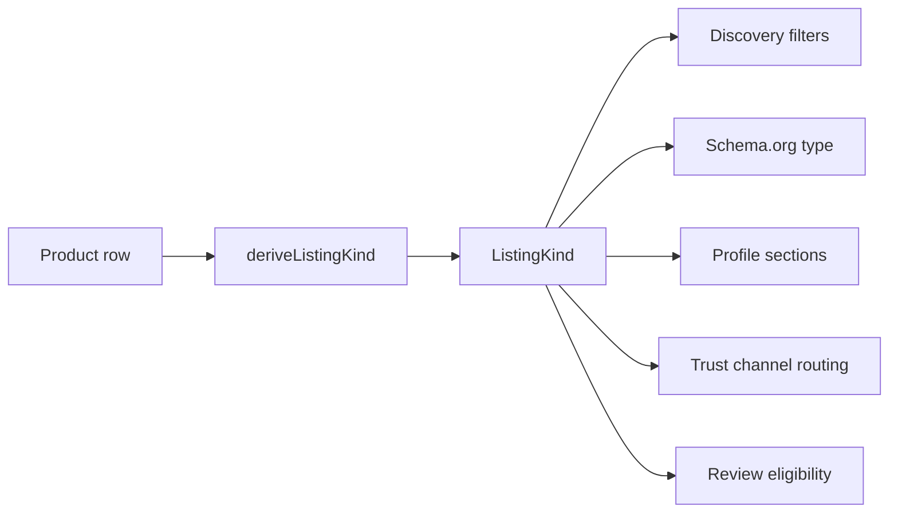

# ListingKind Specification

**Version:** V1 (Phase 1 — implemented)  
**Status:** Canonical derived layer — **implemented in code**  
**Last updated:** 2026-07-06

## Purpose

`ListingKind` is a **derived classification** (no new DB table in Phase 0) that sits above `Product` fields and below Discovery/SEO/Profile consumers. It unifies how HomeCheff treats physically different offer types that share the same `Product` table.

**Non-Product kinds:**

| Kind | Source entity | Notes |
|------|---------------|-------|
| INSPIRATION | `Dish`, `WorkspaceContent` | Not derived from Product |
| DELIVERY_OPERATION | `DeliveryRequest` | Operational, not a listing |

---

## Derivation precedence (Product-backed kinds)

Apply in order — first match wins:

1. If `listingIntent === 'REQUEST'` → **REQUEST**
2. Else if any `specializations[]` matches workshop taxonomy set → **WORKSHOP**
3. Else if any `specializations[]` matches `knowledge.coaching` → **COACHING**
4. Else if `marketplaceCategory === 'PRACTICAL_SERVICE'` → **TASK**
5. Else if `marketplaceCategory IN ('ARTISTIC_SERVICE', 'PRACTICAL_SERVICE', 'KNOWLEDGE', 'DESIGN')` AND not workshop/coaching → **SERVICE**
6. Else → **PRODUCT**

Workshop taxonomy set (from `lib/marketplace/form-config.ts`):

- `knowledge.workshop`
- `knowledge.cookingclass`
- `knowledge.musicclass`

**Ambiguity note:** `DESIGN` category includes both physical creative goods (`create.*` migrated) and digital services (`design.website`). When `specializations[]` contains physical CREATE ids under DESIGN category, treat as **PRODUCT** (override step 5 if physical create taxonomy id present).

---

## Kind reference

### PRODUCT

| Attribute | Value |
|-----------|-------|
| **Definition** | Transferable good: physical item, portioned food, grown produce, digital file deliverable |
| **Examples** | Tomatoes, homemade cake, logo file download, handmade jewelry |
| **Payment models** | FIXED, FROM_PRICE, ON_REQUEST, VOLUNTARY; HOMECHEFF + CONTACT |
| **Fulfillment** | pickup, delivery, shipping, digital |
| **Review types** | ProductReview (checkout), DealReview (community) |
| **Discovery surfaces** | Sale feed, category browse, geo, price, taxonomy |
| **SEO eligibility** | ✅ `/product/[slug]` |
| **Profile placement** | Aanbod |
| **Trust source** | ProductReview + DealReview |

---

### SERVICE

| Attribute | Value |
|-----------|-------|
| **Definition** | Time/skill-based offer by a provider; outcome negotiated |
| **Examples** | Website design, tattoo, photography session, marketing help |
| **Payment models** | ON_REQUEST, HOURLY, DAILY, FROM_PRICE, VOLUNTARY; CONTACT primary |
| **Fulfillment** | onSiteProvider, onSiteClient, digital (deliverable), pickup (rare) |
| **Review types** | DealReview (primary); ProductReview only if checkout wired |
| **Discovery surfaces** | Services filter, taxonomy, trust, distance, availability (future) |
| **SEO eligibility** | ✅ `/product/[slug]` today; future Service schema |
| **Profile placement** | Aanbod → services filter |
| **Trust source** | DealReview |

---

### TASK

| Attribute | Value |
|-----------|-------|
| **Definition** | Short practical help task performed at client location or jointly |
| **Examples** | Dog walking, moving help, computer help, handyman |
| **Payment models** | ON_REQUEST, HOURLY, FIXED, VOLUNTARY |
| **Fulfillment** | onSiteClient, onSiteProvider, pickup |
| **Review types** | DealReview |
| **Discovery surfaces** | Tasks filter, taxonomy (`practical.*`), geo, urgency (future) |
| **SEO eligibility** | ✅ `/product/[slug]`; lower priority than workshops |
| **Profile placement** | Aanbod → tasks filter |
| **Trust source** | DealReview |

---

### WORKSHOP

| Attribute | Value |
|-----------|-------|
| **Definition** | Scheduled group event with capacity |
| **Examples** | Cooking class, music workshop, group craft session |
| **Payment models** | FIXED, FROM_PRICE; CONTACT common |
| **Fulfillment** | onSiteProvider, pickup (venue); digital for online workshops |
| **Review types** | DealReview; optional participant feedback (future, non-trust) |
| **Discovery surfaces** | Date, capacity, topic, geo |
| **SEO eligibility** | ✅ Event schema when dates exist |
| **Profile placement** | Aanbod → workshops filter |
| **Trust source** | DealReview |

---

### COACHING

| Attribute | Value |
|-----------|-------|
| **Definition** | 1:1 or small-group knowledge/mentoring over time |
| **Examples** | Life coaching, language coaching, tutoring |
| **Payment models** | HOURLY, ON_REQUEST, VOLUNTARY |
| **Fulfillment** | onSiteProvider, onSiteClient, digital (online session) |
| **Review types** | DealReview |
| **Discovery surfaces** | Taxonomy, trust, availability (future calendar) |
| **SEO eligibility** | ✅ `/product/[slug]` |
| **Profile placement** | Aanbod → services filter (or dedicated coaching filter) |
| **Trust source** | DealReview |

---

### REQUEST

| Attribute | Value |
|-----------|-------|
| **Definition** | Buyer/community asks "who can help?" — matching-oriented |
| **Examples** | Who can help me move? Who sells tomatoes nearby? Who gives cooking lessons? |
| **Payment models** | Budget (future field), ON_REQUEST, VOLUNTARY; proposals define settlement |
| **Fulfillment** | Defined in matched proposal — not on request itself |
| **Review types** | DealReview after completed help |
| **Discovery surfaces** | Request feed, urgency, location, required skill |
| **SEO eligibility** | ⚠️ `/request/[slug]` — **noindex until UX stable** |
| **Profile placement** | Gezocht (recommended separate from Aanbod) |
| **Trust source** | DealReview on requester/responder after deal |

---

### INSPIRATION

| Attribute | Value |
|-----------|-------|
| **Definition** | Non-transactional creative/knowledge sharing |
| **Examples** | Recipe idea, garden diary, design sketch |
| **Source entity** | `Dish`, `WorkspaceContent` — **not Product** |
| **Payment models** | None |
| **Fulfillment** | N/A |
| **Review types** | Community Feedback (ex-DishReview) — **non-trust** |
| **Discovery surfaces** | Inspiration chip, topic, props, fans |
| **SEO eligibility** | ✅ recipe/garden/design/inspiratie routes |
| **Profile placement** | Inspiratie tab |
| **Trust source** | None (engagement only) |

---

### DELIVERY_OPERATION

| Attribute | Value |
|-----------|-------|
| **Definition** | Courier job fulfilling a community order delivery |
| **Source entity** | `DeliveryRequest` + `CourierAssignment` |
| **Payment models** | Future delivery fees — not V1 |
| **Fulfillment** | Delivery only |
| **Review types** | DeliveryReview |
| **Discovery surfaces** | Future courier job board (authenticated) |
| **SEO eligibility** | ❌ noindex |
| **Profile placement** | Bezorgingen (courier) |
| **Trust source** | DeliveryReview |

---

## Derivation audit matrix

| ListingKind | Derivable today? | Confidence | Required future fields | Ambiguous cases |
|-------------|------------------|------------|------------------------|-----------------|
| **PRODUCT** | Yes | High | — | DESIGN category with service vs physical goods |
| **SERVICE** | Partial | Medium | `listingKind` cache optional | KNOWLEDGE tutoring vs workshop (spec ids disambiguate) |
| **TASK** | Yes | High | — | Overlap with PRACTICAL_SERVICE services |
| **WORKSHOP** | Yes | High | `eventStartsAt`, `eventEndsAt` for discovery | Music class = workshop or coaching (spec id wins) |
| **COACHING** | Yes | Medium | calendar/slot fields | `knowledge.tutoring` → SERVICE not COACHING |
| **REQUEST** | Yes | High | `expiresAt`, `urgency`, `budgetCents`, `neededBy` | "Who sells tomatoes?" = REQUEST or search intent |
| **INSPIRATION** | Yes (Dish) | High | — | Priced Dish misclassified as sale |
| **DELIVERY_OPERATION** | Yes (separate entity) | High | fee fields | Must never derive from Product |

### Field sufficiency by source field

| Field | Used for | Sufficient alone? |
|-------|----------|-------------------|
| `listingIntent` | REQUEST vs OFFER | ✅ for REQUEST |
| `marketplaceCategory` | SERVICE/TASK/WORKSHOP bucket | ⚠️ needs specializations |
| `specializations[]` | Fine-grained kind (workshop, coaching, task) | ✅ primary discriminator |
| `fulfillmentOptions` | Digital vs physical hints | ⚠️ supplementary |
| `priceModel` | Payment/discovery filters | ⚠️ not kind |
| `category` (legacy CHEFF/GROWN/DESIGNER) | Profile filters, feed category | ⚠️ legacy parallel — do not use for kind |

---

## Consumer contract (future systems)

All Discovery, SEO, Matching, Recommendations, and Profile filters **must**:

1. Call `deriveListingKind(product)` — not infer from price or legacy category alone.
2. Never treat `Dish` as Product listing kind.
3. Never index `DeliveryRequest` as marketplace listing.
4. Route reviews to kind-appropriate trust channel per [REVIEW_ARCHITECTURE.md](./REVIEW_ARCHITECTURE.md).

---

## Related documents

- [MARKETPLACE_ENTITY_ARCHITECTURE.md](./MARKETPLACE_ENTITY_ARCHITECTURE.md)
- [marketplace-entity-validation.md](../audits/marketplace-entity-validation.md)
- [DISCOVERY_PREREQUISITES.md](../discovery/DISCOVERY_PREREQUISITES.md)
