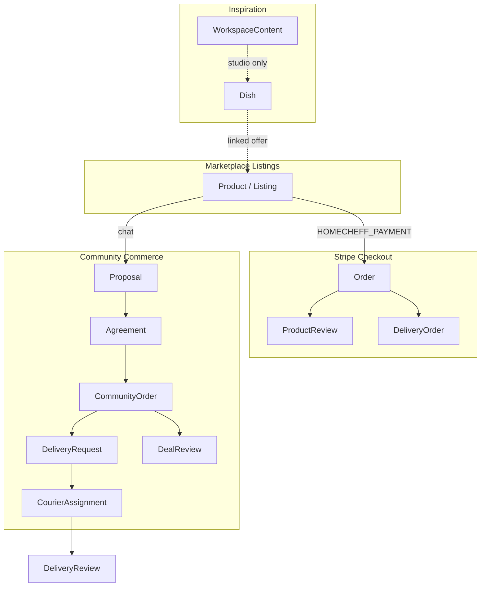
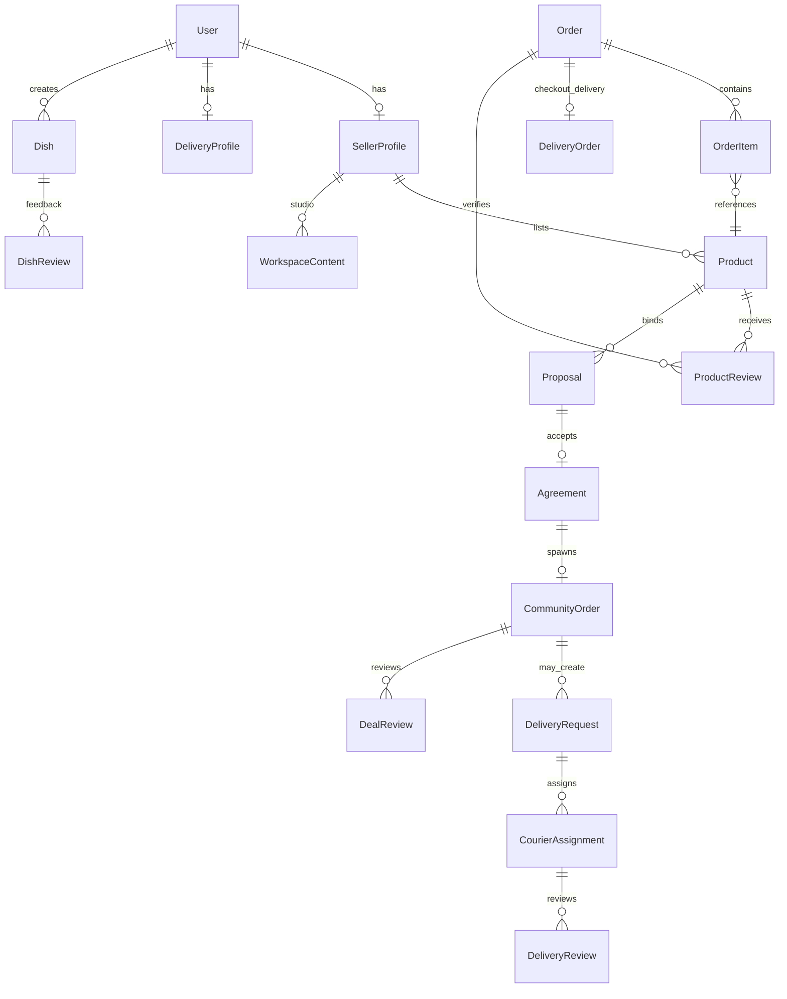

# HomeCheff Marketplace Entity Architecture

**Version:** V1 (Phase 0 documentation)  
**Status:** Canonical specification — no implementation in this document  
**Last updated:** 2026-07-06

This document defines entity boundaries, ownership, and cross-cutting concerns for the HomeCheff marketplace. It is the foundation for Discovery Phase 1, SEO, Matching, and Profile work.

---

## Architecture overview

HomeCheff operates three commerce/content tracks:

**Canonical listing entity:** `Product` (user-facing name: **Listing**).  
**Not listings:** `Dish`, `WorkspaceContent`, `DeliveryRequest`, `CommunityOrder`, `Order`.

---

## 1. Product (Listing)

### Purpose

Unified marketplace listing for all offers and requests: physical goods, food, grown goods, digital deliverables, services, tasks, workshops, coaching, and help-seeking (`listingIntent=REQUEST`).

### Ownership

| Owner | Fields |
|-------|--------|
| **Product (listing)** | title, description, price, stock, taxonomy, fulfillment, payment flags, media |
| **SellerProfile** | seller default location, business info, delivery regions |
| **User** | Stripe Connect, identity |

### Visibility

- Public when `isActive: true` (with Stripe visibility rules for priced HC checkout items).
- REQUEST listings: public in feed "all" today; excluded from sale chip.

### Trust implications

- Checkout path → `ProductReview` on seller's products.
- Contact/deal path → `DealReview` after `CommunityOrder` completion.
- Must **not** blend with courier or inspiration ratings.

### Discovery implications

- Primary discoverable commerce entity.
- Indexed fields: `marketplaceCategory`, `specializations[]`, geo, `priceModel`, `listingIntent`.
- Requires derived `ListingKind` for correct filters (see [LISTING_KIND_SPEC.md](./LISTING_KIND_SPEC.md)).

### SEO implications

- Canonical route: `/product/[slug]` (slug from title + place + id).
- REQUEST listings: future `/request/[slug]` — not implemented.

### Review type

- **ProductReview** (checkout, verified via Order).
- **DealReview** (community path).

### Profile relationship

- **Primary:** Aanbod tab (OFFER) or Gezocht section (REQUEST — recommended).
- Filtered today by legacy `ProductCategory` (chef/garden/designer).

### Payments

- `orderMethod`: HOMECHEFF_PAYMENT | CONTACT.
- `acceptHomeCheffPayment`, `acceptDirectContact`, `barterOpenness`, `acceptedSpecializations[]`.
- Checkout: Stripe `Order` + `StockReservation`.
- Community: `Proposal.settlementMode` → optional `CommunityOrder.checkoutOrderId`.

### Fulfillment

- Source of truth: `fulfillmentOptions` JSON (6 modes).
- Legacy mirror: `delivery` enum, `sellerCanDeliver`, pickup coords.

---

## 2. Dish

### Purpose

Community inspiration content: recipes, garden journeys, design ideas. Optional legacy `priceCents` — **should not** be used for commerce (use Product instead).

### Ownership

- Owned by `User` (creator), not `SellerProfile`.
- Content fields: ingredients, growth metadata, materials, photos, video.

### Visibility

- `DishStatus.PUBLISHED` → public inspiration routes.
- `PRIVATE` → owner only.

### Trust implications

- `DishReview` exists today but **must become Community Feedback** — non-trust, non-discovery-rank.
- Must not feed profile headline trust average.

### Discovery implications

- Inspiration chip in GeoFeed.
- Rank by engagement (props, views) — not transaction trust.

### SEO implications

- `/recipe/[id]`, `/garden/[id]`, `/design/[id]`, `/inspiratie/[id]`.
- Indexable when published.

### Review type

- **DishReview** → future **Community Feedback** (rename only; separate from trust).

### Profile relationship

- **Primary:** Inspiratie tab.
- Vertical filters: chef / garden / designer.

### Payments

- None (deprecated: priced dishes in feed).

### Fulfillment

- N/A (optional legacy `deliveryMode` unused in commerce).

---

## 3. WorkspaceContent

### Purpose

Seller studio portfolio: structured workspace posts (Recipe, GrowingProcess, DesignItem) tied to `SellerProfile`.

### Ownership

- `SellerProfile` via `sellerProfileId`.
- Types: `WorkspaceContentType` enum.

### Visibility

- `isPublic` flag.
- Props via `WorkspaceContentProp` (canonical prop surface).

### Trust implications

- Comments only — no star trust.
- Props are appreciation signals, not trust.

### Discovery implications

- Profile Inspiratie / studio surfaces.
- Not in main GeoFeed product pool today.

### SEO implications

- Future studio pages; not primary SEO landing today.

### Review type

- `WorkspaceContentComment` — community feedback, not trust.

### Profile relationship

- Inspiratie tab (studio subsection) or embedded in overview.

### Payments / Fulfillment

- None.

---

## 4. Proposal

### Purpose

Structured negotiation inside a conversation: price, quantity, dates, fulfillment, settlement, alternative value.

### Ownership

- Bound to `Conversation`; references `productId` and/or legacy `listingId`.
- Parties: `sellerId`, `buyerId`, `createdById`.

### Visibility

- **Private** — conversation participants only.

### Trust implications

- Indirect: accepted proposals lead to `CommunityOrder` → `DealReview`.

### Discovery implications

- None — not discoverable.

### SEO implications

- **noindex** — private.

### Review type

- None directly.

### Profile relationship

- Owner: Afspraken / deals surfaces (`/profile/deals`).

### Payments

- `settlementMode`, `amountCents`, taxonomy value ids.
- `paymentPath`: HOMECHEFF_CHECKOUT | DIRECT_CONTACT | NONE.

### Fulfillment

- `ProposalFulfillmentType`: PICKUP | DELIVERY only (narrower than listing).

---

## 5. Agreement

### Purpose

Immutable snapshot when a proposal is accepted. Freezes terms against subsequent listing edits.

### Ownership

- One-to-one with accepted `Proposal`.
- `agreementSummary` JSON.

### Visibility

- **Private** — deal parties.

### Trust / Discovery / SEO

- None directly.

### Profile / Payments / Fulfillment

- Inherited from proposal snapshot; feeds `CommunityOrder` creation.

---

## 6. CommunityOrder

### Purpose

Executed community deal — **not** the Stripe checkout Order. Tracks fulfillment, completion, reviews.

### Ownership

- `buyerId`, `sellerId`, links to `Agreement`, `Proposal`, `Conversation`.

### Visibility

- **Private** — parties (+ admin ops).

### Trust implications

- **DealReview** after `status: COMPLETED`.
- Counts toward completed deals in trust summary.

### Discovery implications

- None.

### SEO implications

- **noindex**.

### Review type

- **DealReview** (one per party per order).

### Profile relationship

- Owner: Afspraken, Community tab, `/profile/deals`.
- Public profile: aggregate deal count only (trust section).

### Payments

- Optional `checkoutOrderId` → Stripe `Order`.
- Most deals: off-platform settlement via CONTACT.

### Fulfillment

- `fulfillmentMode`: PICKUP | DELIVERY | DIGITAL | ON_SITE_PROVIDER | ON_SITE_CLIENT.
- `deliveryRequested` → spawns `DeliveryRequest`.

---

## 7. Order (Stripe Checkout)

### Purpose

Platform checkout record: cart, payment, shipping labels, escrow.

### Ownership

- `userId` (buyer); line items via `OrderItem` → `Product`.

### Visibility

- Buyer and seller (order detail pages).

### Trust implications

- **ProductReview** per purchased product.
- **DeliveryReview** for checkout courier (`DeliveryOrder`).

### Discovery implications

- Purchase history only — not in public discovery.

### SEO implications

- **noindex** (`/orders/[orderId]`).

### Review type

- ProductReview, DeliveryReview (checkout path).

### Profile relationship

- Owner orders page; not on public profile listing grid.

### Payments

- Stripe session, escrow, platform fees.

### Fulfillment

- `deliveryMode`, shipping fields (EctaroShip), pickup/delivery addresses.

---

## 8. DeliveryRequest

### Purpose

Community-order delivery job for couriers. Operational layer — not a marketplace listing.

### Ownership

- Tied to `CommunityOrder`.
- Assigned via `CourierAssignment`.

### Visibility

- **Private operational** — buyer, seller, assigned courier.
- Future: authenticated courier job board (not public SEO).

### Trust implications

- **DeliveryReview** after assignment completion.

### Discovery implications

- **Not** in GeoFeed.
- Future: courier matching by geo + `CourierAvailability`.

### SEO implications

- **noindex**.

### Review type

- DeliveryReview (community path via `courierAssignmentId`).

### Profile relationship

- Courier: Bezorgingen section.
- Not on Aanbod/Inspiratie.

### Payments / Fulfillment

- V1: no fee settlement on request.
- Fulfillment: delivery addresses and time windows only.

---

## 9. DeliveryProfile

### Purpose

Courier capability profile: vehicle, radius, regions, GPS, availability windows.

### Ownership

- One per `User` (courier role).

### Visibility

- Public courier surface today at `/bezorger/[username]` (legacy — should redirect to `/user/[username]`).

### Trust implications

- **DeliveryReview** aggregate.

### Discovery implications

- Future courier matching input — not listing discovery.

### SEO implications

- Indexable profile subset; canonical URL should be unified user profile.

### Review type

- DeliveryReview.

### Profile relationship

- **Primary:** Bezorgingen (owner + public trust subsection).

### Payments / Fulfillment

- No direct payment; future delivery fees.

---

## 10. SellerProfile

### Purpose

Maker/seller capability: business identity, subscription, product catalog host, workplace photos, workspace content.

### Ownership

- One per selling `User`.
- Hosts `Product[]` relation.

### Visibility

- Public facets embedded in `/user/[username]` profile.

### Trust implications

- Hosts product trust via ProductReview on seller's products.
- Business verification (KVK) in overview.

### Discovery implications

- Profile as discovery surface for seller's listings and taxonomy tags.

### SEO implications

- Via canonical user profile URL.

### Review type

- Indirect: ProductReview, DealReview as seller party.

### Profile relationship

- **Primary:** Overview + Aanbod context.
- Legacy standalone: `/seller/[sellerId]`.

### Payments

- Stripe Connect lives on `User`; seller subscription on profile.

### Fulfillment

- Default delivery regions/mode — listing-level overrides on Product.

---

## Entity relationship diagram

---

## Related documents

- [LISTING_KIND_SPEC.md](./LISTING_KIND_SPEC.md) — derived classification layer
- [ROUTE_OWNERSHIP.md](./ROUTE_OWNERSHIP.md)
- [REVIEW_ARCHITECTURE.md](./REVIEW_ARCHITECTURE.md)
- [PROFILE_ENTITY_MAPPING.md](./PROFILE_ENTITY_MAPPING.md)
- [ADR-MARKETPLACE-FOUNDATION-V1.md](../decision-records/ADR-MARKETPLACE-FOUNDATION-V1.md)
