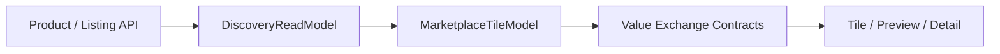

# Marketplace Value Exchange System — Phase 4A

**Status:** Architecture + contracts (no UI wiring)  
**Last updated:** 2026-07-06  
**Builds on:** Tile T1–T3, `lib/marketplace/taxonomy.ts`, ListingKind, Preview layer

---

## North star

HomeCheff must understand **what is offered**, **how payment works**, **what barter categories are accepted**, and **what specific exchange is desired** — across tiles, previews, and detail pages — without changing discovery ranking, trust, or sections.

```
Offer taxonomy  →  Payment method  →  Barter acceptance  →  Desired exchange
       ↓                  ↓                  ↓                    ↓
   Tile icon         Price line      Preview icons         Detail block
```

**Code contracts:** `lib/marketplace/value-exchange/`  
**Icon legend (SSOT):** [MARKETPLACE_ICON_LEGEND.md](./MARKETPLACE_ICON_LEGEND.md)

---

## 1. What is being offered

### Main categories (8)

User-facing icon taxonomy — maps to `MarketplaceCategory`, `ListingKind`, and fulfillment:

| Icon | ID | Maps to |
|------|-----|---------|
| 🍳 | `HOME_CHEFF` | `CREATE` · `PRODUCT` |
| 🌱 | `HOME_GARDEN` | `GROW` · `PRODUCT` |
| 🎨 | `HOME_DESIGNER` | `DESIGN`, `ARTISTIC_SERVICE` · `SERVICE` |
| 🔧 | `SERVICES` | `PRACTICAL_SERVICE` · `SERVICE`, `TASK` |
| 📚 | `WORKSHOPS` | `KNOWLEDGE` · `WORKSHOP` |
| 🎓 | `COACHING` | `KNOWLEDGE` · `COACHING` |
| 🚚 | `DELIVERY` | Fulfillment channel (not offer vertical) |
| 🙋 | `REQUESTS` | `listingIntent: REQUEST` · `REQUEST` |

### Subcategories

Every item in `MARKETPLACE_TAXONOMY` maps to exactly one main category via `category-taxonomy-map.ts`.

Examples:

| Main | Subcategory id | Label |
|------|----------------|-------|
| 🍳 HomeCheff | `create.baking` | Baking |
| 🌱 HomeGarden | `grow.tomato` | Tomato |
| 🎨 HomeDesigner | `artistic.portrait` | Portrait |
| 🔧 Services | `practical.repair` | Repair |
| 📚 Workshops | `knowledge.cookingclass` | Cooking class |
| 🎓 Coaching | `knowledge.coaching` | Coaching |

Full registry: `TAXONOMY_SUBCATEGORY_MAP` + [MARKETPLACE_ICON_LEGEND.md](./MARKETPLACE_ICON_LEGEND.md).

---

## 2. Payment methods

Canonical methods (`VALUE_PAYMENT_METHODS`):

| Method | Emoji | `BarterOpenness` | `PriceModel` examples |
|--------|-------|------------------|----------------------|
| **Money** | 💶 | `MONEY` | `FIXED`, `FROM_PRICE`, `HOURLY`, `DAILY` |
| **Barter** | 🔄 | `BARTER_ONLY` | — |
| **Money + Barter** | 💶🔄 | `MONEY_AND_BARTER` | money models + accepted values |
| **Voluntary contribution** | 🤝 | `MONEY` | `VOLUNTARY` |
| **On request** | 💬 | any | `ON_REQUEST`, contact-only |

Resolver: `resolvePaymentMethod({ barterOpenness, priceModel })`.

Tile price lines reuse existing `marketplace.tile.price.*` keys (T1 presentation matrix).

---

## 3. Barter acceptance model

When `BarterOpenness` ≠ `MONEY`:

```typescript
type BarterAcceptanceModel = {
  acceptedMainCategories: ValueExchangeMainCategory[];  // icon set
  acceptedTaxonomyIds: string[];                        // subcategory ids
  openness: BarterOpenness;
};
```

**Example display (preview):**

> **Accepts:** 🍳 HomeCheff · 🌱 HomeGarden · 🎨 HomeDesigner

Builder: `buildBarterAcceptanceModel({ barterOpenness, acceptedTaxonomyIds })`.

Main categories derived from taxonomy ids via `acceptedMainCategoriesFromTaxonomyIds()` — never free-text categories.

---

## 4. Desired exchange details

For requests and barter counter-offers:

```typescript
type DesiredExchangeDetail = {
  mainCategory: ValueExchangeMainCategory;
  subcategoryId: string;           // e.g. artistic.portrait
  subcategoryLabelKey: string;
  description: string;
};
```

**Example:**

| Field | Value |
|-------|-------|
| Category | 🎨 HomeDesigner |
| Subcategory | Portrait (`artistic.portrait`) |
| Description | I would like a portrait of me and my daughter. |

Builder: `buildDesiredExchangeDetail()`.  
**Detail page only** — never on tile or preview summary.

---

## 5. Surface display rules

| Surface | Category icons | Payment | Accepted categories | Subcategories | Desired exchange |
|---------|----------------|---------|---------------------|---------------|------------------|
| **Tile** | Offer main icon only (max 3) | Price line | Hidden | Hidden | Hidden |
| **Preview** | Offer icon | Yes | Main-category icons (max 6) | Hidden | Hidden |
| **Detail** | Offer icon | Full block | Icons + taxonomy list | Labels shown | Full description |

Rules: `TILE_ICON_DISPLAY_RULES`, `resolveSurfaceIconPlan()`.

Aligns with [MARKETPLACE_PRESENTATION_MATRIX.md](../audits/MARKETPLACE_PRESENTATION_MATRIX.md) — tiles stay dense; previews carry accepted values (T3).

---

## 6. Data flow (target wiring — Phase 4B+)



**Phase 4A:** contracts + docs only.  
**No changes** to `/api/feed`, ranking, trust resolver, or discovery sections.

---

## 7. Module layout

```
lib/marketplace/value-exchange/
  value-exchange-contract.ts    # types, payment, barter, desired exchange
  main-categories.ts            # 8 main category registry
  payment-methods.ts            # 5 payment methods + resolver
  category-taxonomy-map.ts      # taxonomy → main category mapping
  barter-models.ts              # acceptance + desired exchange builders
  tile-display-rules.ts         # tile / preview / detail icon rules
  index.ts
```

---

## 8. Future capabilities (architecture only)

Prepared in contracts — **not implemented**:

| Capability | Purpose |
|------------|---------|
| `barter_matching` | Match complementary offers/requests by taxonomy |
| `exchange_recommendations` | Suggest barter partners (no ML ranking) |
| `multi_party_exchanges` | 3+ party value chains |
| `community_exchange_chains` | Neighborhood circular trades |

See [MARKETPLACE_BARTER_READINESS.md](../audits/MARKETPLACE_BARTER_READINESS.md).

---

## 9. Validation

```bash
npx tsx scripts/validate-value-exchange-system.ts
npm run lint
npm run build
```

---

## 10. Implementation plan (Phase 4B+)

| Step | Scope |
|------|-------|
| **4B** | Wire `resolveSurfaceIconPlan` into tile badge strip (offer icon) |
| **4C** | Preview accepted-category icon row |
| **4D** | Detail page exchange block + desired exchange form |
| **4E** | Barter matching service (read-only suggestions) |
| **4F** | API persistence for `DesiredExchangeDetail` on REQUEST listings |

---

## References

- [MARKETPLACE_ICON_LEGEND.md](./MARKETPLACE_ICON_LEGEND.md)
- [MARKETPLACE_TILE_ARCHITECTURE.md](../audits/MARKETPLACE_TILE_ARCHITECTURE.md)
- [MARKETPLACE_PRESENTATION_MATRIX.md](../audits/MARKETPLACE_PRESENTATION_MATRIX.md)
- [MARKETPLACE_TILE_T3.md](../progress/MARKETPLACE_TILE_T3.md)
- `lib/marketplace/taxonomy.ts`
