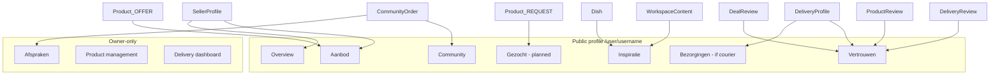

# Profile Entity Mapping

**Version:** V1 (Phase 0)  
**Last updated:** 2026-07-06

Maps entities to Profile V2 sections. Canonical profile URL: `/user/[username]`.

## Profile sections

| Section | Tab ID | Audience | Purpose |
|---------|--------|----------|---------|
| **Overview** | `overview` | Public + owner | Identity, bio, roles, specializations, business block, HCP |
| **Aanbod** | `aanbod` | Public | OFFER listings (products/services/tasks/workshops) |
| **Gezocht** | *(recommended)* | Public | REQUEST listings — **not implemented as tab yet** |
| **Inspiratie** | `inspiratie` | Public | Dish + WorkspaceContent |
| **Community** | `community` | Public + owner | Fans, social proof, deals entry |
| **Vertrouwen** | `vertrouwen` | Public | Split trust channels |
| **Bezorgingen** | *(overview subsection)* | Public + owner | Courier capability — if `DeliveryProfile` |
| **Afspraken** | *(owner only)* | Owner | Open proposals / community orders |

Current tabs in code: Overview, Aanbod, Inspiratie, Community, Vertrouwen (`lib/profile/profile-v2/tabs.ts`). Gezocht and Afspraken are **recommended additions**.

---

## Entity mapping matrix

### Product (Listing)

| Dimension | Value |
|-----------|-------|
| **Primary section** | Aanbod (OFFER) or Gezocht (REQUEST) |
| **Secondary appearances** | Overview (featured listing count); Vertrouwen (product review aggregate) |
| **Public visibility** | Active listings public on profile |
| **Owner visibility** | All listings including inactive in ProductManagement |
| **Trust relevance** | ProductReview → product trust on Vertrouwen |
| **Filters today** | chef / garden / designer (legacy category) |
| **Filters planned** | services, tasks, workshops, trade |

---

### Dish

| Dimension | Value |
|-----------|-------|
| **Primary section** | Inspiratie |
| **Secondary appearances** | Overview (creator badge); Community (engagement) |
| **Public visibility** | PUBLISHED dishes only |
| **Owner visibility** | PRIVATE + PUBLISHED in management |
| **Trust relevance** | **None** — Community Feedback only |
| **Filters** | chef / garden / designer (inspiratie vertical) |

---

### WorkspaceContent

| Dimension | Value |
|-----------|-------|
| **Primary section** | Inspiratie (studio) |
| **Secondary appearances** | Overview (portfolio preview) |
| **Public visibility** | `isPublic: true` |
| **Owner visibility** | All content in studio management |
| **Trust relevance** | None — props/comments are engagement |
| **Filters** | By workspace type (recipe, garden, design) |

---

### CommunityOrder

| Dimension | Value |
|-----------|-------|
| **Primary section** | Afspraken (owner) |
| **Secondary appearances** | Community tab (deal history link); Vertrouwen (completed count) |
| **Public visibility** | **Not listed** — counts/aggregates only |
| **Owner visibility** | Full list at `/profile/deals` |
| **Trust relevance** | DealReview after completion |

---

### DeliveryRequest

| Dimension | Value |
|-----------|-------|
| **Primary section** | Bezorgingen (courier owner) |
| **Secondary appearances** | None on public buyer/seller profile |
| **Public visibility** | **Private** |
| **Owner visibility** | Courier dashboard / delivery ops |
| **Trust relevance** | Indirect via DeliveryReview on completion |

---

### DeliveryProfile

| Dimension | Value |
|-----------|-------|
| **Primary section** | Bezorgingen |
| **Secondary appearances** | Overview (courier badge); Vertrouwen (courier rating) |
| **Public visibility** | Public summary on unified profile |
| **Owner visibility** | Full settings at `/delivery/profiel` |
| **Trust relevance** | DeliveryReview aggregate |
| **Legacy URL** | `/bezorger/[username]` — redirect candidate |

---

### SellerProfile

| Dimension | Value |
|-----------|-------|
| **Primary section** | Overview + Aanbod context |
| **Secondary appearances** | Vertrouwen (business verification); all product grids |
| **Public visibility** | Public facets on user profile |
| **Owner visibility** | Seller settings, subscription, KVK |
| **Trust relevance** | Hosts product trust; KVK badge (not star rating) |
| **Legacy URL** | `/seller/[sellerId]` — redirect candidate |

---

## Section composition diagram

---

## Aanbod filter mapping (target state)

| Filter | ListingKind / source | Legacy filter today |
|--------|---------------------|---------------------|
| `all` | All OFFER listings | ✅ |
| `chef` | PRODUCT food, CHEFF category | ✅ |
| `garden` | PRODUCT GROW, GROWN category | ✅ |
| `designer` | PRODUCT/DESIGN creative goods | ✅ |
| `services` | SERVICE, COACHING | ❌ hidden |
| `tasks` | TASK | ❌ hidden |
| `workshops` | WORKSHOP | ❌ hidden |
| `trade` | barterOpenness != MONEY | ❌ hidden |
| `help` | REQUEST (or move to Gezocht) | ❌ hidden |

**Recommendation:** Move REQUEST listings to **Gezocht** tab/filter — do not mix with Aanbod OFFER grid.

---

## Visibility rules

1. **Public profile** never lists private CommunityOrders or DeliveryRequests.
2. **Inactive products** visible to owner only (unless sales history rule applies in feed).
3. **Trust section** shows channel-specific ratings — never single blended star (target).
4. **HCP / badges** in Overview — never in Vertrouwen star rating.

---

## Related documents

- [MARKETPLACE_ENTITY_ARCHITECTURE.md](./MARKETPLACE_ENTITY_ARCHITECTURE.md)
- [LISTING_KIND_SPEC.md](./LISTING_KIND_SPEC.md)
- [ROUTE_OWNERSHIP.md](./ROUTE_OWNERSHIP.md)
- [REVIEW_ARCHITECTURE.md](./REVIEW_ARCHITECTURE.md)
