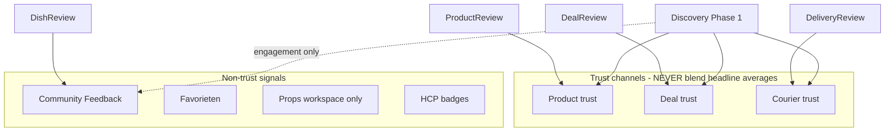

# Review Architecture

**Version:** V1 (Phase 0)  
**Last updated:** 2026-07-06

Defines review types, trust ownership, and blending rules. Discovery and profile systems must consume this spec — not invent parallel rating models.

---

## Review type inventory

| Review model | Schema location | Transaction gate |
|--------------|-----------------|------------------|
| ProductReview | `ProductReview` | Order / OrderItem (verified) |
| DealReview | `DealReview` | CommunityOrder COMPLETED |
| DeliveryReview | `DeliveryReview` | DeliveryOrder OR CourierAssignment COMPLETED |
| DishReview | `DishReview` | Optional Order link — **not required** |
| ReviewResponse | `ReviewResponse` | Reply to ProductReview only |

---

## ProductReview

| Dimension | Specification |
|-----------|---------------|
| **Purpose** | Rate a purchased product after Stripe checkout |
| **Trust?** | **Yes** — product trust channel |
| **Discovery?** | May inform product/seller ranking **within product trust tier only** |
| **SEO?** | Review content may appear on product page — not separate URL |
| **Profile visibility** | Seller product rating aggregate; buyer history private |
| **Public visibility** | Public on product detail |
| **Transaction gated?** | **Yes** — `orderId` / `orderItemId` / review token |
| **Must never blend with** | DealReview, DeliveryReview, DishReview |

**Unique constraint:** `(productId, buyerId)`

---

## DealReview

| Dimension | Specification |
|-----------|---------------|
| **Purpose** | Rate counterparty after completed community deal |
| **Trust?** | **Yes** — deal trust channel |
| **Discovery?** | Service/task/workshop/request matching weight |
| **SEO?** | No standalone page |
| **Profile visibility** | Vertrouwen tab — deal rating separate from product |
| **Public visibility** | Aggregate on profile; individual reviews TBD |
| **Transaction gated?** | **Yes** — `communityOrderId` must be COMPLETED |
| **Must never blend with** | ProductReview, DeliveryReview, DishReview |

**Unique constraint:** `(communityOrderId, reviewerId)`

**Applies to ListingKinds:** SERVICE, TASK, WORKSHOP, COACHING, REQUEST (post-help), and contact-path PRODUCT deals.

---

## DeliveryReview

| Dimension | Specification |
|-----------|---------------|
| **Purpose** | Rate courier after delivery completed |
| **Trust?** | **Yes** — courier trust channel |
| **Discovery?** | Courier matching / assignment ranking |
| **SEO?** | No |
| **Profile visibility** | Bezorgingen / Vertrouwen — courier section only |
| **Public visibility** | Aggregate on courier profile |
| **Transaction gated?** | **Yes** — checkout `orderId` OR `courierAssignmentId` completed |
| **Must never blend with** | ProductReview, DealReview, DishReview |

**Unique constraints:** `(deliveryProfileId, reviewerId, orderId)`, `(courierAssignmentId, reviewerId)`

**Two paths:**

1. Checkout: `DeliveryOrder` → `orderId`
2. Community: `CourierAssignment` → `courierAssignmentId` + `deliveryRequestId`

---

## DishReview → Community Feedback

| Dimension | Specification |
|-----------|---------------|
| **Purpose** | Community appreciation and constructive feedback on inspiration content |
| **Trust?** | **No** — must **not** affect seller trust score or discovery rank |
| **Discovery?** | Engagement signal only (like comment count) — **not** star average |
| **SEO?** | May display on inspiration page — UGC |
| **Profile visibility** | Inspiratie section — feedback count, not trust stars |
| **Public visibility** | Public on dish/inspiration detail |
| **Transaction gated?** | **No** — open feedback (abuse via moderation) |
| **Must never blend with** | ProductReview, DealReview, DeliveryReview |

### Why it differs from trust reviews

| Trust reviews | Community Feedback |
|---------------|-------------------|
| Post-transaction accountability | Post-view appreciation |
| Affects matching and profile trust | Affects engagement metrics only |
| Verified purchase/deal/delivery | No verification required |
| Star average on Vertrouwen | Props + comments on Inspiratie |
| Legal/commerce implications | Creative/community norms |

**Phase 0 decision:** Rename conceptually to **Community Feedback**; keep `DishReview` table name until migration phase. Remove from `averageRating` in stats API and trust summary.

---

## ReviewResponse

| Dimension | Specification |
|-----------|---------------|
| **Purpose** | Seller public reply to ProductReview |
| **Trust?** | No direct rating impact |
| **Discovery?** | No |
| **SEO?** | Embedded in product page |
| **Profile visibility** | On product review threads |
| **Public visibility** | Public |
| **Transaction gated?** | N/A — reply to existing review |
| **Must never blend with** | N/A |

---

## Trust blending rules (canonical)

### Current violations (must fix before trust-weighted discovery)

| Location | Violation |
|----------|-----------|
| `getProfileTrustSummary()` | Averages product + deal + delivery into one `averageRating` |
| `/api/user/[userId]/stats` | Merges ProductReview + DishReview into `averageRating` |
| Stats API | DishReview counted as `totalReviews` trust proxy |

### Target profile trust display

Show **separate metrics**:

- Product rating (count) — if seller
- Deal rating (count) — if community seller/buyer
- Courier rating (count) — if delivery profile
- Community feedback count — if creator (no stars in headline)

---

## Review eligibility by ListingKind

| ListingKind | Primary review | Secondary |
|-------------|----------------|-----------|
| PRODUCT | ProductReview (checkout) | DealReview (contact) |
| SERVICE | DealReview | ProductReview if checkout |
| TASK | DealReview | — |
| WORKSHOP | DealReview | Participant feedback (future, non-trust) |
| COACHING | DealReview | — |
| REQUEST | DealReview (after help) | — |
| INSPIRATION | Community Feedback | — |
| DELIVERY_OPERATION | DeliveryReview | — |

---

## Related documents

- [MARKETPLACE_ENTITY_ARCHITECTURE.md](./MARKETPLACE_ENTITY_ARCHITECTURE.md)
- [LISTING_KIND_SPEC.md](./LISTING_KIND_SPEC.md)
- [PROFILE_ENTITY_MAPPING.md](./PROFILE_ENTITY_MAPPING.md)
- [DISCOVERY_PREREQUISITES.md](../discovery/DISCOVERY_PREREQUISITES.md)
