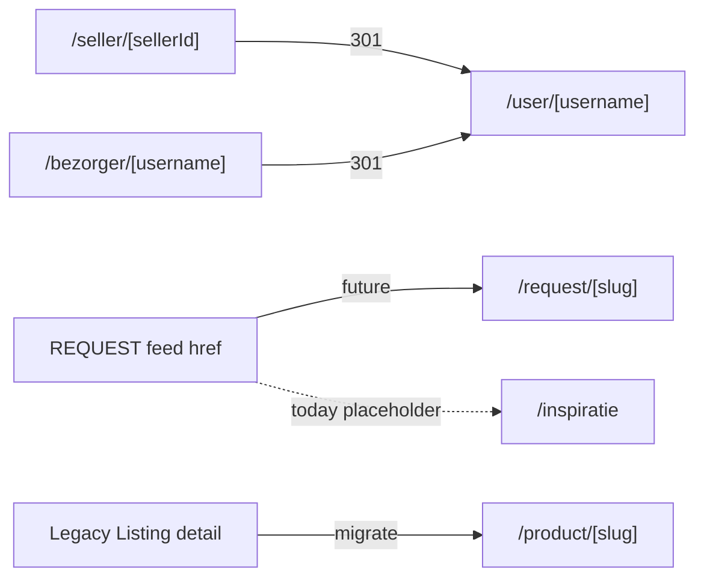

# Route Ownership Matrix

**Version:** V2 (UX Finalization Phase 2)  
**Last updated:** 2026-07-07

Defines canonical ownership for marketplace-related routes. Discovery Phase 1 must not introduce competing URLs for the same entity type. UX Finalization Phase 2 corrected the canonical/alias status for the agreements hub and the feed/inspiration hubs (both now redirect to `/`).

## Legend

| Tag | Meaning |
|-----|---------|
| **Canonical** | Source of truth URL — link here |
| **Legacy** | Still serves content — migrate away |
| **Redirect candidate** | Should 301/308 to canonical |
| **Private** | Auth or party-scoped — no public discovery |
| **SEO** | Public index eligibility |
| **Discovery** | May appear in GeoFeed, recommendations, or browse |

---

## Identity & profile

| Route | Entity | Status | SEO | Discovery | Notes |
|-------|--------|--------|-----|-----------|-------|
| `/user/[username]` | User identity + capabilities | **Canonical (public profile)** | ✅ | ✅ (profile as surface) | Profile V2; canonical intent for any public profile link |
| `/seller/[sellerId]` | SellerProfile | **Legacy** | ✅ | ✅ | Redirect candidate → `/user/[username]` |
| `/bezorger/[username]` | DeliveryProfile | **Legacy** | ✅ | ⚠️ | Redirect candidate → `/user/[username]#bezorgingen` |
| `/profile` | Own profile (private) | **Private** | ❌ | ❌ | Authenticated owner; public equivalent is `/user/[username]` |
| `/profile/deals` | Agreements Hub ("Mijn Afspraken") | **Canonical (private hub)** | ❌ | ❌ | Unified operations cockpit: proposals, deals, payments, delivery, history, agenda |
| `/agreements` | — | **Redirect (alias)** | ❌ | ❌ | 308 → `/profile/deals` (`app/agreements/page.tsx`). Do not link directly; use `DEALS_PROFILE_PATH` |

---

## Marketplace listings (Product)

| Route | Entity | Status | SEO | Discovery | Notes |
|-------|--------|--------|-----|-----------|-------|
| `/product/[id\|slug]` | Product OFFER | **Canonical** | ✅ | ✅ | Slug SEO via `buildProductSlugPath` |
| `/product/[id]/edit` | Product (owner) | **Private** | ❌ | ❌ | Edit flow |
| `/request/[slug]` | Product REQUEST | **Future** | ⚠️ noindex initially | ✅ | **Not implemented** — placeholder in feed href |
| `/sell`, `/sell/new` | Create listing | **Private** | ❌ | ❌ | Creation flow |
| `/r/[slug]` | Short link | **Canonical alias** | ⚠️ | ⚠️ | Resolve to product/inspiration target |

---

## Inspiration

| Route | Entity | Status | SEO | Discovery | Notes |
|-------|--------|--------|-----|-----------|-------|
| `/recipe/[id]` | Dish (chef) | **Canonical** | ✅ | ✅ inspiration | Vertical-specific SEO |
| `/garden/[id]` | Dish (garden) | **Canonical** | ✅ | ✅ inspiration | |
| `/design/[id]` | Dish (design) | **Canonical** | ✅ | ✅ inspiration | |
| `/inspiratie` | Inspiration browse | **Redirect** | ❌ | ❌ | Redirects to `/` (single Discover surface); `?bron=dorpsplein` → `/?chip=sale` |
| `/inspiratie/[id]` | Dish (generic) | **Canonical fallback** | ✅ | ✅ | Used when vertical unknown |

---

## Feed & discovery surfaces

| Route | Entity | Status | SEO | Discovery | Notes |
|-------|--------|--------|-----|-----------|-------|
| `/dorpsplein` | GeoFeed | **Redirect** | ❌ | ❌ | Redirects to `/?chip=sale`; the feed lives on `/` |
| `/` (home) | Mixed + GeoFeed | **Canonical entry & feed** | ✅ | ✅ | Single Discover surface (`#homecheff-feed`); `/dorpsplein` and `/inspiratie` redirect here |
| `/favorites` | Favorite items | **Private** | ❌ | ❌ | Saved products/dishes |
| `/place` | Location picker | **Utility** | ❌ | ❌ | Geo context |

---

## Commerce & deals (private)

| Route | Entity | Status | SEO | Discovery | Notes |
|-------|--------|--------|-----|-----------|-------|
| `/checkout` | Order (in progress) | **Private** | ❌ | ❌ | Stripe checkout |
| `/orders`, `/orders/[orderId]` | Order | **Private** | ❌ | ❌ | Buyer/seller history |
| `/deal-review/[communityOrderId]` | DealReview form | **Private** | ❌ | ❌ | Post-deal review |
| `/delivery-review/[deliveryRequestId]` | DeliveryReview form | **Private** | ❌ | ❌ | Post-delivery review |
| `/review/[token]` | ProductReview token | **Private** | ❌ | ❌ | Email review link |
| `/messages`, `/messages/[conversationId]` | Proposal/chat | **Private** | ❌ | ❌ | Negotiation |
| `/reservations` | Legacy Reservation | **Legacy** | ❌ | ❌ | Listing-era — deprecate |

---

## Delivery operations

| Route | Entity | Status | SEO | Discovery | Notes |
|-------|--------|--------|-----|-----------|-------|
| `/delivery/dashboard` | Courier ops | **Private** | ❌ | ❌ | Courier authenticated |
| `/delivery/profiel` | Own delivery profile | **Private** | ❌ | ❌ | |
| `/delivery/signup` | Onboarding | **Utility** | ❌ | ❌ | |
| `/bezorger-worden` | Marketing | **SEO landing** | ✅ | ❌ | Acquisition, not entity page |

Future courier job board: **Private/authenticated** — not public SEO.

---

## SEO landing pages (marketing)

| Route | Purpose | SEO | Discovery |
|-------|---------|-----|-----------|
| `/[seoSlug]`, `/en/[seoSlug]` | City/category landing | ✅ | ✅ indirect |
| `/seo-hub` | SEO index | ✅ | ❌ |
| `/eten-verkopen-[stad]` etc. | Local landing | ✅ | ❌ |

These are **marketing/discovery entry** — not entity detail pages. Link to canonical `/product/` and `/user/` routes.

---

## API routes (discovery-relevant)

| Route | Purpose | Discovery consumer |
|-------|---------|-------------------|
| `GET /api/feed` | GeoFeed pool | Dorpsplein, GeoFeed |
| `GET /api/products` | Product list | Profile, admin |
| `GET /api/recommendations/smart` | Recommendations | **Orphaned** — not used in app pages |
| `GET /api/user/[userId]/trust-summary` | Trust metrics | Profile vertrouwen |
| `GET /api/user/[userId]/stats` | Social stats | Profile tiles — **conflicted** |

---

## Redirect roadmap (documentation only)

---

## Navigation canonicals & aliases (UX Finalization Phase 2)

| Canonical route | Label (NL / EN) | Aliases / redirects | Reachable via nav |
|-----------------|-----------------|---------------------|-------------------|
| `/profile/deals` | Mijn Afspraken / My Agreements | `/agreements` → `/profile/deals` | NavBar dropdown, mobile menu, profile sidepanel, role quick links |
| `/orders` | Bestellingen / Orders | — | NavBar dropdown, mobile menu (buyer-reachable) |
| `/favorites` | Favorieten / Favorites | — | NavBar dropdown, mobile menu |
| `/notifications` | Meldingen / Notifications | — | Desktop `NotificationBell` + mobile menu |
| `/` | Ontdekken / Discover | `/dorpsplein` → `/?chip=sale`, `/inspiratie` → `/` | Header, bottom nav |
| `/user/[username]` | Publiek profiel / Public profile | `/seller/[sellerId]`, `/bezorger/[username]` (redirect candidates) | Profile surfaces |

- **Never hardcode** `/profile/deals`; import `DEALS_PROFILE_PATH` / `PROFILE_DEALS_NAV` from `lib/profile/deals-navigation.ts`.
- `/agreements` stays as a redirect alias only — do not add content to it.

---

## Rules for Discovery Phase 1

1. **Link products only to `/product/[slug]`** — never invent `/item/[id]`.
2. **Do not SEO-index** proposals, orders, delivery requests, or chat.
3. **Profile links** must use `/user/[username]` in new code.
4. **REQUEST items** must not href to `/inspiratie` once `/request/[slug]` exists.
5. **Inspiration** must use vertical routes (`/recipe`, `/garden`, `/design`) when category known.

---

## Related documents

- [MARKETPLACE_ENTITY_ARCHITECTURE.md](./MARKETPLACE_ENTITY_ARCHITECTURE.md)
- [LISTING_KIND_SPEC.md](./LISTING_KIND_SPEC.md)
- [MARKETPLACE_CONFLICTS.md](../audits/MARKETPLACE_CONFLICTS.md)
