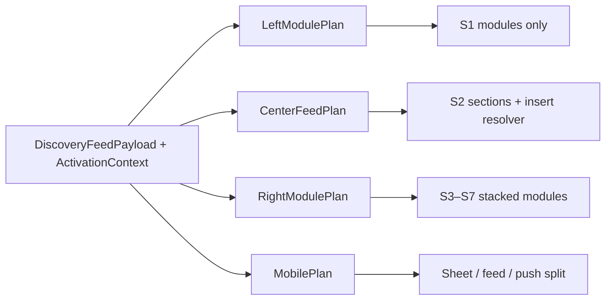

# Surface System Vision

**Phase:** 3D — Architecture only  
**Status:** Specification  
**Last updated:** 2026-07-06  
**Builds on:** Activation 3C, Activity Cards 3B, Discovery 2E, Sponsored 3A-EXT

---

## Problem

HomeCheff today spreads discovery, filters, promos, reputation, and actions across **disconnected surfaces**:

| Today | Issue |
|-------|-------|
| Left column (~280px) | Almost entirely filters — underused for wayfinding |
| Right column (~320px) | Mixed utility, platform promos, pulse — no clear “opportunities” lane |
| Center feed | Organic sections + tiles + competing inserts |
| Mobile | Single column; filter sheet; activity cards after row 4/12/24 |

Users need **one mental model**: where to **browse** (discovery), where to **act** (activation), where to **grow** (partner/community), and what is **paid** (sponsored) — without more endless scroll.

---

## North star

```
Browse (center)  ·  Control (left)  ·  Act & grow (right)  ·  Nudge (feed inserts / push)
```

**Digital → Real World** applies to every surface: right column and activations drive offline outcomes; center feed remains **listing discovery**, not engagement bait.

---

## Surface tiers

| Tier | Role | Examples |
|------|------|----------|
| **S0 — Chrome** | Persistent shell | Nav, layout grid, bottom nav |
| **S1 — Control** | User-driven constraints | Filters, scope, sort, layout toggle |
| **S2 — Discovery** | Organic marketplace content | Section bands, tiles, map (future) |
| **S3 — Activation** | Private contextual actions | Activity cards, sidebar activation stack |
| **S4 — Community** | Social proof & belonging | Pulse, moments, spotlight (editorial) |
| **S5 — Opportunity** | Growth & partner paths | Ambassador, courier, business invite |
| **S6 — Commercial** | Paid inventory | Sponsored placements (labeled) |
| **S7 — Platform** | HomeCheff-owned CTAs | HomePromotion, onboarding, jobs |
| **S8 — Lifecycle** | Post-event surfaces | Order review, message prompts, push |

**Hard rule:** S6 never borrows S2 ranking. S3 never borrows S6 slots. S7 never mimics S3 or S6.

---

## Desktop grid (current → target)

```
┌─────────────────────────────────────────────────────────────────┐
│  Hero (S7) — chip, search CTA, seasonal platform message        │
├──────────────┬──────────────────────────────┬───────────────────┤
│  LEFT 280px  │  CENTER (fluid)              │  RIGHT 320px      │
│  S1 Control  │  S2 Discovery                │  S3–S5 Opportunity│
│              │  + S3 feed activations       │  + S4 Community   │
│              │  + S6 feed sponsored         │  + S6 sponsored   │
│              │  + S7 mobile-style inserts   │  + S7 quick actions│
└──────────────┴──────────────────────────────┴───────────────────┘
```

Sticky columns scroll independently (`hc-home-sticky-grid`); architecture preserves this — **no full-page sidebar takeover**.

---

## Contract slots (feed payload)

Parallel `discovery.futureSlots` — never merged resolvers:

| Slot | Tier | Status |
|------|------|--------|
| `activity_cards` | S3 | 3B enabled |
| `sponsored_placements` | S6 | Architecture only |
| `recommendations` | — | Disabled / out of scope |

Sidebar modules consume **same payload slices** via `SurfaceRouter` — not separate ranking APIs.

---

## Surface router (conceptual, 3E+)



**Resolver order (center feed inserts):**  
`organic sections → platform inserts → activity cards → sponsored → inspiration interleave`

---

## Density & anti-spam (global)

| Cap | Value | Applies |
|-----|-------|---------|
| Activation feed | 2/session, 1 visible | S3 feed |
| Activation sidebar | 3 stacked, collapse at 2 | S3 right |
| Sponsored feed | 3/session | S6 |
| Sponsored sidebar | 3 total (1 hero + 2 compact) | S6 right |
| Community spotlight | 1/week editorial | S4 |
| Partner invite modules | 1 visible per category / 14d | S5 |
| Push (future) | 2/week, opt-in | S8 |

---

## Guest vs logged-in

| Surface | Guest | Logged-in |
|---------|-------|-----------|
| Filters (left) | Yes | Yes |
| Organic feed | Yes | Yes |
| Activity cards | No | Yes |
| Partner / ambassador modules | Teaser only | Full |
| Sponsored sidebar | Max 1 spotlight | Full caps |
| Profile owner activations | N/A | Yes |

---

## What 3D defines vs later phases

| 3D (this doc set) | 3E+ implementation |
|-------------------|---------------------|
| Surface ownership matrix | `SidebarModule` components |
| Left/right philosophy | Refactor `HomeDesktopSidebar` stack |
| Module types & rotation | `SurfaceRouter` lib |
| Mobile mapping | Drawer hosts, notification policy |
| Community growth paths | Partner funnel pages |

**Out of scope 3D:** UI mockups, code, schema, ranking changes, enabling sponsored slot.

---

## References

- [SIDEBAR_ARCHITECTURE.md](./SIDEBAR_ARCHITECTURE.md)
- [MOBILE_SURFACE_ARCHITECTURE.md](./MOBILE_SURFACE_ARCHITECTURE.md)
- [../audits/SURFACE_OWNERSHIP_MATRIX.md](../audits/SURFACE_OWNERSHIP_MATRIX.md)
- [ACTIVATION_SYSTEM_VISION.md](./ACTIVATION_SYSTEM_VISION.md)
- [DISCOVERY_SPONSORED_PLACEMENTS.md](./DISCOVERY_SPONSORED_PLACEMENTS.md)
