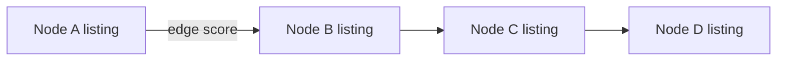

# Exchange Graph Readiness — Audit

**Phase:** 4D  
**Date:** 2026-07-06

---

## Graph model



| Concept | Type | 4D status |
|---------|------|-----------|
| Node | `ExchangeGraphNode` | Implemented |
| Edge | `ExchangeGraphEdge` | Implemented |
| Chain path | `ExchangeChainPath` | Type only |
| Chain finder | `findExchangeChainPaths()` | Returns `[]` |

---

## Node contract

```typescript
{
  id: 'exg-node:{listingId}',
  listingId,
  userId,
  profile: ExchangeListingProfile,
}
```

---

## Edge contract

```typescript
{
  id: 'exg-edge:{from}:{to}',
  fromNodeId, toNodeId,
  fromListingId, toListingId,
  matchType: ExchangeMatchType,
  score: number,
  direction: 'bidirectional' | 'offer_to_want',
}
```

---

## Integrity rules

| Rule | Enforced by |
|------|-------------|
| No duplicate nodes | `validateExchangeGraphIntegrity` |
| No self-loops | `validateExchangeGraphIntegrity` |
| No orphan edges | `validateExchangeGraphIntegrity` |
| Edge deduplication | `dedupeGraphEdges` |
| `chainMatchingEnabled === false` | Graph meta |

---

## Future chains (4F)

| Pattern | Example |
|---------|---------|
| A → B | Repair for herbs |
| A → B → C | Meal → herbs → logo |
| A → B → C → D | Four-party neighborhood loop |

**Cap:** `EXCHANGE_GRAPH_MAX_CHAIN_LENGTH = 4`

**Anti-gaming (planned):**

- No self-loops
- No duplicate listings in path
- No same user twice in chain

---

## Not in 4D

- Cycle detection execution
- Chain scoring
- Settlement routing
- UI chain visualization

---

## Code

`lib/marketplace/exchange/exchange-graph.ts`
