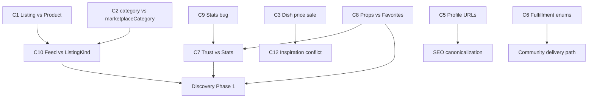

# Marketplace Architecture — Conflict Report

**Version:** V1 (Phase 0)  
**Last updated:** 2026-07-06

Documents conflicts between parallel models, APIs, and UX paths. Each conflict blocks clean Discovery, SEO, or Trust unless resolved.

---

## Conflict severity

| Level | Meaning |
|-------|---------|
| **Critical** | Wrong data or broken UX in production paths |
| **High** | Architectural debt — causes rework if discovery built on it |
| **Medium** | Inconsistency — manageable with documentation |
| **Low** | Cleanup / naming — no immediate user impact |

---

## C1 — Listing vs Product (dual listing models)

| Attribute | Detail |
|-----------|--------|
| **Severity** | **Critical** |
| **Conflict** | `Listing` table vs `Product` table both appear in feed and proposal bindings |
| **Affected systems** | `/api/feed`, `/api/products/[id]`, `Favorite`, `Proposal`, `Reservation` |
| **Evidence** | Feed merges both; product API falls back to Listing CRUD |
| **Migration difficulty** | High — requires data migration + API unification |
| **Resolution** | Phase 1: stop feed merge for new items; migrate Listing → Product; deprecate `Reservation`/`Transaction` listing path; keep `listingId` on Proposal read-only until migrated |

---

## C2 — Product.category vs marketplaceCategory

| Attribute | Detail |
|-----------|--------|
| **Severity** | **High** |
| **Conflict** | Legacy `ProductCategory` (CHEFF/GROWN/DESIGNER) vs `MarketplaceCategory` (CREATE/GROW/DESIGN/SERVICES/KNOWLEDGE) |
| **Affected systems** | Profile Aanbod filters, feed vertical filters, recommendations API, checkout |
| **Evidence** | Profile filters use legacy category; create flow writes both |
| **Migration difficulty** | Medium — derive legacy from V2 for compatibility layer |
| **Resolution** | Discovery reads `marketplaceCategory` + `specializations[]`; legacy `category` is **display/filter alias only** until removed |

---

## C3 — Dish price vs Product sale

| Attribute | Detail |
|-----------|--------|
| **Severity** | **High** |
| **Conflict** | `Dish.priceCents > 0` triggers `isMarketplaceSaleItem()` true |
| **Affected systems** | GeoFeed sale chip, discovery classification |
| **Evidence** | `lib/feed/marketplace-sale.ts` line 87–88 |
| **Migration difficulty** | Low — exclude DISH feedSource from sale heuristic |
| **Resolution** | Inspiration never sale; monetized content must be Product OFFER |

---

## C4 — DeliveryRequest vs DeliveryOrder

| Attribute | Detail |
|-----------|--------|
| **Severity** | **Medium** (documented boundary) |
| **Conflict** | Two delivery execution models with similar names |
| **Affected systems** | Reviews, notifications, ops UI |
| **Evidence** | `DeliveryOrder` → Stripe Order; `DeliveryRequest` → CommunityOrder |
| **Migration difficulty** | Low if naming/docs clear |
| **Resolution** | Rename in UI: "Bezorging (bestelling)" vs "Bezorgopdracht (community)"; never merge tables |

---

## C5 — Seller route vs User route vs Bezorger route

| Attribute | Detail |
|-----------|--------|
| **Severity** | **High** |
| **Conflict** | Three public profile URLs for one identity |
| **Affected systems** | SEO, analytics, discovery links, social sharing |
| **Evidence** | `/user/[username]`, `/seller/[sellerId]`, `/bezorger/[username]` all serve profiles |
| **Migration difficulty** | Medium — redirects + link updates |
| **Resolution** | Canonical `/user/[username]`; 301 legacy routes; update internal links |

---

## C6 — Proposal fulfillment vs CommunityOrder fulfillment

| Attribute | Detail |
|-----------|--------|
| **Severity** | **High** |
| **Conflict** | Proposal: PICKUP/DELIVERY only; CommunityOrder: 5 modes including DIGITAL, on-site |
| **Affected systems** | Service/workshop/digital deals, delivery request creation |
| **Evidence** | `ProposalFulfillmentType` vs `CommunityOrderFulfillmentMode` enums |
| **Migration difficulty** | Medium — extend proposal enum or map at accept time |
| **Resolution** | Align enums at agreement acceptance; map listing `fulfillmentOptions` → proposal → CO |

---

## C7 — Trust summary vs Stats API

| Attribute | Detail |
|-----------|--------|
| **Severity** | **Critical** |
| **Conflict** | Two profile rating sources with different blending rules |
| **Affected systems** | Profile V2, UserStatsTile, trust block |
| **Evidence** | `getProfileTrustSummary()` blends 3 channels; stats API blends ProductReview + DishReview |
| **Migration difficulty** | Medium — unify API contract |
| **Resolution** | Single trust API with split channels; stats API for social counts only; remove DishReview from rating average |

---

## C8 — Props vs Favorites (products)

| Attribute | Detail |
|-----------|--------|
| **Severity** | **Critical** |
| **Conflict** | Two UX actions write same `Favorite` row on products |
| **Affected systems** | Discovery engagement rank, stats, product detail |
| **Evidence** | `PropsButton` + `FavoriteButton` on `ProductSaleCommerceZone`; `/api/props/toggle` uses Favorite |
| **Migration difficulty** | Low — remove Props from products; keep Props on WorkspaceContent |
| **Resolution** | Products: Favoriet only; Workspace: Props only; merge counts in discovery |

---

## C9 — Stats API favorites query bug

| Attribute | Detail |
|-----------|--------|
| **Severity** | **High** |
| **Conflict** | `totalFavorites` uses `listingId: { in: dishIds }` instead of `dishId` |
| **Affected systems** | UserStatsTile, profile social proof |
| **Evidence** | `app/api/user/[userId]/stats/route.ts` ~87 |
| **Migration difficulty** | Low — one-line fix (future phase) |
| **Resolution** | Fix field; dedupe with totalProps |

---

## C10 — Feed taxonomy vs ListingKind

| Attribute | Detail |
|-----------|--------|
| **Severity** | **High** |
| **Conflict** | `FeedKind` includes SERVICE/TASK but derivation never assigns them |
| **Affected systems** | Feed chips, href resolver, future discovery sections |
| **Evidence** | `deriveFeedTaxonomy()` → PRODUCT for all offers |
| **Migration difficulty** | Medium — add ListingKind layer |
| **Resolution** | Implement `deriveListingKind`; map to FeedKind; extend filter registry |

---

## C11 — subcategory vs specializations[]

| Attribute | Detail |
|-----------|--------|
| **Severity** | **Medium** |
| **Conflict** | Legacy `subcategory` string vs canonical `specializations[]` taxonomy ids |
| **Affected systems** | Search, badges, matching |
| **Evidence** | Both on Product; form-config falls back to subcategory |
| **Migration difficulty** | Low — normalize on read |
| **Resolution** | `specializations[]` canonical; subcategory deprecated |

---

## C12 — FeedKind INSPIRATION vs priced Dish in sale pool

| Attribute | Detail |
|-----------|--------|
| **Severity** | **High** |
| **Conflict** | Same as C3 — taxonomy says INSPIRATION but sale heuristic overrides |
| **Affected systems** | GeoFeed chips |
| **Resolution** | See C3 |

---

## C13 — CommunityOrder.checkoutOrderId vs direct checkout

| Attribute | Detail |
|-----------|--------|
| **Severity** | **Medium** |
| **Conflict** | Two payment paths to Order — direct product checkout vs proposal-linked |
| **Affected systems** | Deal UX, review eligibility, stock |
| **Evidence** | `proposal-accept-routing.ts`, `deal-ux-state.ts` |
| **Migration difficulty** | Medium — document when each path applies |
| **Resolution** | ProductReview only from direct Order or linked checkoutOrderId; DealReview for community terms |

---

## C14 — HCP / badges vs trust

| Attribute | Detail |
|-----------|--------|
| **Severity** | **Medium** |
| **Conflict** | Gamification visible on profile alongside trust |
| **Affected systems** | Discovery rank (if leaked), profile Overview |
| **Resolution** | HCP never in trust or discovery rank — engagement badge only |

---

## C15 — Smart recommendations vs GeoFeed

| Attribute | Detail |
|-----------|--------|
| **Severity** | **Low** |
| **Conflict** | Parallel discovery systems — one orphaned |
| **Affected systems** | Recommendations component unused in app |
| **Resolution** | P2: wire to Discovery Phase 1 section registry or deprecate |

---

## Conflict dependency graph

---

## Resolution priority order

1. **C8, C9, C7** — social/trust signal integrity (P0)
2. **C10, C2, P0-2 ListingKind** — discovery classification (P0)
3. **C3, C12** — inspiration boundary (P0)
4. **C1** — listing model unification (P0 decision, P1 execution)
5. **C5** — profile URL redirects (P1)
6. **C6** — fulfillment alignment (P1)
7. **C4, C13, C14, C15** — documentation and cleanup (P1–P2)

---

## Related documents

- [marketplace-entity-validation.md](./marketplace-entity-validation.md)
- [DISCOVERY_PREREQUISITES.md](../discovery/DISCOVERY_PREREQUISITES.md)
- [ADR-MARKETPLACE-FOUNDATION-V1.md](../decision-records/ADR-MARKETPLACE-FOUNDATION-V1.md)
