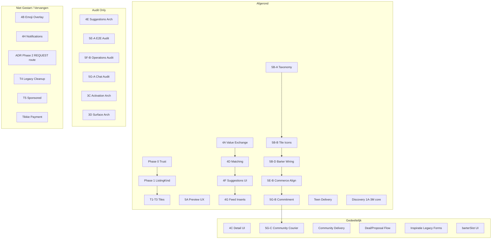

# Marketplace & Delivery Roadmap Reconciliation Audit

**Date:** 2026-07-07  
**Scope:** Read-only reconciliation — geen code, geen wijzigingen.  
**Doel:** 100% zekerheid over de werkelijke projectstatus vóór nieuwe Marketplace-, Delivery- of Commerce-fases.

**Methode:** Cross-check van `docs/progress/`, `docs/audits/`, `docs/architecture/`, `docs/decision-records/`, en implementatiebestanden in `lib/`, `components/`, `app/api/`.

**Workspace-snapshot:** Git working tree bevat **on-gecommit** community-delivery wiring (Phase 5G-C) en diverse marketplace-wijzigingen — zie §2.2 en §9.

---

## Executive summary

HomeCheff heeft **twee parallelle werelden** die de roadmap-ambiguïteit verklaren:

| Wereld | Status | Kern |
|--------|--------|------|
| **Discovery & presentation** | Grotendeels gebouwd | Tiles T1–T3, preview 5A, taxonomy 5B-A, exchange 4A–4G |
| **Contracts & architecture** | Veel afgerond | ListingKind, value exchange, detail contracts, matching, suggestions |
| **Commerce & operations** | Gedeeltelijk coherent | Proposal/deal stack werkt; Stripe-pad productie-klaar; community operations fragmentarisch |
| **Delivery** | Twee stacks | Teen/platform ✅ · Community ⚠️ (backend + chat; courier UI on-gecommit) |

**Belangrijkste reconciliatie:** Meerdere progress-docs zijn **verouderd** ten opzichte van latere audits/implementaties. Vooral `MARKETPLACE_TILE_PHASE_T1_T2.md`, `MARKETPLACE_PHASE5B_A_TAXONOMY_CONSOLIDATION.md` (conclusie), en `MARKETPLACE_CHAT_DEAL_DELIVERY_COMMITMENT_AUDIT.md` (pre-5G-B/5G-C gaps).

---

## 1. Marketplace fase-overzicht

### 1.1 Foundation & ADR

| Fase | Oorspronkelijk doel | Status | Bewijs |
|------|---------------------|--------|--------|
| **ADR Marketplace Foundation V1** | Canoniek listing-model: `Product` = listing, `deriveListingKind()`, trust split, commerce paden | **Gedeeltelijk** — ADR nog *Proposed*; Phase 0–1 geïmplementeerd | `docs/decision-records/ADR-MARKETPLACE-FOUNDATION-V1.md`; `docs/progress/TRUST_STABILIZATION_PHASE0.md` ✅; `docs/progress/LISTINGKIND_FOUNDATION_PHASE1.md` ✅ |
| **ADR Phase 2** — REQUEST route `/request/[slug]` | Eigen route voor verzoeken | **Niet gestart** | ADR §implementation phases; alle kinds nog via `/product/[id]` |
| **ADR Phase 3–4** — Workshop capacity, service availability | Per-kind fulfillment velden | **Niet gestart** | ADR only |
| **ADR Phase 5–6** — Discovery integratie, SEO landing | Volledige discovery + SEO | **Gedeeltelijk** — discovery tiles/exchange wel; SEO automation niet | Discovery progress docs; geen SEO automation code |
| **Ecosystem V3** — Feed taxonomy 5D | `direction × kind × category × exchange` | **Vervangen / deels** — ListingKind + taxonomy dekt deel; volledige feed-taxonomie niet | `docs/HOMECHEFF_ECOSYSTEM_V3.md`; `docs/HOMECHEFF_FEED_TAXONOMY.md` |

### 1.2 Trust & ListingKind

| Fase | Doel | Status | Bewijs |
|------|------|--------|--------|
| **Phase 0** — Trust Stabilization | Favoriet vs Prop, trust split, stats cleanup, badge priority | **Afgerond** (minor legacy strings) | `docs/progress/TRUST_STABILIZATION_PHASE0.md`; `lib/trust/`, `lib/profile/compute-user-public-stats.ts` |
| **Phase 1** — ListingKind Foundation | `deriveListingKind()`, feed classification, profile filters | **Afgerond** | `docs/progress/LISTINGKIND_FOUNDATION_PHASE1.md`; `lib/marketplace/contracts/derive-listing-kind.ts`; `/api/feed` |

### 1.3 Surface audit (pre-tile)

| Fase | Doel | Status | Bewijs |
|------|------|--------|--------|
| **Surface Audit** | Presentation matrix, variant matrix, card rules | **Afgerond (audit only)** | `docs/progress/MARKETPLACE_SURFACE_AUDIT.md`; `docs/audits/MARKETPLACE_PRESENTATION_MATRIX.md` |

### 1.4 Tile system (T1–T3, 5A)

| Fase | Doel | Status | Bewijs |
|------|------|--------|--------|
| **T1** — Feed tiles Compact/Standard | Presentation-layer tiles in feed | **Afgerond** | `docs/progress/MARKETPLACE_TILE_T1.md`; `components/marketplace/tiles/`; `FeedMarketplaceCard.tsx` |
| **T2** — Mini + profile integration | Mini tile, profile grid, favorites | **Afgerond** | `docs/progress/MARKETPLACE_TILE_T2.md`; `ProfilePublicAanbodTileGrid.tsx` |
| **T3** — Preview layer | Hover/long-press secondary info | **Afgerond** | `docs/progress/MARKETPLACE_TILE_T3.md`; `components/marketplace/previews/` |
| **T1–T2 umbrella** | Planning doc T1+T2 | **Vervangen / verouderd** | `docs/progress/MARKETPLACE_TILE_PHASE_T1_T2.md` zegt "not started"; T1/T2 docs zeggen Complete |
| **T4** — Legacy card removal | Inspiratie hub, verwijder stubs | **Niet gestart** | Genoemd in T2 doc |
| **T5** — Sponsored sidebar mount | `MarketplaceTileSidebar` in feed | **Niet gestart** | T2 doc deferred |
| **5A** — Preview UX refinements | Langere delays, info button, scroll protection | **Afgerond** | `docs/progress/MARKETPLACE_PREVIEW_UX_PHASE5A.md`; `preview-state-manager.ts` |

### 1.5 Exchange roadmap (4A–4H)

| Fase | Doel | Status | Bewijs |
|------|------|--------|--------|
| **4A** — Value Exchange System | Canonieke payment/barter/accepted-values contracts | **Afgerond (contracts)** | `docs/progress/MARKETPLACE_VALUE_EXCHANGE_PHASE4A.md`; `lib/marketplace/value-exchange/` |
| **4B** — Tile icon wiring (`resolveSurfaceIconPlan`) | Emoji overlay tier policy op tiles | **Vervangen** door 5B-B Lucide pad | Geen progress doc; 4A noemt 4B; `docs/audits/MARKETPLACE_TILE_ICON_WIRING_AUDIT.md` |
| **4C** — Detail Page System | Per-kind detail contracts, section order | **Gedeeltelijk** — contracts ✅, UI wiring ⚠️ | `docs/progress/MARKETPLACE_DETAIL_PHASE4C.md`; `lib/marketplace/detail/`; `docs/audits/MARKETPLACE_DETAIL_AUDIT.md` |
| **4D** — Exchange Matching | Match types, score model, graph | **Afgerond (contracts)** | `docs/progress/MARKETPLACE_EXCHANGE_PHASE4D.md`; `lib/marketplace/exchange/` |
| **4E** — Suggestions Architecture | Surface matrix, anti-gaming | **Afgerond (docs only)** | `docs/progress/MARKETPLACE_EXCHANGE_PHASE4E.md`; `docs/architecture/MARKETPLACE_EXCHANGE_SUGGESTIONS.md` |
| **4F** — Suggestions UI | Detail/profile/sidebar read-only modules | **Afgerond** | `docs/progress/MARKETPLACE_EXCHANGE_PHASE4F.md`; `components/marketplace/exchange-suggestions/` |
| **4G** — Feed inserts + mobile | Feed interleave, mobile module, caps, analytics | **Afgerond** | `docs/progress/MARKETPLACE_EXCHANGE_PHASE4G.md`; `GeoFeed.tsx`, `useExchangeFeedInsertCards.ts` |
| **4H** — Notifications + multi-step chains | Push/in-app exchange alerts, chain matching | **Niet gestart** | `docs/audits/EXCHANGE_NOTIFICATION_READINESS.md`; `chainMatchingEnabled: false` |

### 1.6 Taxonomy & commerce alignment (5B–5G)

| Fase | Doel | Status | Bewijs |
|------|------|--------|--------|
| **5B-A** — Taxonomy Consolidation | Eén registry, legacy map, edit flow unified | **Afgerond** | `docs/progress/MARKETPLACE_PHASE5B_A_TAXONOMY_CONSOLIDATION.md`; 845/845 checks |
| **5B-B** — Tile icon wiring | Lucide taxonomy icons op tile badges | **Afgerond** (audit only, geen progress doc) | `docs/audits/MARKETPLACE_TILE_ICON_WIRING_AUDIT.md`; `resolve-tile-badge-icon.ts` |
| **5B-C** — Barter openness coverage audit | Inventarisatie bestaande velden | **Afgerond (audit only)** | `docs/audits/MARKETPLACE_BARTER_OPENNESS_EXISTING_COVERAGE_AUDIT.md` |
| **5B-D** — Barter openness wiring | `BarterOpennessSelector`, forms, detail | **Afgerond** | `docs/audits/MARKETPLACE_BARTER_OPENNESS_WIRING_AUDIT.md`; `BarterOpennessSelector.tsx` |
| **5E-A** — E2E exchange transaction audit | Keten listing→checkout inventarisatie | **Afgerond (audit only)** | `docs/audits/MARKETPLACE_END_TO_END_EXCHANGE_TRANSACTION_AUDIT.md` |
| **5E-B** — Commerce alignment | Barter gates, settlement validation, checkout wiring | **Afgerond** | `docs/audits/MARKETPLACE_EXCHANGE_COMMERCE_ALIGNMENT_AUDIT.md`; `barter-commerce-alignment.ts` |
| **5E-F** — MONEY_AND_BARTER mobile audit | Sticky vs proposal asymmetrie | **Afgerond (audit only)** | `docs/audits/MARKETPLACE_MONEY_AND_BARTER_MOBILE_CHOICE_AUDIT.md` |
| **5E-G** — Exchange funnel analytics | GA4 events op exchange surfaces | **Afgerond** | `docs/audits/MARKETPLACE_EXCHANGE_FUNNEL_ANALYTICS_AUDIT.md` |
| **5F-B** — Operations audit | Order vs CommunityOrder, delivery stacks, affiliate | **Afgerond (audit only)** | `docs/audits/MARKETPLACE_OPERATIONS_FULFILLMENT_DELIVERY_AFFILIATE_SUBSCRIPTION_AUDIT.md` |
| **5G-A** — Chat/deal/delivery audit | Gap analyse commitment + courier UI | **Afgerond (audit only)** | `docs/audits/MARKETPLACE_CHAT_DEAL_DELIVERY_COMMITMENT_AUDIT.md` |
| **5G-B** — Deal commitment & payment trust | Checkbox, server guard, risk copy | **Afgerond** | `docs/audits/MARKETPLACE_DEAL_COMMITMENT_PAYMENT_TRUST_AUDIT.md`; `ProposalCard.tsx`, `DealCard.tsx` |
| **5G-C** — Community courier MVP | List API, dashboard tab, claim flow | **Gedeeltelijk — on-gecommit** | Zie §2; `CommunityDeliveryPanel.tsx`, `claim/route.ts` (untracked) |

### 1.7 Discovery phases (marketplace-gerelateerd)

| Fase | Doel | Status | Bewijs |
|------|------|--------|--------|
| **1A** Search | ListingKind filters, REQUEST search | **Afgerond** | `docs/progress/DISCOVERY_SEARCH_PHASE1A.md`; `lib/search/` |
| **1B** Read model | Discovery read model contracts | **Afgerond** | `docs/progress/DISCOVERY_READ_MODEL_PHASE1B.md` |
| **1C** Consumer | Consumer contracts | **Afgerond** | `docs/progress/DISCOVERY_CONSUMER_PHASE1C.md` |
| **2A–2E** Trust/ranking/sections/feed | Ranking engine foundation, feed contract | **Gedeeltelijk** — engine ✅, geen volledige API rollout | `DISCOVERY_TRUST_RANKING_PHASE2A.md` (spec); `DISCOVERY_RANKING_PHASE2C.md` (foundation); `DISCOVERY_FEED_PHASE2E.md` ✅ |
| **3A** Activity cards architecture | Taxonomy + trigger matrix | **Afgerond (architecture)** | `DISCOVERY_ACTIVITY_CARDS_PHASE3A.md` |
| **3B** Activity cards implementation | Feed inserts, eligibility | **Afgerond** | `DISCOVERY_ACTIVITY_CARDS_PHASE3B.md`; `components/discovery/activity-cards/` |
| **3C** Activation system | 100 activations, viral concepts | **Afgerond (architecture only)** | `DISCOVERY_ACTIVATION_PHASE3C.md` |
| **3D** Surface architecture | Sidebar/mobile surface design | **Afgerond (architecture only)** | `DISCOVERY_SURFACE_PHASE3D.md` |
| **3E–3F** Surface implementation | Sidebar stack, mobile surfaces | **Afgerond** | `DISCOVERY_SURFACE_PHASE3E.md`, `DISCOVERY_SURFACE_PHASE3F.md` ✅ |
| **3G** Real-world activations | Activation engine wiring | **Afgerond** | `DISCOVERY_ACTIVATION_PHASE3G.md` ✅ |
| **3H–3M** HCP, community, opportunities, growth | Opportunity economy, HCP, growth surfaces | **Afgerond** | `DISCOVERY_HCP_PHASE3K.md` t/m `DISCOVERY_GROWTH_SURFACES_PHASE3M.md` ✅ |

---

## 2. Delivery fase-overzicht

### 2.1 Twee delivery stacks

| Stack | Model | Status | Bewijs |
|-------|-------|--------|--------|
| **Teen / platform (5A)** | `DeliveryOrder` + Stripe `Order` | **Gebouwd — productie-klaar** | `docs/HOMECHEFF_DELIVERY_FOUNDATION.md`; `DeliveryDashboard.tsx`; `/api/delivery/dashboard` |
| **Community (5B+)** | `DeliveryRequest` + `CourierAssignment` + `CommunityOrder` | **Gedeeltelijk** | `lib/delivery/delivery-request-service.ts`; `lib/delivery/DELIVERY_MARKETPLACE_V1.md` |

### 2.2 Per onderdeel

| Onderdeel | Status | Bewijs | Ontbrekend |
|-----------|--------|--------|------------|
| **Community Delivery** | **Gedeeltelijk** | Service layer compleet; auto-create bij accept (`proposal-service.ts`); notifications (`notify-delivery-request.ts`) | Geen fees/payouts; geen seller/buyer dashboard view; adressen alleen uit profiel |
| **Courier Dashboard** | **Gebouwd (teen)** / **Gedeeltelijk (community)** | `app/delivery/dashboard/page.tsx`; teen accept/status/earnings werkt | Community tab + panel **on-gecommit** (`CommunityDeliveryPanel.tsx`); GPS tracking UI; roster matching ongebruikt |
| **Delivery Requests** | **Gebouwd** | Create API `POST /api/community-orders/[id]/delivery-request`; auto-create; `DealCard` CTA | Geen lijst voor partijen buiten chat |
| **Assignments** | **Gedeeltelijk** | APIs: assign, accept, complete, claim; FSM in service | Party-assign API **zonder UI**; `DelivererSelector.tsx` **zero imports**; community geen PICKED_UP/IN_TRANSIT stappen |
| **DealCard Delivery** | **Gebouwd** | `deal-ux-state.ts` CTAs; request/status/courier name; inline details | Geen dedicated delivery page; status niet op `/profile/deals` |
| **Community Courier MVP (5G-C)** | **Gedeeltelijk — on-gecommit** | `GET /api/delivery/community-requests`; `POST .../claim`; `CommunityDeliveryPanel`; validator script | Niet op main; geen CI validator; geen earnings; geen GA4 events |

### 2.3 On-gecommit werk (git snapshot 2026-07-07)

```
?? app/api/delivery-requests/[id]/claim/route.ts
?? app/api/delivery/community-requests/route.ts
?? components/delivery/CommunityDeliveryPanel.tsx
?? scripts/validate-community-delivery-wiring.ts
 M components/delivery/DeliveryDashboard.tsx
 M lib/delivery/delivery-request-service.ts
```

**Conclusie delivery:** Backend + chat-pad zijn **af**; operationele courier-ervaring is **bijna af** maar nog **niet vastgelegd op Git**. Audits die "geen courier UI" melden zijn **deels verouderd**.

---

## 3. Exchange roadmap (4A–4H) — detail

| Fase | Status | Documentatie | Implementatie | Ontbrekend |
|------|--------|--------------|---------------|------------|
| **4A** Value Exchange | ✅ Contracts | Progress + audit | `lib/marketplace/value-exchange/` (7 modules) | `resolveSurfaceIconPlan` niet op tiles (bewust → 5B-B) |
| **4B** Tile icons (origineel) | ⚠️ Vervangen | Alleen referenties | 5B-B Lucide pad i.p.v. emoji overlay | Dedicated progress doc; emoji overlay rij |
| **4C** Detail | ⚠️ Gedeeltelijk | Progress ✅ | Contracts ✅; `ProductValueExchangeSection` op product page | Per-kind routes; `DETAIL_SECTION_IDS` order; unified trust block |
| **4D** Matching | ✅ Contracts | Progress ✅ | `lib/marketplace/exchange/` (9 modules) | UI (by design); chain execution → 4H |
| **4E** Suggestions arch | ✅ Docs | Progress + architecture | Geen code (intentional) | Preview teaser nog open |
| **4F** Suggestions UI | ✅ | Progress ✅ | Detail/profile/sidebar modules + API | Tiles/feed waren 4G scope |
| **4G** Feed + mobile | ✅ | Progress ✅ | Feed insert elke 20e sale row; mobile module; caps; GA4 | Notifications; ranking |
| **4H** Notifications + chains | ❌ | Readiness audit only | `FUTURE_EXCHANGE_SUGGESTION_TYPES`; `chainMatchingEnabled: false` | Volledige fase |

---

## 4. Tile Redesign readiness

| Element | Status | Bewijs |
|---------|--------|--------|
| **Categoriebadge (aanbod)** | **Gebouwd** | `resolve-tile-badge-icon.ts` → `TileBadgeRow` op alle varianten |
| **Accepted value iconen** | **Gedeeltelijk** | Alleen **Standard** variant toont `accepted_value` badges met Lucide icons |
| **Micro trust row** | **Gebouwd** | `TileTrustCue.tsx` + `build-tile-trust-cue.ts` op Compact/Standard |
| **Value exchange rij (`barterSlot`)** | **Audit only / data only** | `BuildTileBadgesResult.barterSlot.reserved: true` — **niet gerenderd** |
| **Category overlays (emoji tier)** | **Ontbreekt** | `resolveSurfaceIconPlan` bestaat maar niet wired naar tiles |
| **Tile icon wiring** | **Gebouwd (5B-B)** | `build-tile-badges.ts` Phase 5B-B; validator in `validate-marketplace-tile-system.ts` |

**Doc drift:** `MARKETPLACE_PHASE5B_A_TAXONOMY_CONSOLIDATION.md` §conclusie zegt "Tile UI iconen: Nee" — **onjuist** na 5B-B implementatie. Zie `MARKETPLACE_TILE_ICON_WIRING_AUDIT.md`.

**Nog open voor volledige tile redesign:**
- `barterSlot` UI rij (dedicated value-exchange strip)
- Accepted values op Compact/Mini varianten
- Main-category emoji overlay (optioneel, 4A origineel plan)
- Inspiratie tiles: legacy `inspirationCategoryLabel` strings

---

## 5. Taxonomy status

| Vraag | Antwoord |
|-------|----------|
| **Taxonomy Consolidation uitgevoerd?** | **Ja** — Phase 5B-A Complete (2026-07-07) |
| **Alleen audit?** | Nee — 845/845 consolidation checks + code |
| **Deels uitgevoerd?** | Legacy paden blijven voor inspiratie |

### Per component

| Component | Status | Bewijs |
|-----------|--------|--------|
| **Registry** | ✅ 96 selecteerbare items, 106 totaal | `lib/marketplace/taxonomy.ts` |
| **Legacy forms** | ⚠️ Gedeeltelijk | `Compact*Form` nog voor `platform === 'inspiratie'` en `useMarketplaceV2 === false` |
| **MarketplaceEntryFlow** | ✅ Dorpsplein create | `components/products/marketplace/MarketplaceEntryFlow.tsx` |
| **MarketplaceOfferForm** | ✅ Dorpsplein edit + create | `TaxonomySpecializationPicker`, `BarterOpennessSelector`, `AcceptedValuesPicker` |
| **AcceptedValuesPicker** | ✅ 96 canonical ids | Gebruikt in form + `CreateProposalSheet` |
| **Exchange matching** | ✅ Auto-includes new taxonomy ids | 4D/4F/4G generieke overlap |
| **Legacy map** | ✅ | `lib/marketplace/legacy-subcategory-map.ts` |

---

## 6. Deal & Proposal Flow

| Onderdeel | Status | Bewijs |
|-----------|--------|--------|
| **Voorstelkaart (`ProposalCard`)** | **Volledig** | Create, pending, accept/reject/counter/cancel |
| **Proposal lifecycle** | **Volledig** | `PENDING` → `ACCEPTED`/`REJECTED`/`COUNTERED`/`CANCELLED` |
| **Accepteren/weigeren** | **Volledig** | APIs + UI; commitment checkbox (5G-B) |
| **Chat deal status (`DealCard`)** | **Volledig** | Post-accept CTAs via `deal-ux-state.ts` |
| **Orderbevestiging in chat** | **Gedeeltelijk** | `CommunityOrder` + payment status voor HomeCheff; geen Stripe status in chat voor parallel `Order` pad |
| **Delivery status in chat** | **Gedeeltelijk** | Request + status line + courier name; inline details only |
| **Payment status in chat** | **Gedeeltelijk** | `HOMECHEFF_CHECKOUT` unpaid CTA; `DIRECT_CONTACT` risk copy; geen structured off-platform confirmation |

### Gaps

| Gap | Severity |
|-----|----------|
| Counter-proposal is money-only (geen taxonomy/settlement edit) | P1 |
| Geen E2E validator proposal→deal→checkout | P1 |
| SERVICE/REQUEST chats: geen product prefill in proposal sheet | P1 |
| Exchange suggestions → geen direct "open proposal" CTA | P1 |

---

## 7. Community Economy

| Onderdeel | Status | Dekking |
|-----------|--------|---------|
| **Buurthulp** | **Gedeeltelijk** | Discovery surfaces (`COMMUNITY_HELPER` opportunity type, 8 variants); **geen** transaction/proposal integratie |
| **Diensten** | **Gedeeltelijk** | `ListingKind: SERVICE` via taxonomy; detail CTA `request_proposal`; geen aparte diensten-hub |
| **Verzoeken** | **Gedeeltelijk** | `ListingKind: REQUEST`; search intent; geen `/request/[slug]` route; geen Gezocht-sectie |
| **Community delivery** | **Gedeeltelijk** | Backend + chat; courier UI on-gecommit |
| **Vrijwillige bijdrage** | **Gedeeltelijk** | `VOLUNTARY` settlement + `VOLUNTARY_CONTRIBUTION` in registry; geen collection mechanisme |
| **Community settlements** | **Gedeeltelijk** | Agreement snapshot + `MARK_COMPLETE`; geen barter settlement engine |

**Buurthulp CTA** landt op generiek `/?chip=sale` — niet op gefilterde REQUEST listings (`community-helper-variants.ts`).

---

## 8. Payment Ecosystem

| Methode | Status | Code mapping |
|---------|--------|--------------|
| **Stripe / HomeCheff** | **Ondersteund** | `HOMECHEFF_CHECKOUT`; `acceptHomeCheffPayment`; webhook → `checkoutOrderId` |
| **Cash** | **Gedeeltelijk** | Geen apart cash enum — valt onder `DIRECT_CONTACT` / `acceptDirectContact` |
| **Tikkie/verzoek** | **Niet ondersteund** | Zero matches in codebase |
| **Handmatige betaling** | **Gedeeltelijk** | `DIRECT_CONTACT` — off-platform, geen proof/escrow |
| **Exchange-only deals** | **Ondersteund** | `VALUE_ONLY` settlement + `BARTER_ONLY` openness; cart/checkout geblokkeerd (5E-B) |
| **Hybride deals** | **Ondersteund** | `MONEY_AND_VALUE` + `MONEY_AND_BARTER`; checkout voor geldleg, proposal voor value leg |

**Drie registries (niet verwarren):**
1. Listing value-exchange: `PAYMENT_METHOD_REGISTRY` (`payment-methods.ts`)
2. Listing checkout flags: `PaymentMethodCheckboxes.tsx` (Stripe vs direct)
3. Proposal payment path: `HOMECHEFF_CHECKOUT` | `DIRECT_CONTACT` | `NONE`

---

## 9. Open P0 / P1 / P2 Gaps

### P0 — Blokkades voor verdere marketplace-uitrol

| # | Gap | Status | Bewijs |
|---|-----|--------|--------|
| P0-1 | `BARTER_ONLY` → cart/checkout leak | **✅ Opgelost (5E-B)** | `barter-commerce-alignment.ts`; `useCart.ts` gate |
| P0-2 | Geen courier UI voor community delivery | **⚠️ Gedeeltelijk opgelost — on-gecommit** | 5G-C files in working tree; niet op main |
| P0-3 | Geen commitment op accept | **✅ Opgelost (5G-B)** | `MARKETPLACE_DEAL_COMMITMENT_PAYMENT_TRUST_AUDIT.md` |
| P0-4 | ADR Marketplace Foundation niet signed-off | **Open** | ADR status: *Proposed* — governance risico, geen code blocker |

**Actuele P0 voor uitrol:** Commit + deploy 5G-C community courier wiring; ADR sign-off.

### P1 — Belangrijke verbeteringen

| # | Gap | Bewijs |
|---|-----|--------|
| P1-1 | Community delivery niet op `/profile/deals` | `app/api/profile/deals/route.ts` — geen delivery fields |
| P1-2 | `DelivererSelector` unwired — geen courier pre-select | `components/checkout/DelivererSelector.tsx` — zero imports |
| P1-3 | Counter-proposal barter UX (alleen €) | `ProposalCard.tsx` counter UI |
| P1-4 | Geen E2E validator proposal→checkout chain | 5E-A TG7; validators bestaan per onderdeel |
| P1-5 | Buurthulp → geen gesloten transactielus | `COMMUNITY_HELPER_EXPANSION.md` §Boundaries |
| P1-6 | `DIRECT_CONTACT` geen settlement confirmation | `deal-ux-state.ts` — risk copy only |
| P1-7 | Detail page niet unified (4C contracts vs legacy page) | `MARKETPLACE_DETAIL_AUDIT.md` |
| P1-8 | `/request/[slug]` route ontbreekt | ADR Phase 2 |
| P1-9 | Exchange suggestions → geen proposal CTA | 5E-A §7–8 |
| P1-10 | Parallel order views (`/orders` vs `/profile/deals`) | 5F-B §2 |

### P2 — Latere optimalisaties

| # | Gap |
|---|-----|
| P2-1 | `barterSlot` tile UI rij |
| P2-2 | Preview exchange teaser (4E surface rule) |
| P2-3 | 4H notifications + multi-step chains |
| P2-4 | Inspiratie → taxonomy picker (legacy Compact*Form) |
| P2-5 | T4 legacy card removal, T5 sponsored sidebar |
| P2-6 | Community delivery payouts/fees |
| P2-7 | Subscription tier limits enforcement (`lib/pricing.ts` marketing only) |
| P2-8 | Affiliate payout crons scheduling |
| P2-9 | `COMMUNITY_ORDER_V2.md` stale vs webhook fix |
| P2-10 | Doc hygiene: verouderde progress conclusions bijwerken |

---

## 10. Wat daadwerkelijk gebouwd is

### Volledig operationeel

- Trust stabilization (Phase 0) + ListingKind (Phase 1)
- Marketplace tile system T1–T3 + preview UX 5A
- Taxonomy consolidation 5B-A + tile icon wiring 5B-B + barter openness 5B-D
- Value exchange contracts 4A + matching 4D + suggestions 4F + feed/mobile 4G
- Discovery: search 1A, read model 1B, feed 2E, activity cards 3B, surfaces 3E–3F, activations 3G, opportunities 3I–3M
- Proposal/deal stack: create, accept, reject, counter, cancel, commitment 5G-B
- Commerce alignment 5E-B: barter gates, settlement validation, community order checkout
- Teen/platform delivery end-to-end
- Stripe checkout + webhook + seller dashboard voor `Order`

### Gebouwd maar fragmentarisch / niet gecommit

- Community courier dashboard tab + claim API (5G-C) — **working tree only**
- Party-assign delivery API — backend only, no UI

### Alleen contracts / architecture (geen volledige UI)

- Detail page system 4C
- Exchange suggestions architecture 4E
- Activation system 3C, surface architecture 3D
- ADR phases 2–6

---

## 11. Wat alleen geaudit is

| Audit | Fase | Opgevolgd door implementatie? |
|-------|------|-------------------------------|
| `MARKETPLACE_SURFACE_AUDIT` | Pre-tile | ✅ T1–T3 |
| `MARKETPLACE_VALUE_EXCHANGE_DATA_AUDIT` | Pre-5B | ✅ 5B-A |
| `MARKETPLACE_TAXONOMY_COVERAGE_AUDIT` | Pre-5B-A | ✅ 5B-A |
| `MARKETPLACE_END_TO_END_EXCHANGE_TRANSACTION_AUDIT` | 5E-A | ✅ 5E-B |
| `MARKETPLACE_EXCHANGE_COMMERCE_ALIGNMENT_AUDIT` | 5E-B record | ✅ implemented |
| `MARKETPLACE_OPERATIONS_FULFILLMENT_DELIVERY_AFFILIATE_SUBSCRIPTION_AUDIT` | 5F-B | ⚠️ partial (5G-C in progress) |
| `MARKETPLACE_CHAT_DEAL_DELIVERY_COMMITMENT_AUDIT` | 5G-A | ✅ 5G-B done; 5G-C partial |
| `MARKETPLACE_DEAL_COMMITMENT_PAYMENT_TRUST_AUDIT` | 5G-B | ✅ implemented |
| `MARKETPLACE_MONEY_AND_BARTER_MOBILE_CHOICE_AUDIT` | 5E-F | ❌ no implementation (intentional asymmetry) |
| `EXCHANGE_NOTIFICATION_READINESS` | 4H prep | ❌ not started |
| `MARKETPLACE_DETAIL_AUDIT` | 4C gaps | ❌ not fully addressed |

---

## 12. Wat overgeslagen of vervangen is

| Item | Wat gebeurde |
|------|--------------|
| **4B origineel** (`resolveSurfaceIconPlan` op tiles) | Vervangen door 5B-B Lucide badge pad |
| **Feature flag `NEXT_PUBLIC_MARKETPLACE_TILES_V1`** | Genoemd in planning; tiles always-on |
| **`MARKETPLACE_TILE_PHASE_T1_T2.md`** | Umbrella doc niet bijgewerkt na T1/T2 implementatie |
| **REQUEST route `/request/[slug]`** | Bewust uitgesteld; tijdelijk `/product/[slug]` |
| **Ecosystem V3 volledige feed taxonomy (5D)** | Deels gedekt door ListingKind + taxonomy; dedicated 5D niet uitgevoerd |
| **Tikkie als betaalmethode** | Nooit gepland in code; alles off-platform = `DIRECT_CONTACT` |
| **Barter settlement engine** | Bewust MVP: handmatig `MARK_COMPLETE` |
| **Community delivery fees** | Uitgesloten in V1 doc |
| **Activity cards 3C / Surface 3D** | Architecture-only; latere fases (3E–3G) implementeerden subsets |

---

## 13. Eerstvolgende logische fase

Op basis van huidige status, open P0/P1, en dependency chain:

### Onmiddellijk (vóór nieuwe grote fases)

1. **Riedel 5G-C** — Commit, lint, build, push community courier wiring (`CommunityDeliveryPanel`, claim API, list API, validator in CI)
2. **ADR sign-off** — Marketplace Foundation V1 van *Proposed* → *Accepted*
3. **Doc reconciliation** — Update verouderde progress conclusions (5B-A, T1–T2 umbrella, 5G-A gaps)

### Daarna (kleinste hoogste impact)

4. **5G-D Operations parity** — Delivery status op `/profile/deals`; party-assign UI of verwijder dead `DelivererSelector`
5. **5E-C Proposal polish** — Counter barter terms; exchange suggestion → proposal CTA; E2E validator
6. **4C UI wiring (incrementeel)** — Detail trust block + section order; geen full redesign

### Niet nu starten

- **4H** notifications/chains — backend voorbereid, geen user demand signal
- **T4/T5** legacy cleanup/sponsored — geen blocker
- **Tile full redesign** — `barterSlot` UI pas na operations parity
- **Nieuwe payment rails (Tikkie)** — productbeslissing nodig

---

## 14. Aanbevolen roadmapvolgorde

```
┌─────────────────────────────────────────────────────────────────┐
│ NU: Commit 5G-C + ADR sign-off + doc hygiene                    │
└────────────────────────────┬────────────────────────────────────┘
                             ▼
┌─────────────────────────────────────────────────────────────────┐
│ 5G-D: Operations parity (deals dashboard, delivery badges)      │
└────────────────────────────┬────────────────────────────────────┘
                             ▼
┌─────────────────────────────────────────────────────────────────┐
│ 5E-C: Proposal polish (counter barter, suggestion CTA, E2E)    │
└────────────────────────────┬────────────────────────────────────┘
                             ▼
┌─────────────────────────────────────────────────────────────────┐
│ 4C-UI: Detail contract migration (incremental, per kind)        │
└────────────────────────────┬────────────────────────────────────┘
                             ▼
┌─────────────────────────────────────────────────────────────────┐
│ ADR Phase 2: /request/[slug] + Gezocht discovery section        │
└────────────────────────────┬────────────────────────────────────┘
                             ▼
┌─────────────────────────────────────────────────────────────────┐
│ 5B-C tile: barterSlot UI + preview exchange teaser              │
└────────────────────────────┬────────────────────────────────────┘
                             ▼
┌─────────────────────────────────────────────────────────────────┐
│ Community economy closed loop: Buurthulp → REQUEST → proposal   │
└────────────────────────────┬────────────────────────────────────┘
                             ▼
┌─────────────────────────────────────────────────────────────────┐
│ 4H: Exchange notifications + multi-step chains (when ready)     │
└────────────────────────────┬────────────────────────────────────┘
                             ▼
┌─────────────────────────────────────────────────────────────────┐
│ T4/T5: Legacy cleanup + sponsored sidebar                       │
└─────────────────────────────────────────────────────────────────┘
```

---

## 15. Fasekaart — visueel overzicht



---

## 16. Validators & smoke references

| Script | Fase | Checks |
|--------|------|--------|
| `validate-marketplace-tiles.ts` | T1 | Tile model + builders |
| `validate-marketplace-tile-system.ts` | T2 + 5B-B | Mini/profile + icon wiring |
| `validate-marketplace-previews.ts` | T3 | Preview builders |
| `validate-marketplace-preview-ux.ts` | 5A | UX constants + state manager |
| `validate-marketplace-taxonomy-consolidation.ts` | 5B-A | 845/845 |
| `validate-value-exchange-system.ts` | 4A | Contracts |
| `validate-marketplace-detail-system.ts` | 4C | Contracts |
| `validate-exchange-foundation.ts` | 4D | Matching |
| `validate-exchange-suggestions.ts` | 4F | Resolver + UI modules |
| `validate-exchange-feed.ts` | 4G | Feed inserts |
| `validate-marketplace-exchange-commerce-alignment.ts` | 5E-B | Barter gates |
| `validate-marketplace-deal-commitment.ts` | 5G-B | 22 checks |
| `validate-community-delivery-wiring.ts` | 5G-C | Exists; **not in package.json** |

---

## 17. Conclusie

Het project bevindt zich in **fase "presentation + contracts complete, operations in progress"**:

- **Marketplace discovery layer** (tiles, preview, taxonomy, exchange suggestions) is **grotendeels af** en gevalideerd met scripts.
- **Transaction engine** (proposal → CommunityOrder → checkout) is **coherent na 5E-B/5G-B**, maar **operations UI** (deals dashboard, community courier) loopt achter.
- **Delivery** heeft een werkende **teen stack** en een **community stack** waarvan de courier-ervaring **gebouwd maar niet gecommit** is.
- **Meerdere audits beschrijven een eerdere staat** — altijd code + meest recente audit boven oudere progress conclusions verifiëren.

**Zekerheidscheck geslaagd:** Nieuwe Marketplace-, Delivery- of Commerce-fases kunnen pas veilig starten na commit van 5G-C, ADR sign-off, en expliciete keuze over operations parity (5G-D) vs tile polish (5B-C) vs detail migration (4C-UI).

---

## Related documents

| Document | Relevantie |
|----------|------------|
| [ADR-MARKETPLACE-FOUNDATION-V1.md](../decision-records/ADR-MARKETPLACE-FOUNDATION-V1.md) | Canonieke foundation |
| [MARKETPLACE_OPERATIONS_FULFILLMENT_DELIVERY_AFFILIATE_SUBSCRIPTION_AUDIT.md](./MARKETPLACE_OPERATIONS_FULFILLMENT_DELIVERY_AFFILIATE_SUBSCRIPTION_AUDIT.md) | Operations gaps |
| [MARKETPLACE_CHAT_DEAL_DELIVERY_COMMITMENT_AUDIT.md](./MARKETPLACE_CHAT_DEAL_DELIVERY_COMMITMENT_AUDIT.md) | Deal + delivery plan |
| [MARKETPLACE_DEAL_COMMITMENT_PAYMENT_TRUST_AUDIT.md](./MARKETPLACE_DEAL_COMMITMENT_PAYMENT_TRUST_AUDIT.md) | 5G-B status |
| [MARKETPLACE_END_TO_END_EXCHANGE_TRANSACTION_AUDIT.md](./MARKETPLACE_END_TO_END_EXCHANGE_TRANSACTION_AUDIT.md) | 5E-A → 5E-B |
| [MARKETPLACE_TILE_ICON_WIRING_AUDIT.md](./MARKETPLACE_TILE_ICON_WIRING_AUDIT.md) | 5B-B tile icons |
| [HOMECHEFF_DELIVERY_FOUNDATION.md](../HOMECHEFF_DELIVERY_FOUNDATION.md) | Teen delivery |
| [MARKETPLACE_TRANSACTION_SCENARIO_QA.md](./MARKETPLACE_TRANSACTION_SCENARIO_QA.md) | Post-5E-B scenario matrix |

---

*Audit uitgevoerd zonder codewijzigingen. Snapshot datum: 2026-07-07.*
