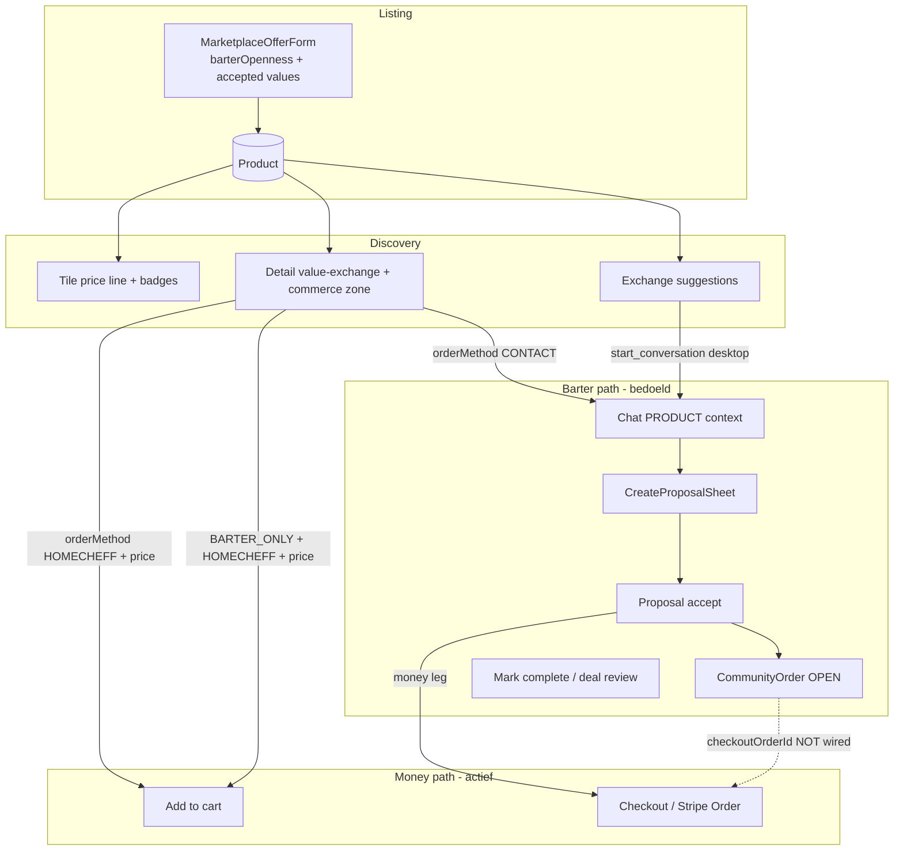

# Marketplace Phase 5E-A — End-to-End Exchange & Transaction Experience Audit

**Datum:** 2026-07-07  
**Scope:** Listing → tile → detail → chat → proposal → order → checkout → statusupdates. Read-only audit; geen feature-code.  
**Voorganger:** `MARKETPLACE_BARTER_OPENNESS_WIRING_AUDIT.md` (Phase 5B-D)

---

## 1. Executive summary

Na Phase 5B-D is **listing-data** (taxonomy, accepted values, `barterOpenness`) technisch aangesloten op forms, detail en matching. De **gebruikerservaring over de volledige keten is nog niet coherent**.

| Laag | Status | Kernprobleem |
|------|--------|--------------|
| Create/edit | **Grotendeels OK** | Copy bruikbaar; enkele tegenstrijdige combinaties mogelijk |
| Tiles | **Gedeeltelijk OK** | Barter zichtbaar via price line; accepted badges alleen op standard variant |
| Detail | **Split brain** | Value-exchange sectie kent barter; commerce zone + checkout negeren barter |
| Chat/proposal | **Bestaat, hergebruiken** | `CreateProposalSheet` + `Proposal`/`CommunityOrder` — wel prefilled, niet afgedwongen |
| Checkout (Stripe) | **Money-only pad** | Geen barter-gate; `BARTER_ONLY` kan per ongeluk via winkelwagen |
| Matching/suggestions | **Backend OK, UX dun** | Rijke signalen; gebruiker ziet vereenvoudigde suggesties, geen proposal-CTA |

**P0 productieblokker:** Gebruiker kan op een `BARTER_ONLY`-listing (met prijs + HomeCheff-betaling) **direct afrekenen via cart/checkout**, terwijl de bedoelde ruilflow via **chat → proposal → CommunityOrder** loopt.

**Veiligste volgende fase (5E-B):** Barter-gates op detail/checkout (geen redesign), proposal-settlement valideren tegen listing `barterOpenness`, proposal-checkout URL aansluiten — **hergebruik bestaande proposal/CommunityOrder stack**.

---

## 2. Huidige end-to-end flow

**Twee parallelle “order”-systemen:**

| Systeem | Model | Doel |
|---------|-------|------|
| Stripe checkout | `Order` | Cart → `/checkout` → betaling |
| Chat deals | `Proposal` → `Agreement` → `CommunityOrder` | Voorstel, ruil, mixed settlement |

`barterOpenness` en `SettlementMode` zijn **niet gekoppeld** aan cart/checkout-gates (die gebruiken `orderMethod` + Stripe-status).

---

## 3. Listing create/edit dekking

### Componenten (Phase 5B-D)

| Component | Rol | Status |
|-----------|-----|--------|
| `MarketplaceOfferForm` | Hoofdformulier create/edit | Payload bevat `barterOpenness` + `acceptedSpecializations` |
| `BarterOpennessSelector` | 3 keuzes via `PAYMENT_METHOD_REGISTRY` | Actief |
| `AcceptedValuesPicker` | Taxonomy multi-select | Actief; suggestie → `MONEY_AND_BARTER` |
| `TaxonomySpecializationPicker` | Edit: aangeboden specs | Actief |
| `MarketplaceEntryFlow` | Intent/category vóór form | Geen barter-stap (bewust) |
| `CategoryFormSelector` | Route naar V2 form | Edit + create via zelfde form |

### Opslag & payload

- **Create/edit/republish:** `POST /api/products/create`, `PATCH /api/products/[id]` — backend accepteert `barterOpenness` via `parseMarketplaceV2FromBody`.
- **Draft:** Geen apart draft-model; edit page laadt product → `existingProduct.barterOpenness` → form prefill via `resolveBarterOpennessForFormPrefill`.

### Gebruikersbegrip copy

| Keuze | i18n (NL) | Duidelijk? |
|-------|-----------|------------|
| MONEY | “Geld” | Ja |
| MONEY_AND_BARTER | “Geld + ruil” | Ja |
| BARTER_ONLY | “Ruil” | Redelijk; hint legt uit (`marketplace.barterOpenness.hint`) |
| Accepted values | “Wat accepteer je eventueel ook als waarde?” | Ja, optioneel |

### Tegenstrijdige keuzes (mogelijk vandaag)

| Combinatie | Toegestaan? | Risico |
|------------|-------------|--------|
| `BARTER_ONLY` + prijs + HomeCheff-betaling aan | **Ja** | Detail toont checkout + “Ruil” tegelijk |
| `MONEY` + accepted values | **Ja** (expliciet) | Matching ziet geen acceptance; detail toont accepted chips |
| `BARTER_ONLY` zonder accepted | **Nee** | Form validatie `barterAcceptedRequired` |
| `VOLUNTARY` priceModel + `BARTER_ONLY` | **Ja** | Zeldzaam; settlement afleiding in proposals |

### i18n consistentie (form)

- Barter labels: `marketplace.valueExchange.payment.*` — consistent NL/EN.
- Accepted values: `marketplace.acceptedValues.*` — aparte sectie, geen termconflict.

**Conclusie create/edit:** Data-opslag **OK** na 5B-D. UX-risico zit in **combinaties die downstream niet afdwingen** (barter + checkout flags).

---

## 4. Tile/detail dekking

### Tiles

| Signaal | MONEY | MONEY_AND_BARTER | BARTER_ONLY |
|---------|-------|------------------|-------------|
| Price line | Euro / on-request / alternativeValue | “€X + ruil” (if price > 0) | “Ruil” |
| Accepted-value badge | Standard variant only, max 1 | Zelfde | Zelfde |
| `barterSlot` | Reserved, **niet gerenderd** | Reserved | Reserved |
| Taxonomy icons (5B-B) | Op offer + accepted badges | Zelfde | Zelfde |

**Variant inconsistentie:** Compact/mini/sidebar tonen **geen** accepted badges — alleen price line.

**Overlap:** Standard tiles kunnen “€X + ruil” **én** accepted-chip tonen (dubbel signaal). `barterSlot` activeren zou **derde** laag worden — niet doen zonder productbesluit.

**Matching-signalen die gebruiker niet ziet:** `mutualBarterReady`, main-category overlap, desired exchanges, trust/score caps.

### Detail

| Element | Barter-aware? | Opmerking |
|---------|---------------|-----------|
| `ProductValueExchangeSection` | **Ja** | “Betaling & ruil” + accepted chips |
| `ProductOfferedBadgesSection` | Nee (aanbod) | Boven value-exchange |
| `ProductSaleCommerceZone` price | **Nee** | `formatProductPriceLabel` — ignoreert `barterOpenness` |
| `ProductSalePrimaryActions` | **Nee** | Cart/contact op `orderMethod` only |
| `ProductSaleStickyCta` | **Nee** | Zelfde |
| `ExchangeSuggestionsDetailBlock` | Indirect | Desktop: chat-CTA; mobile: listing-only |

**CTA-logica vandaag:**

| Listing type | Primary CTA | Logisch? |
|--------------|-------------|----------|
| Alleen geld (`MONEY`, HomeCheff) | Add to cart / checkout | **Ja** |
| Geld + ruil | Checkout **+** value-exchange sectie | **Gedeeltelijk** — geen “voorstel doen” primair |
| Alleen ruil (`BARTER_ONLY`) | **Nog steeds cart** als HomeCheff + prijs | **Nee — P0** |
| Contact-only (`orderMethod=CONTACT`) | Contact maker → chat | **Ja** voor chat; geen checkout |

**Dubbele info:** Value-exchange + commerce price kunnen tegenspreken (sectie “Ruil”, sidebar “€12,50 + bestellen”).

**Ontbrekend:** `detail-action-matrix` kent `requestProposal` voor SERVICE/REQUEST — **niet wired** op product page.

---

## 5. In-chat offer/proposal dekking

### Bestaand model (hergebruiken — niet opnieuw bouwen)

| Artifact | Pad | Rol |
|----------|-----|-----|
| UI create | `components/chat/proposals/CreateProposalSheet.tsx` | Voorstel met settlement, taxonomy, payment path |
| UI cards | `ProposalCard.tsx`, `DealCard.tsx`, `CommunityOrderSummaryCard.tsx` | Pending / accepted deal UX |
| API | `app/api/conversations/[id]/proposals/route.ts` | Create + list |
| Accept/counter | `app/api/proposals/[id]/accept|counter|reject|cancel` | Statusflow |
| Service | `lib/proposals/proposal-service.ts` | Business logic |
| Settlement | `lib/proposals/proposal-settlement.ts` | `SettlementMode` ↔ product |
| Binding | `lib/proposals/proposal-product-binding.ts` | Product context, payment path validation |
| Accept routing | `lib/proposals/proposal-accept-routing.ts` | Checkout URL generation |
| Deal UX | `lib/proposals/deal-ux-state.ts` | Post-accept CTAs |

**Prisma:** `Proposal` (`settlementMode`, `acceptedValueTaxonomyIds`, `requestedValueTaxonomyIds`), `CommunityOrder` (`OPEN|COMPLETED|CANCELLED`, `checkoutOrderId`).

### Listing → chat dataflow

`resolveConversationHeader.ts` laadt voor PRODUCT-chats:
- `barterOpenness`, `acceptedSpecializations`, prijs, fulfillment
- `defaultPaymentPath` (Stripe readiness — **niet** barter-afgeleid)

`CreateProposalSheet` prefill:
- `settlementMode` ← `deriveSettlementModeFromProduct({ barterOpenness, ... })`
- `acceptedValueTaxonomyIds` ← product accepted specs
- `paymentPath` ← `defaultPaymentPath`

### Vragen beantwoord

| Vraag | Antwoord |
|-------|----------|
| Wordt `barterOpenness` gebruikt? | **Ja** — prefill settlement; **niet** server-side afgedwongen |
| Worden accepted values gebruikt? | **Ja** — prefill + fallback op product specs |
| Wordt taxonomy gebruikt? | **Ja** — `AcceptedValuesPicker` in sheet, `requestedValueTaxonomyIds` |
| Geldbod op `BARTER_ONLY`? | **Mogelijk** — UI biedt alle settlement modes; geen server check tegen listing |
| Ruilvoorstel op MONEY-only listing? | **Mogelijk** — `VALUE_ONLY` settlement toegestaan |
| Geld + item combineren? | **Ja** — `MONEY_AND_VALUE` + requested/accepted taxonomy ids |
| Meerdere items ruilen? | **Gedeeltelijk** — meerdere taxonomy ids in arrays; geen multi-line UX |
| Statusupdates helder? | **Redelijk** — proposal statuses + deal card; counter is **money-only** (geen taxonomy wijziging) |

---

## 6. Checkout/order dekking

### Per `barterOpenness`

| Waarde | Cart/checkout | Chat proposal | CommunityOrder |
|--------|---------------|---------------|----------------|
| **MONEY** | Normaal Stripe-pad | `MONEY` settlement | Optioneel checkout na accept |
| **MONEY_AND_BARTER** | **Checkout nog steeds mogelijk** | Prefill `MONEY_AND_VALUE` | Mixed deal |
| **BARTER_ONLY** | **Checkout mogelijk** (gap) | Prefill `VALUE_ONLY`, checkout geblokkeerd in proposal | Mark complete, geen betaling |

### Gates vandaag

| Check | Waar | Barter-aware? |
|-------|------|---------------|
| Contact-only | `isContactOnlyProduct` / checkout API | Nee (`orderMethod` only) |
| Stripe ready | `requiresStripeForHomecheffCheckout` | Nee |
| Proposal checkout | `validatePaymentPath` | **Ja** — geen checkout bij `VALUE_ONLY` |
| Listing checkout | `app/api/checkout/route.ts` | **Nee** |

### Kritieke gaps

1. **`BARTER_ONLY` + HomeCheff + prijs → Add to cart** — gebruiker kan per ongeluk betalen.
2. **Proposal accept `checkoutUrl`** (`/checkout?productId&communityOrderId`) — checkout page **negeert query params**; cart-only flow.
3. **`CommunityOrder.checkoutOrderId`** — **nooit geschreven**; “paid” state in deal UX werkt niet voor Stripe-leg.
4. **Cash/on pickup** — geen apart barter cash model; `DIRECT_CONTACT` payment path in proposals.

### Barter-deal statusmodel

**Bestaat:** `CommunityOrder.status`: `OPEN` → `COMPLETED` / `CANCELLED` + delivery flags + deal review (`/deal-review/[communityOrderId]`).

**Geen apart “barter settlement engine”** — handmatig afhandelen via chat + mark complete (documented in `MARKETPLACE_BARTER_READINESS.md`).

---

## 7. Chat ↔ order ↔ marketplace koppeling

| Link | Status |
|------|--------|
| Listing → chat | `MakerContactSection` + product context conversation |
| Chat → listing | Header toont product; geen deep link terug in notifications |
| Chat offer → order | Accept → `CommunityOrder`; money leg → checkout URL (**broken wiring**) |
| Order → chat | Stripe `Order` los van `CommunityOrder` |
| Order status → chat | Pusher `proposal-updated`; geen Stripe status in chat |
| Notifications | `notify-proposal-event.ts` → `/messages?conversation=…` |
| Deep links | Proposal → chat; deal review → `/deal-review/…`; Stripe order → `/orders/…` |

**Koop vs ruil:**

| Type | Primair pad | Statusupdates |
|------|-------------|---------------|
| Koop (Stripe) | Cart → Order | Order status emails/UI |
| Ruil/barter | Chat → Proposal → CommunityOrder | Proposal + deal card; handmatig complete |

**Gap:** Gebruiker op suggestion → chat (desktop) → moet zelf “voorstel” openen; **geen directe proposal-CTA** vanuit suggestie of detail.

---

## 8. Matching/suggestions dekking

### Matching signalen (4D)

| Signaal | Gebruikt in matching | Zichtbaar voor user |
|---------|---------------------|---------------------|
| Taxonomy (offer specs) | Ja | Tiles/detail badges |
| Accepted values | Ja (if barter open) | Tiles/detail |
| `barterOpenness` | Ja — gates acceptance | Detail value-exchange; tiles price line |
| Locatie/afstand | Ja — scoring | Suggestie “lokaal” label |
| Main category overlap | Ja — mutual readiness | **Nee** |
| Desired exchanges | Ja — direct match | **Nee** (niet in listing form) |
| Trust/score | Ja — caps | **Nee** |
| Profiel | Indirect | Username op suggestiekaart |

### Suggestions (4F/4G)

| Surface | CTAs | Chat link |
|---------|------|-----------|
| Detail desktop (`ExchangeSuggestionCard`) | view listing, profile, **start conversation** | `/messages?user=…` |
| Detail mobile | Tap → listing | **Geen chat** |
| Feed insert | Listing only | Nee |
| Sidebar | Listing only | Nee |

- Geen `request_proposal` CTA (bewust — validator asserteert dit).
- Caps/dismiss: client storage in suggestion modules.
- **Sluit niet direct aan** op CreateProposalSheet — gebruiker moet in chat zelf voorstel starten.

---

## 9. UX-copy/i18n bevindingen

### Goed gedekt (NL/EN)

- `marketplace.valueExchange.payment.*` — Geld / Ruil / Geld + ruil
- `marketplace.detail.valueExchange.title` — Betaling & ruil
- `marketplace.exchangeSuggestions.*` — suggestie copy
- `marketplace.barterOpenness.hint`
- `proposal.*` — groot blok voor chat proposals

### Inconsistenties / hardcoded

| Issue | Locatie |
|-------|---------|
| Stock/sold-out NL literals | `ProductSaleCommerceZone`, `ProductSalePrimaryActions`, `ProductSaleStickyCta` |
| Product page NL | `page.tsx`: “weergaven”, “verkocht”, “Beoordelingen” |
| Chat proposal NL hardcoded | `ChatThreadMessageRow`: “Voorstel”; `ConversationsList`: “📋 Voorstel” |
| “Sponsored” EN hardcoded | `build-tile-badges.ts` |
| Term mix EN | “Barter” vs NL “Ruil” — bewust maar ongelijk |
| `marketplace.exchange.signals.*` | Volledig vertaald, **niet in UI** |
| `marketplace.detail.actions.requestProposal` | Bestaat, **niet op product page** |

### Begrijpelijkheid nieuwe gebruiker

**Flow vandaag:** Gebruiker ziet op tiles soms “Ruil”, kan op detail alsnog “Bestellen” — **verwarrend**. Ruil vereist impliciete kennis: contact → chat → voorstel. Geen guided flow.

**Voorkeur NL-termen (deels al aanwezig):**

| Gewenst | Huidige key/status |
|---------|-------------------|
| Betaling | ✅ `marketplace.valueExchange.payment.money` |
| Ruilen | ✅ “Ruil” |
| Open voor ruil | ⚠️ alleen impliciet via MONEY_AND_BARTER |
| Alleen verkoop | ⚠️ “Geld” — niet “alleen verkoop” |
| Voorstel doen | ✅ `proposal.*` / `marketplace.detail.actions.requestProposal` (unwired) |
| Afspraak maken | ⚠️ verspreid in deal copy |

---

## 10. Dubbelbouw-risico’s

### Absoluut hergebruiken (niet opnieuw bouwen)

| Systeem | Waarom |
|---------|--------|
| `Proposal` + `CommunityOrder` + `Agreement` | Enige barter-deal engine |
| `CreateProposalSheet` + settlement helpers | Prefill + validation basis |
| `buildDetailValueExchangeBlock` | Detail payment/barter plan |
| `PAYMENT_METHOD_REGISTRY` + `BarterOpenness` enum | Single source payment/barter labels |
| `AcceptedValuesPicker` | Form + proposal taxonomy UI |
| Exchange matching 4D + suggestions 4F/4G | Ranking/surfaces klaar |
| `ExchangeSuggestionCard` | Desktop chat entry |

### Overlap / duplicate risico’s

| Risico | Detail |
|--------|--------|
| Tweede accepted-values UI | `ProductAcceptedBadgesSection` vervangen door value-exchange — **niet terugbrengen** |
| Parallel payment UI | Barter selector + PaymentMethodCheckboxes — OK (verschillende assen) |
| Duplicate barter badges | Price line + accepted chip + `barterSlot` |
| Nieuw “offer model” | `Proposal` dekt chat offers |
| Nieuw barter order type | `CommunityOrder` dekt barter deals |
| Legacy `SettlementMode` vs `BarterOpenness` | **Beide behouden** — mapping in `proposal-settlement.ts` |
| `exchangeOpenness` / `tradeOpenness` | **Niet introduceren** |

### Ong gebruikte / prepared code

- `barterSlot` — reserved, niet UI
- `marketplace.exchange.signals.*` — geen renderer
- `detail-action-matrix` `requestProposal` — niet op product page
- `CommunityOrder.checkoutOrderId` — schema field, unwired

---

## 11. Productgaten

| ID | Gap | Impact |
|----|-----|--------|
| PG1 | BARTER_ONLY listing → cart/checkout | Gebruiker betaalt waar ruil bedoeld is |
| PG2 | Detail price vs value-exchange tegenspraak | Vertrouwen / begrip |
| PG3 | Geen guided “voorstel doen” op barter listings | Reactiepad onduidelijk |
| PG4 | Mobile suggestions geen chat-CTA | Discovery → actie friction |
| PG5 | Proposal settlement niet gebonden aan listing barter | Verkeerd voorsteltype mogelijk |
| PG6 | Counter proposal geen barter-termen | Ruil-onderhandeling beperkt |
| PG7 | Legacy listings `null` barter + accepted | Display vs matching mismatch tot edit |

---

## 12. Technische gaten

| ID | Gap | Bestand(en) |
|----|-----|-------------|
| TG1 | Checkout negeert `communityOrderId` | `app/checkout/page.tsx`, `app/api/checkout/route.ts` |
| TG2 | `checkoutOrderId` never written | proposal accept flow |
| TG3 | Geen `barterOpenness` check in checkout API | `app/api/checkout/route.ts` |
| TG4 | Commerce zone ignoreert barter in price | `ProductSaleCommerceZone.tsx` |
| TG5 | Geen server validation proposal vs listing barter | `proposal-service.ts` |
| TG6 | Counter kopieert taxonomy unchanged | `proposal-service.ts` counter |
| TG7 | Geen E2E validator proposal→deal→checkout | scripts gap |

---

## 13. Prioriteitenmatrix

### P0 — Productieblokkers

| # | Item | Actie richting |
|---|------|----------------|
| P0-1 | Cart/checkout op `BARTER_ONLY` | Gate: hide cart / block checkout API when `BARTER_ONLY` |
| P0-2 | Detail commerce toont euro + checkout op barter-primary | Commerce price/CTA barter-aware; primary CTA → chat/proposal |
| P0-3 | Proposal checkout URL dead end | Checkout page honor `productId` + `communityOrderId`; write `checkoutOrderId` |

### P1 — Belangrijke UX-gaten

| # | Item |
|---|------|
| P1-1 | Wire `requestProposal` / “Voorstel doen” op product detail voor barter listings |
| P1-2 | Server validation: proposal `settlementMode` vs listing `barterOpenness` |
| P1-3 | Mobile exchange suggestions → chat CTA parity |
| P1-4 | Form: `BARTER_ONLY` → suggest/disable HomeCheff-only checkout path |
| P1-5 | Toon exchange match signals (optioneel 1 regel uitleg op suggestie) |

### P2 — Polish

| # | Item |
|---|------|
| P2-1 | i18n hardcoded NL in commerce + chat |
| P2-2 | Tile variant parity (accepted badges compact) |
| P2-3 | Counter proposal barter taxonomy editing |
| P2-4 | Legacy listing backfill prompt (edit to confirm barter) |
| P2-5 | “Sponsored” tile badge i18n |

---

## 14. Aanbevolen volgende fase (5E-B)

**Focus:** Coherent barter/reactiepad zonder matching/checkout redesign.

1. **Barter gates op detail + checkout** — hergebruik `barterOpenness` + `isContactOnlyProduct`-patroon; geen nieuwe enum.
2. **Primary CTA matrix** — wire `detail-action-matrix` / `requestProposal` voor `BARTER_ONLY` en `MONEY_AND_BARTER`.
3. **Proposal settlement enforcement** — extend `validatePaymentPath` / new validator: listing `barterOpenness` ↔ `SettlementMode`.
4. **Community deal checkout wiring** — fix query params + `checkoutOrderId` (bestaand schema).
5. **Suggestion → chat parity** — mobile module chat link (kleine UI change).
6. **Validator** — `validate-marketplace-e2e-exchange-transaction.ts` (proposal accept → community order chain).

**Niet in 5E-B:** matching scoring wijzigen, chat UI redesign, nieuwe order types, tile redesign, `barterSlot` activatie.

---

## Conclusie — expliciete antwoorden

| Vraag | Antwoord |
|-------|----------|
| **Kan een gebruiker een listing aanmaken die alleen te ruil is?** | **Ja** — `BARTER_ONLY` + accepted values in form (5B-D). |
| **Kan een andere gebruiker daarop logisch reageren?** | **Gedeeltelijk** — via chat/contact wel; detail biedt geen duidelijke “voorstel doen”-primair; suggestions (desktop) → chat. |
| **Gaat die reactie via chat, checkout of order?** | **Bedoeld: chat → Proposal → CommunityOrder.** Checkout is parallel money-pad en **niet geblokkeerd** voor barter-only. |
| **Kan iemand per ongeluk betalen waar ruil bedoeld is?** | **Ja (P0)** — als listing HomeCheff-betaling + prijs heeft ondanks `BARTER_ONLY`. |
| **Kan iemand per ongeluk ruil voorstellen waar alleen verkoop bedoeld is?** | **Ja** — proposal UI staat `VALUE_ONLY` toe; geen server check tegen listing `MONEY`. |
| **Bestaat er al een in-chat offer model?** | **Ja** — `Proposal` + `CreateProposalSheet` + `ProposalCard`/`DealCard`. **Hergebruiken.** |
| **Bestaat er al een ordermodel voor barter-only / money+barter?** | **Ja** — `CommunityOrder` + `SettlementMode` (`VALUE_ONLY`, `MONEY_AND_VALUE`). Stripe `Order` alleen voor money leg. |
| **Wat moet absoluut niet opnieuw gebouwd worden?** | Proposal/CommunityOrder stack, settlement helpers, value-exchange block, AcceptedValuesPicker, exchange matching/suggestions, BarterOpenness enum. |
| **Veiligste eerstvolgende implementatiefase?** | **5E-B: barter gates + detail CTA + proposal validation + checkout wiring** — klein, hergebruikt bestaand, fix P0. |

---

## Bijlage A — Validatie (2026-07-07)

| Script | Resultaat |
|--------|-----------|
| `npm run lint` | pass |
| `npm run build` | pass |
| `validate-marketplace-tile-system.ts` | 90/90 |
| `validate-marketplace-taxonomy-consolidation.ts` | 845/845 |
| `validate-exchange-foundation.ts` | 50/50 |
| `validate-value-exchange-system.ts` | 53/53 |
| `validate-exchange-suggestions.ts` | 124/124 |
| `validate-marketplace-detail-system.ts` | 182/182 |
| `validate-marketplace-barter-openness-wiring.ts` | 18/18 |
| `validate-conversation-context.ts` | PASS |

**Geen dedicated chat/order/checkout E2E validator** — gap genoteerd als TG7.

---

## Bijlage B — Kernbestanden referentie

| Domein | Pad |
|--------|-----|
| Form | `components/products/marketplace/MarketplaceOfferForm.tsx` |
| Detail value | `components/product/detail/ProductValueExchangeSection.tsx` |
| Detail commerce | `components/product/detail/ProductSaleCommerceZone.tsx` |
| Proposal create | `components/chat/proposals/CreateProposalSheet.tsx` |
| Settlement | `lib/proposals/proposal-settlement.ts` |
| Accept routing | `lib/proposals/proposal-accept-routing.ts` |
| Checkout API | `app/api/checkout/route.ts` |
| Exchange suggestions | `components/marketplace/exchange-suggestions/ExchangeSuggestionCard.tsx` |
| Matching | `lib/marketplace/exchange/exchange-resolver.ts` |
