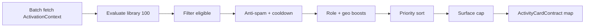

# Real-World Activation Engine

**Phase:** 3C — Architecture only  
**Last updated:** 2026-07-06

---

## Purpose

Specify how activations are **selected** from the library based on real-world signals — without entering discovery ranking, trust scoring for feed order, or recommendation ML.

Engine sits **parallel** to:

- `buildDiscoveryFeed` / section registry
- Ranking profiles (Phase 2C)
- Trust enrichment (Phase 2B)

Output: ordered list of `ActivationCandidate[]` for surface routers (feed slot, sidebar, lifecycle hooks).

---

## Signal catalog

### Location & distance

| Signal | Source | Use |
|--------|--------|-----|
| `has_location` | User place/lat/lng | Gate LOCAL, HELP, DISCOVERY nearby |
| `distance_km` | Viewer ↔ listing | Hyperlocal activations L05, H01 |
| `feed_scope` | nearby / national | Boost LOCAL when `nearby` |
| `place_name` | City/postcode match | L06 street-level prompts |
| `radius_km` | Feed filter | Cap irrelevant activations |

### Favorites & social graph (lightweight)

| Signal | Source | Use |
|--------|--------|-----|
| `favorite_count` | User favorites | S02 conversation nudge |
| `favorites_without_conversations` | Fav + no thread | S02 |
| `repeat_seller_ids` | Order history | C10 reconnect |
| `fans_count` | Follow | **Display only — forbidden for eligibility ranking** |

### Profile maturity

| Signal | Source | Use |
|--------|--------|-----|
| `completeness_percent` | ProfileV2 | R01, R02 |
| `has_profile_photo` | User | S01, R02 |
| `has_seller_role` | sellerRoles | E01, W01 |
| `has_workspace_photos` | WorkplacePhoto | R05 |
| `email_verified` | User | R03 |
| `days_since_signup` | createdAt | C01 welcome neighbour |

### Orders & commerce

| Signal | Source | Use |
|--------|--------|-----|
| `product_count` | Seller products | E01 |
| `completed_deals` | Orders DELIVERED/SHIPPED | E02, C07 |
| `completed_deal_without_review` | Order + no review | C02 / REQUEST_REVIEW |
| `repeat_customers` | Trust snapshot | E10 |
| `has_stripe` | Stripe connect | E03 |
| `barter_openness` | Product | E04 |

### Reviews & trust (activation only, not feed rank)

| Signal | Source | Use |
|--------|--------|-----|
| `pending_review` | Unreviewed deal | REVIEW activations |
| `trust_tier` | DiscoveryTrustContract | D07 visit trusted maker |
| `deal_review_count` | Trust | Post-deal lifecycle |

**Forbidden:** using these signals to reorder feed listings.

### Workshops & events

| Signal | Source | Use |
|--------|--------|-----|
| `has_workshop_listing` | KNOWLEDGE products | W01 inverse, W07 repeat |
| `availability_date` | Product | W02 attend, W04 visit |
| `capacity_remaining` | Future field | W05 last seat |
| `workshop_location` | place | W04 |

### Help & requests

| Signal | Source | Use |
|--------|--------|-----|
| `nearby_request_count` | Feed pool REQUEST | H01, D02 (3B) |
| `needed_by` | REQUEST date | H07 urgent |
| `listing_intent` | REQUEST | HELP category pool |

### New users nearby

| Signal | Source | Use |
|--------|--------|-----|
| `new_users_in_radius_7d` | User geo + createdAt | C01 welcome |
| `new_sellers_in_radius_30d` | Seller profiles | C07 support starter |
| `new_creators_in_radius` | First listing date | D01 meet maker |

---

## Engine pipeline



### ActivationContext (proposed type, 3D)

```typescript
type ActivationContext = {
  userId: string;
  loggedIn: boolean;
  role: 'buyer' | 'seller' | 'courier' | 'creator' | 'partner' | 'mixed';
  location: { hasLocation: boolean; lat?: number; lng?: number; place?: string };
  profile: { completenessPercent: number; hasPhoto: boolean; emailVerified: boolean };
  commerce: { productCount: number; dishCount: number; completedDeals: number; ... };
  local: { nearbyRequestCount: number; newUsersNearby7d: number; feedScope: string };
  social: { favoritesWithoutConversations: number };
  cooldownState: ActivityCardCooldownState;
};
```

### Boost rules (not ranking)

| Condition | Effect |
|-----------|--------|
| `feedScope === 'nearby'` | +15 priority to LOCAL, HELP, DISCOVERY |
| `role === 'seller'` | Suppress E01; boost W01, E02 |
| `role === 'buyer'` | Boost H01, D03, C07 |
| `completed_deal_without_review` | Pin REQUEST_REVIEW band Critical |
| `new_users_in_radius_7d > 0` | Boost C01 |

Boosts adjust **activation priority only** — never listing scores.

---

## Surface router

| Surface | Max | Selection |
|---------|-----|-----------|
| Feed mobile | 2/session, 1 visible | Slots 4, 12, 24 |
| Feed desktop | 2/session | Between sections |
| Sidebar | 1–3 stack | Filter LOCAL + PARTNER |
| Post-order | 1 | REVIEW, C02 |
| Profile owner | 4 | CREATOR + PARTNER |

---

## Completion detection (3D)

| Activation class | Detection |
|------------------|-----------|
| Profile complete | `completenessPercent === 100` |
| First listing | `productCount >= 1` |
| Review left | ProductReview created |
| Workshop attended | Order/workshop attendance flag (future) |
| Barter complete | Deal with barter flag |
| Invite converted | Welkom signup attribution |
| Courier onboarded | DeliveryProfile created |

Server may auto-transition lifecycle → `completed` and suppress card.

---

## Integration with 3B

Current: `fetchActivityCardEligibilityInput` + `resolveActivityCardContracts` implement **subset** of engine for 11 types.

3D: Replace/extend with `resolveActivations(context, library)` returning full catalog matches mapped to `ActivityCardContract` for feed.

---

## Forbidden engine behaviours

- Collaborative filtering
- “Users like you also…”
- HCP &lt; X as gate
- View count thresholds
- Sponsored insertion
- Writing back to `orderedListingIds`

---

## References

- [ACTIVATION_LIBRARY_100.md](./ACTIVATION_LIBRARY_100.md)
- [ACTIVITY_CARD_ELIGIBILITY.md](./ACTIVITY_CARD_ELIGIBILITY.md)
- [ACTIVITY_CARD_INSERTION.md](./ACTIVITY_CARD_INSERTION.md)
