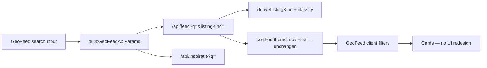

# Search Architecture Audit

**Version:** V1 (Discovery Phase 1A)  
**Last updated:** 2026-07-06

## Summary

HomeCheff search is **distributed** across multiple APIs and client-side filters. Before Phase 1A, **no path used ListingKind** for filtering. Phase 1A introduces `lib/search/` as the canonical layer without changing ranking or ordering.

---

## Search paths audited

| Path | API / surface | Text search | ListingKind | Sort | Notes |
|------|---------------|-------------|-------------|------|-------|
| **GeoFeed** | `GET /api/feed?q=` + client filter | Server + client | ✅ Phase 1A | Unchanged (`createdAt`, client sort) | Primary homepage feed |
| **Dorpsplein** | `GET /api/products?q=` + client filter | Server + client | ✅ Phase 1A | Client `sortDorpspleinProducts` | Legacy product grid |
| **Inspiratie pool** | `GET /api/inspiratie?q=` | Server + client | ✅ INSPIRATION | `newest` / `popular` | Dishes only |
| **Creator search** | `GET /api/users?q=` | Server | N/A (users) | `createdAt desc` | Name/bio/place |
| **Profile Aanbod** | `GET /api/seller/products` + client | None | ✅ `deriveListingKind` | `createdAt desc` | Filter chips only |
| **Inspiratie page** | Client filter on `/api/inspiratie` | Client only | ❌ pre-1A | Client | Uses InspiratieContent |
| **Legacy Listing** | Merged in `/api/feed` | Title/desc | Defaults PRODUCT | Feed sort | No V2 fields |
| **Admin product search** | Admin UI local filter | Client | ❌ | — | Out of scope |
| **Smart recommendations** | `/api/recommendations/smart` | — | ❌ | Ranking | **Not Discovery Phase 1** — unused in routes |

---

## Query flow (GeoFeed — primary)

1. User enters query → `appliedQ` sent to `/api/feed`
2. Server: Prisma text search + REQUEST intent expansion
3. Server: attach `listingKind`, `listingIntent`, `marketplaceCategory`, `specializations`
4. Client: `matchesSearchTextQuery` on sale + inspiration pools (ordering unchanged)

---

## Taxonomy usage (before → after)

| Field | Before 1A | After 1A |
|-------|-----------|----------|
| `listingIntent` | Feed DB only | Search filters + results |
| `marketplaceCategory` | Partial in feed | Exposed on all search results |
| `specializations[]` | Feed select | Text search haystack + results |
| `Product.category` | Dorpsplein + profile vertical | Legacy parallel only |
| `ListingKind` | Feed attach only | All search APIs + filters |

---

## ListingKind awareness by path

| ListingKind | Feed search | Products search | Inspiratie | Profile filter |
|-------------|-------------|-----------------|------------|----------------|
| PRODUCT | ✅ | ✅ | — | ✅ |
| SERVICE | ✅ | ✅ | — | ✅ |
| TASK | ✅ | ✅ | — | ✅ |
| WORKSHOP | ✅ | ✅ | — | ✅ |
| COACHING | ✅ | ✅ | — | ✅ |
| REQUEST | ✅ intent + text | ✅ | — | ✅ help filter |
| INSPIRATION | ✅ dishes | — | ✅ | — (Inspiratie tab) |

---

## Canonical module

All new search logic: **`lib/search/`**

- Contract: `lib/search/contracts/search-contract.ts`
- Text: `matchesSearchTextQuery`, `inferSearchQueryIntent`
- Filters: `matchesSearchListingFilters`, `matchesSearchItem`
- Classification: `attachSearchClassificationToRecord`
- Prisma helpers: `buildProductTextSearchWhere`, `buildDishTextSearchWhere`

---

## Explicit non-goals (Phase 1A)

- No ranking engine changes
- No Wilson / trust weighting
- No recommendation API changes
- No Gezocht tab UI
- No new routes
