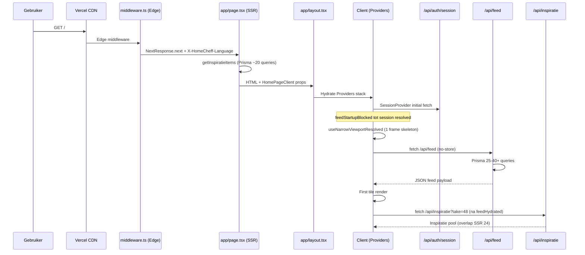

# HomeCheff First-Load Request Graph

**Datum:** 2026-07-12  
**Route:** `GET /` (homepage) — web browser en Capacitor WebView (`https://homecheff.eu`)  
**Scope:** Read-only trace uit code. Geen runtime-metingen in deze fase.

---

## 1. Request graph (overzicht)



---

## 2. Stap-voor-stap trace

| # | Stap | Bestand | Blokkeert first paint? | Blokkeert interactiviteit? | Parallel mogelijk? |
|---|------|---------|------------------------|---------------------------|-------------------|
| 1 | DNS + TLS | Infra | Ja (netwerk) | Ja | — |
| 2 | `middleware.ts` | `middleware.ts` L124–162 | Minimaal (Edge) | Nee | Ja met CDN |
| 3 | Root layout metadata | `app/layout.tsx` `generateMetadata` | SSR latency | Nee | Gedeeltelijk |
| 4 | Root layout render | `app/layout.tsx` L157+ | SSR latency | Nee | — |
| 5 | Homepage SSR | `app/page.tsx` L57–89 | **Ja (TTFB)** | Ja | Inspiratie parallel intern |
| 6 | HTML delivery | — | **FCP** | — | — |
| 7 | JS bundle download | Webpack chunks | — | **Ja** | Preload `_next/static` |
| 8 | Hydration Providers | `components/Providers.tsx` | — | **Ja** | Defer non-critical |
| 9 | Session fetch | `SessionProvider` L42–45 | — | **Ja (feed gate)** | Kan parallel met shell paint |
| 10 | Viewport gate | `HomePageClient` L153–180 | Skeleton visible | **Ja** | — |
| 11 | GeoFeed mount | `GeoFeed.tsx` | — | **Ja** | dynamic import mogelijk |
| 12 | Filter restore | `GeoFeed` L1223–1341 | — | Gedeeltelijk | Wacht op session |
| 13 | Feed fetch | `GeoFeed` L1665+ | — | **Ja** | Cache peek eerst |
| 14 | Feed API execution | `app/api/feed/route.ts` | — | **Ja** | Server-side only |
| 15 | First tile render | `GeoFeed` + `feedMedia.tsx` | — | LCP candidate | — |
| 16 | Inspiratie refetch | `GeoFeed` L1973+ | Nee | Vertraagt stabiliteit | **Dubbel** met SSR |
| 17 | Profile bootstrap | `UserBootstrapProvider` L86–113 | Nee | Bij nearby scope | Idle callback |
| 18 | Comms unread | `CommsUnreadProvider` | Nee | Background | Parallel |
| 19 | i18n load | `useTranslation` | Nee | Gedeeltelijk | localStorage eerst |
| 20 | Images lazy load | `feedMedia.tsx` `` | Nee | LCP als above-fold | priority op hero |

---

## 3. Wat blokkeert first paint (FCP)

| Factor | Bewijs | Impact |
|--------|--------|--------|
| SSR TTFB incl. inspiratie Prisma | `app/page.tsx` + `getInspiratieItems` | **Hoog** |
| Grote JS bundles (GeoFeed, NavBar, Providers) | Static imports in layout/home | **Hoog** |
| Geen streaming boundary op feed | GeoFeed client-only na hydration | **Middel** |
| Fonts | System fonts in `globals.css` (geen blocking webfont gevonden) | Laag |
| Third-party scripts | GA/Vercel Analytics **na consent** | Laag op eerste bezoek |

---

## 4. Wat blokkeert interactiviteit (TTI / INP)

| Factor | Bewijs | Impact |
|--------|--------|--------|
| `feedStartupBlocked` wacht op session | `GeoFeed.tsx` L1207–1211 | **Hoog** — alle users |
| Viewport skeleton gate | `useNarrowViewport.ts` + `HomePageClient` | **Middel** — 1+ frame |
| `/api/feed` latency (25–40+ queries) | `app/api/feed/route.ts` | **Kritiek** |
| 15+ provider hydrations | `Providers.tsx` | **Hoog** |
| Pusher client init via CommsRealtimeListener | `lib/pusher.ts` singleton | Middel (ingelogd) |
| Bootstrap profile voor nearby scope | `UserBootstrapProvider` | Middel (subset users) |

---

## 5. Dubbele / onnodige werk

| Issue | Locatie | Effect | Prioriteit |
|-------|---------|--------|------------|
| **Dubbele inspiratie fetch** | SSR 24 + client 48 | Extra API + Prisma | P1 |
| **Dubbele `/api/profile/me`** | UserBootstrap + useUserValidation (3s) | 2× zelfde endpoint | P1 |
| **`/api/profile/me` + `/api/user/me`** | Bootstrap vs CommsRealtimeListener | Parallel session calls | P2 |
| **UserActionCenter dubbel mount** | HomePageClient skeleton + mobile branch | 2× action-center fetch | P2 |
| **Perf baseline dubbel** | HomePageClient L71 + GeoFeed L924 | Dev noise only | P3 |
| **Feed perf reporter** | Zelfde | Dev only | P3 |

---

## 6. Auth-blocking analyse

| Scenario | Gedrag |
|----------|--------|
| Anoniem | Homepage rendert; feed wacht alleen op `sessionStatus !== 'loading'` |
| Ingelogd default (national scope) | Feed na session; geen bootstrap block |
| Ingelogd + nearby scope zonder coords | Feed blocked tot `UserBootstrapProvider` profile coords |
| Onboarding incompleet | `AuthCompletionGate` kan redirecten — **niet** op eerste paint voor guests |

**Geen harde auth-block op HTML** — soft block op feed data only.

---

## 7. Locatie-initialisatie

| Bron | Bestand | Blocking? |
|------|---------|-----------|
| URL `?place=` | GeoFeed L1343–1347 | Nee — sync |
| localStorage feed surface | GeoFeed L1223–1341 | Nee |
| Profile coords (idle) | GeoFeed L1441–1480 | Alleen nearby scope |
| GPS auto | **Uitgeschakeld** op homepage L1505–1509 | ✅ Geen permission block |

---

## 8. Capacitor-specifiek pad

| Stap | Config / code | Impact |
|------|---------------|--------|
| Splash screen | `launchShowDuration: 3250` | 3.25s visuele delay |
| Remote URL | `server.url: https://homecheff.eu` | Volledige web cold start in WebView |
| Geen lokale bundle | `webDir: dist` placeholder | Geen offline app shell |
| Native push init | `NativePushTokenSync` in Providers | Background na auth |
| App version check | `AppUpdateStatusProvider` 650ms delay | Native only |

**Niet meetbaar uit code:** Android cold launch TTI vs. warm launch — vereist device profiling.

---

## 9. Service worker & PWA

| Item | Status |
|------|--------|
| `public/manifest.json` | ✅ Gelinkt in layout metadata |
| `public/sw.js` | ❌ **Niet geregistreerd** — geen `navigator.serviceWorker.register` |
| Offline app shell | ❌ Niet actief |
| Push (web) | `NotificationProvider` niet op `/` |

---

## 10. Parallelisatie-kansen (niet geïmplementeerd)

```
HUIDIG (waterfall):
  HTML → hydrate → session → viewport → GeoFeed → /api/feed → tiles → /api/inspiratie

MOGELIJK (na optimalisatie):
  HTML → hydrate + session parallel
       → GeoFeed dynamic import tijdens skeleton
       → /api/feed parallel met non-critical providers (deferred)
       → inspiratie uit SSR hergebruiken (skip client refetch)
```

---

## 11. `force-dynamic` op homepage-keten

| Segment | Setting |
|---------|---------|
| `app/page.tsx` | `revalidate = 60` ✅ |
| `app/layout.tsx` | Default async |
| `/api/feed` | `force-dynamic` |
| `/api/auth/session` | `force-dynamic` |
| `/api/profile/me` | `force-dynamic` |

**Conclusie:** Page shell kan ISR-gecachet worden; **feed-data altijd dynamisch** via client fetch.

---

## 12. Instrumentatie (bestaand — Fase 13K)

| Bestand | Doel |
|---------|------|
| `lib/feed/feed-performance-baseline.ts` | Client milestones |
| `lib/feed/feed-api-timing.ts` | Server `Server-Timing` |
| `components/PerformanceMonitor.tsx` | LCP/FID/CLS (diag flag) |

Activeer met `NEXT_PUBLIC_FEED_PERF_BASELINE=1` en `FEED_PERF_TIMING=1` voor Fase 2 metingen.

---

## Acceptatiecriteria

- [x] Volledig pad van request tot feed tiles getraceerd
- [x] Blokkeerders first paint vs. interactiviteit gescheiden
- [x] Dubbele fetches expliciet benoemd
- [x] Capacitor-pad behandeld
- [x] Geen codewijzigingen
