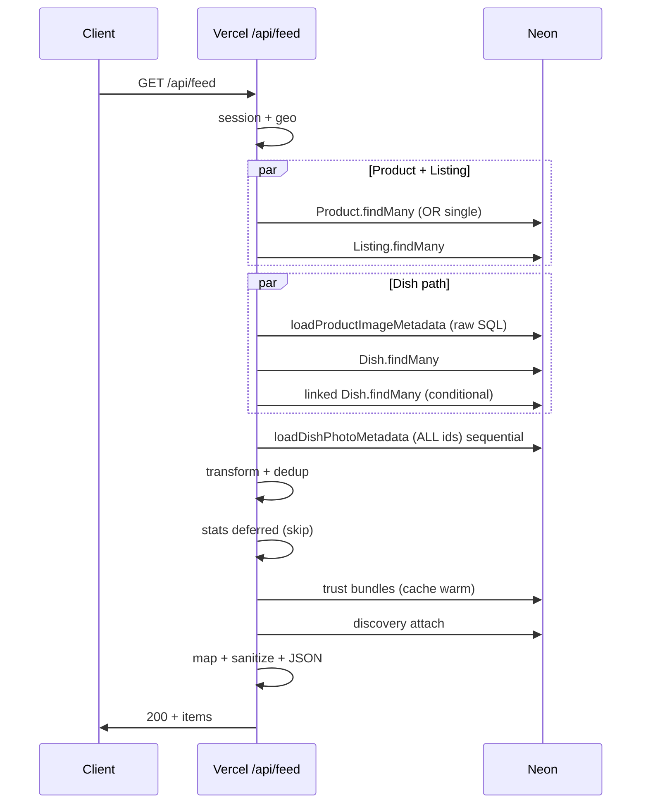
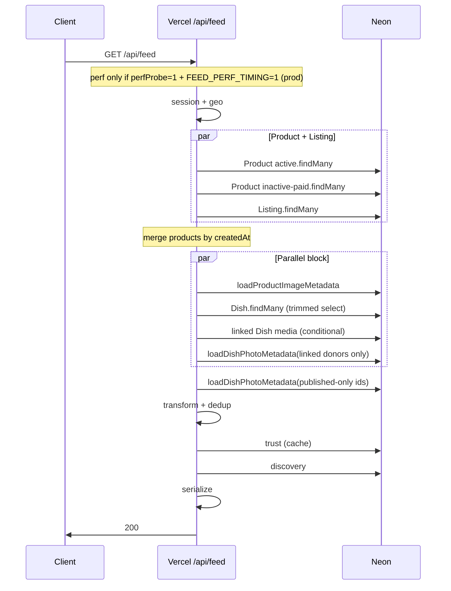

# Phase 3E — Request Graph

**Datum:** 2026-07-13  
**Endpoint:** `GET /api/feed?scope=national&radius=0`

---

## Before (Phase 3D op main)

---

## After (Phase 3E)

---

## Stap-tabel (productie warm, pre-3E gemeten)

| # | Stap | Wall ms | Parallel? | Cache mogelijk? |
|---|------|---------|-----------|-----------------|
| 1 | session/auth | ~5 | — | no-store logged-in |
| 2 | geo | ~0 | — | — |
| 3 | Product.findMany | **1204** | ↔ Listing | no |
| 4 | Listing.findMany | ~200* | ↔ Product | no |
| 5 | product metadata SQL | ~150* | ↔ Dish | no |
| 6 | Dish.findMany | **949** | na product ids | no |
| 7 | linked dish media | ~100* | ↔ Dish | no |
| 8 | dish metadata SQL | ~200* | **was sequential** → 3E parallel | no |
| 9 | transform | ~5 | — | — |
| 10 | stats | **0** (deferred) | — | — |
| 11 | trust | **370** | — | in-memory warm |
| 12 | discovery | ~100* | — | — |
| 13 | serialize | ~10 | — | — |

\*Geschat uit totaal minus gemeten buckets.

---

## Parallelisatie beslissingen

| Pair | Toegestaan? | 3E actie |
|------|-------------|----------|
| Product + Listing | ✅ | Behouden |
| Product active + inactive | ✅ | **Nieuw** split_or |
| Dish + product metadata + linked | ✅ | Behouden + linked meta parallel |
| Trust + stats | stats deferred | trust na transform |
| Discovery + trust | na trust | ongewijzigd |

Geen extra `Promise.all` toegevoegd die Prisma query count explosief verhoogt.
