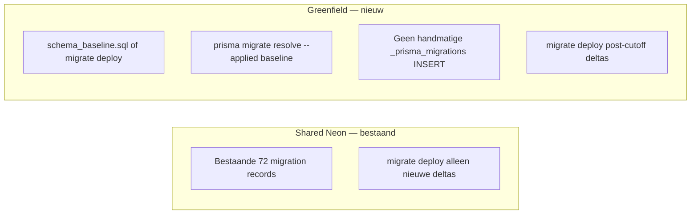

# Phase 9 — Bootstrap Strategy

**Baselineversie:** `20260713_current_state`  
**Voorgestelde Prisma-migratie:** `20260714_greenfield_current_state_baseline`

---

## Probleem

- 70 historische `prisma/migrations/` mappen zijn **niet** uitvoerbaar op lege DB
- Shared Neon heeft **72** `_prisma_migrations` records (incl. 8 DB-only)
- Greenfield moet **zelfde eindschema** bereiken **zonder** 70 stappen

---

## Oplossing: twee paden



---

## Greenfield bootstrap (exacte commando's — **niet uitgevoerd**)

### Vereisten

```bash
export DATABASE_URL="postgresql://user:pass@<disposable-neon-host>/dbname?sslmode=require"
export DIRECT_URL="$DATABASE_URL"   # indien vereist door schema
export GREENFIELD_TEST_ACK=I_UNDERSTAND_DISPOSABLE
```

### Optie A — geïntegreerd testscript (aanbevolen)

```bash
# Dry-run (geen DB writes):
npx tsx scripts/run-disposable-greenfield-test.ts

# Uitvoeren op disposable DB:
npx tsx scripts/run-disposable-greenfield-test.ts --execute

# Met optionele sentinel + opruimen:
npx tsx scripts/run-disposable-greenfield-test.ts --execute --include-sentinel --cleanup
```

### Optie B — handmatige stappen (officieel)

```bash
# 1. Valideer baseline lokaal
npx tsx scripts/validate-current-state-baseline.ts

# 2. Pas DDL toe
npx prisma db execute --file prisma/baseline-staging/20260713_current_state/schema_baseline.sql \
  --url "$GREENFIELD_DATABASE_URL" --schema prisma/schema.prisma

# 3. Registreer baseline (geen SQL — alleen history)
npx prisma migrate resolve --applied 20260714_greenfield_current_state_baseline \
  --schema prisma/schema.prisma

# 4. Post-cutoff
npx prisma migrate deploy
```

Zie Phase 9A: [`homecheff-prisma-phase9a-migration-history-flow.md`](./homecheff-prisma-phase9a-migration-history-flow.md)

---

## `_prisma_migrations` op greenfield

| Wat | Greenfield | Shared Neon |
|-----|------------|-------------|
| 70 historische namen | **Niet** registreren | ✅ Al applied |
| 8 Phase-8 reconstructies | **Niet** registreren | ✅ Al applied |
| `20260714_greenfield_current_state_baseline` | ✅ **Eén** applied row | **Niet** uitvoeren (schema bestaat al) |
| Post-cutoff migraties | `migrate deploy` | `migrate deploy` |

### Waarom geen `resolve --applied` × 70?

- Verbergt broken history zonder bewijs dat SQL ooit liep
- Checksum-manipulatie op schaal → tooling-conflicten
- Phase 8B: eerste failure bij migratie #1

### Checksum baseline-record

- SHA-256 van **promoted** `prisma/migrations/20260714_greenfield_current_state_baseline/migration.sql`
- Na promote: zelfde bestand als `schema_baseline.sql` (of marker + verwijzing)
- Documenteer hex in `manifest.json` bij promote

---

## Voorkomen dubbele deploy

| Anti-pattern | Mitigatie |
|--------------|-----------|
| `migrate deploy` op lege DB | README + CI guard; bootstrap script |
| Baseline SQL + volledige 70 deploy | Greenfield `_prisma_migrations` bevat geen oude namen |
| `db push` op prod | Blijft verboden in Riedel/BCPD voor schema-sync |
| Handmatig valse checksums | Alleen via `register_migration.sql` + gedocumenteerde sha256 |

---

## CI-voorstel (toekomst)

```yaml
# .github/workflows/greenfield-baseline.yml (voorstel)
- run: npx tsx scripts/validate-current-state-baseline.ts
- run: npx tsx scripts/run-disposable-greenfield-test.ts --execute
  env:
    DATABASE_URL: ${{ secrets.DISPOSABLE_NEON_URL }}
    GREENFIELD_TEST_ACK: I_UNDERSTAND_DISPOSABLE
```

---

## Promote naar actieve keten (post-review, nog niet uitgevoerd)

1. Verplaats `prisma/baseline-staging/…` → `prisma/baseline/20260713_current_state/`
2. Maak `prisma/migrations/20260714_greenfield_current_state_baseline/migration.sql` (kopie of marker)
3. Documenteer in `docs/audits/` + developer README
4. **Niet** toepassen op shared Neon

---

## Standaardwaarschuwing voor developers

> **Nieuwe database?** Gebruik **niet** `npx prisma migrate deploy` op een lege database.  
> Volg `prisma/baseline-staging/20260713_current_state/README.md` en het greenfield-testscript.
