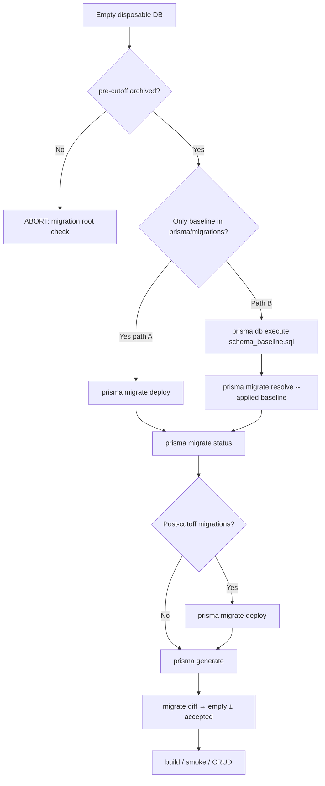

# Phase 9A — Migration History Flow

**Baseline migration:** `20260714_greenfield_current_state_baseline`  
**Cutoff:** 2026-07-13

---

## Officiële Prisma-flow (geen handmatige inserts)

### `migrate resolve --applied`

- Markeert migratie als toegepast in `_prisma_migrations`
- **Voert geen SQL uit**
- Checksum = SHA-256 van lokaal `migration.sql` (Prisma berekent)
- Gebruik **alleen nadat** database-schema overeenkomt met die migratie

### `migrate deploy`

- Voert pending `migration.sql` bestanden uit in mapvolgorde
- Registreert checksum automatisch

---

## Greenfield — werkelijk lege database



### Path A (preferred after promote)

```bash
export GREENFIELD_DATABASE_URL="postgresql://...@<disposable>/..."
export GREENFIELD_TEST_ACK=I_UNDERSTAND_DISPOSABLE

# Prerequisite: prisma/migrations/ contains ONLY:
#   migration_lock.toml
#   20260714_greenfield_current_state_baseline/

npx prisma migrate deploy --schema prisma/schema.prisma
npx prisma migrate status
```

**Verwacht:** deploy draait baseline SQL; status = up to date.

### Path B (DDL via db execute)

```bash
npx prisma db execute \
  --file prisma/baseline-staging/20260713_current_state/schema_baseline.sql \
  --url "$GREENFIELD_DATABASE_URL" \
  --schema prisma/schema.prisma

npx prisma migrate resolve --applied 20260714_greenfield_current_state_baseline \
  --schema prisma/schema.prisma
```

**Volgorde:** DDL **eerst**, resolve **daarna**. Nooit omgekeerd.

---

## Shared Neon — geen baseline DDL

```bash
# Eenmalig na promote (schema bestaat al):
npx prisma migrate resolve --applied 20260714_greenfield_current_state_baseline \
  --schema prisma/schema.prisma

# Daarna normaal:
npx prisma migrate deploy   # alleen nieuwe post-cutoff deltas
```

**Niet:** `db execute` baseline SQL op shared Neon.

---

## Post-cutoff `migrate deploy`

Na baseline registration draaien pending migraties met naam **>** `20260714_greenfield_current_state_baseline`:

```bash
npx prisma migrate deploy
```

Greenfield en shared Neon volgen **dezelfde** post-cutoff bestanden.

---

## Wat gebeurt met historische 72 records op shared Neon?

Na archive van lokale pre-cutoff mappen:

- `_prisma_migrations` op Neon **behoudt** oude namen
- `migrate status` kan melden: *"applied to database but missing from migrations directory"*
- **Geen redeploy** — verwacht en veilig
- Nieuwe migraties na cutoff deployen normaal

---

## Phase 8 reconstructies

- **Niet** in `prisma/migrations/`
- Opgeslagen: `docs/baseline-history/phase8-reconstructed/`
- Shared Neon: records blijven; geen lokale map nodig voor deploy

---

## Verboden

| Actie | Reden |
|-------|-------|
| `INSERT INTO _prisma_migrations` | Bypass Prisma checksum contract |
| Handmatige checksum | Drift met `migration.sql` |
| `resolve` vóór DDL | False applied state |
| `migrate deploy` op lege DB met 61 pre-cutoff mappen | Eerste failure #1 (auto_encryption) |
