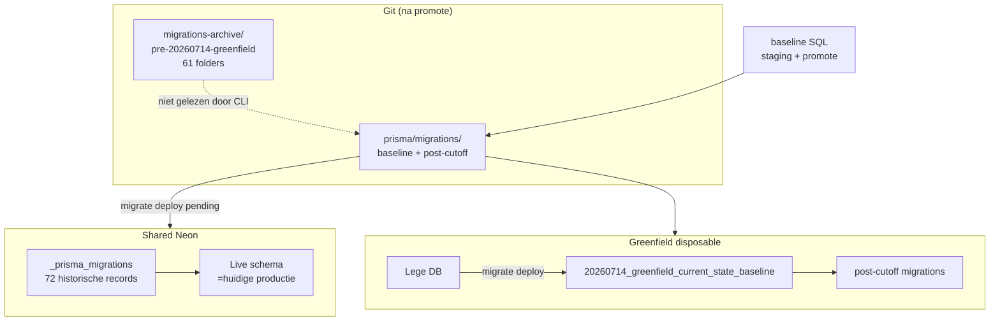

# Phase 9B — Dual Migration Track Architecture

**Branch:** `performance/phase2-baseline`  
**Datum:** 2026-07-13  
**Prisma:** 6.16.2 (`package.json`: `"prisma": "^6.15.0"`)  
**Status:** Read-only analyse — geen databaseacties

---

## DEEL 1 — Officiële Prisma-mogelijkheden (6.16.2)

Onderzoek via geïnstalleerde CLI (`npx prisma --version`), [Prisma 6 docs](https://www.prisma.io/docs/orm/reference/prisma-config-reference) en repo-inspectie.

| Mogelijkheid | Ondersteund | Documentatie | Voordelen | Nadelen | Risico shared Neon | Risico greenfield |
|--------------|-------------|--------------|-----------|---------|-------------------|-------------------|
| **`prisma.config.ts`** | **Ja** (6.12+) | [Prisma Config](https://www.prisma.io/docs/orm/reference/prisma-config-reference) | Centrale `schema`, `migrations.path`, `datasource.url` | Nog niet in repo; team moet leren | Laag als alleen pad wijzigt | Laag voor apart greenfield-pad |
| **Meerdere schemafiles** | **Ja** | Multi-schema / `prismaSchemaFolder` | Scheiding domeinen | **Twee clients**, dubbele generate — niet gewenst | Hoog (twee deploy-lijnen) | Hoog |
| **Meerdere migration directories tegelijk** | **Nee** | Eén `migrations.path` per config | — | Prisma leest **één** root per invoke | — | — |
| **Alternatieve migration root** | **Ja** | `migrations: { path: "..." }` in `prisma.config.ts` of historisch `--migrations-directory` (deprecated → config) | Archive buiten actieve root | Vereist config-switch of env per track | Laag na archive | **Vereist** voor greenfield |
| **CLI `--schema`** | **Ja** | `prisma migrate * --schema prisma/schema.prisma` | Expliciet | Geen pad naar migrations | Geen | Geen |
| **`package.json` workflows** | **Ja** (conventie) | Geen Prisma-specifiek | `db:migrate:*` scripts | Geen enforcement zonder CI | Medium (verkeerd script) | Medium |
| **npm/pnpm workspace** | **Ja** | Monorepo multi-package | Apart prisma-package | Overkill; dubbele client | Hoog | Medium |

**Conclusie DEEL 1:** Prisma ondersteunt **één actieve migration root per aanroep**. Dual-track = **archief + één actieve root** (optie A) of **twee configs met verschillend `migrations.path`** (optie B). Geen officiële “twee roots tegelijk” zonder config-switch.

---

## DEEL 2 — Opties A t/m E

### A — Historische migraties archiveren; baseline wordt nieuwe root

| Aspect | Gedrag |
|--------|--------|
| **Layout** | `prisma/migrations-archive/pre-20260714-greenfield/` (61 folders) + `prisma/migrations/` (baseline + post-cutoff) |
| **`migrate status` (shared)** | “Applied but missing locally” voor gearchiveerde namen — **verwacht**, schema blijft up to date |
| **`migrate deploy` (shared)** | Past alleen **pending** post-cutoff toe; herpast archief niet |
| **`_prisma_migrations`** | **Geen bulk delete**; eenmalig `migrate resolve --applied` voor baseline (schema bestaat al) |
| **Greenfield** | Lege DB → `migrate deploy` → baseline DDL + registratie automatisch |

**Risico's:** Status-ruis; developer verwarring zonder docs. **Geen** schema-drift als geen pending.

### B — Twee Prisma-configuraties (historical / greenfield)

| Aspect | Gedrag |
|--------|--------|
| **Ondersteuning** | Officieel via `prisma.config.shared.ts` + `prisma.config.greenfield.ts` (`migrations.path` verschilt) |
| **Onderhoud** | Twee paden sync houden; elke nieuwe migratie alleen in greenfield-root |
| **CI** | `PRISMA_CONFIG=...` per job |
| **Developer UX** | `--config` of npm-script; foutgevoelig |

**Risico's:** Vergeten juiste config = verkeerde deploy. Fallback, niet primair.

### C — Baseline buiten migration root (bootstrap SQL + resolve)

| Aspect | Gedrag |
|--------|--------|
| **Flow** | `db execute` baseline SQL → `migrate resolve --applied` → post-cutoff `deploy` |
| **Veilig op shared?** | **Nee** voor baseline SQL (schema bestaat); **ja** voor greenfield disposable |
| **Officieel** | `resolve` en `db execute` zijn supported; handmatige INSERT in `_prisma_migrations` **niet** |

Bewijs: Phase 9A verwijderde handmatige INSERT; Prisma docs beschrijven `migrate resolve --applied` als registratiemechanisme.

### D — Nieuw migration package (aparte npm package)

| Aspect | Gedrag |
|--------|--------|
| **Prisma** | Geen first-class “migration package” |
| **CI/deploy** | Custom wiring; `@prisma/client` blijft uit hoofd-schema |
| **Onderhoud** | Hoog — publish/sync tussen packages |

Niet aanbevolen.

### E — Eenmalige history-cutover (`_prisma_migrations` herschrijven)

| Aspect | Gedrag |
|--------|--------|
| **Risico** | **Kritiek** — checksums, applied-but-missing, rollback onmogelijk |
| **Herstelbaarheid** | Laag zonder DB-backup |
| **Shared Neon** | **Verboden** |

---

## DEEL 3 — Aanbevolen architectuur

**Primair: Optie A** (archive + single active root) — voortzetting Phase 9A Optie C.

**Fallback: Optie B** — alleen als archive-promote tijdelijk geblokkeerd is; greenfield via apart `migrations.path` in `prisma.config.greenfield.ts`.

### Diagram

### Eén toekomstige migrationlijn

1. **Alle** nieuwe migraties → `prisma/migrations/YYYYMMDD_description/`.
2. **Shared Neon:** `npm run db:migrate:shared` (expliciet, met `DATABASE_URL`) past pending toe.
3. **Greenfield:** zelfde folders; op lege DB eerst baseline via `migrate deploy`.
4. **Shared na cutover:** eenmalig `migrate resolve --applied 20260714_greenfield_current_state_baseline`; daarna zelfde post-cutoff folders als greenfield.

---

## Configuratie

- `prisma/migration-tracks.config.json` — paden, cutoff, policies
- Validators: `validate-migration-cutoff.ts`, `validate-dual-track-migration-config.ts`

---

## Bevestiging

Geen `migrate deploy`, `resolve`, `db execute`, commits, push, merge of deployment in Phase 9B.
