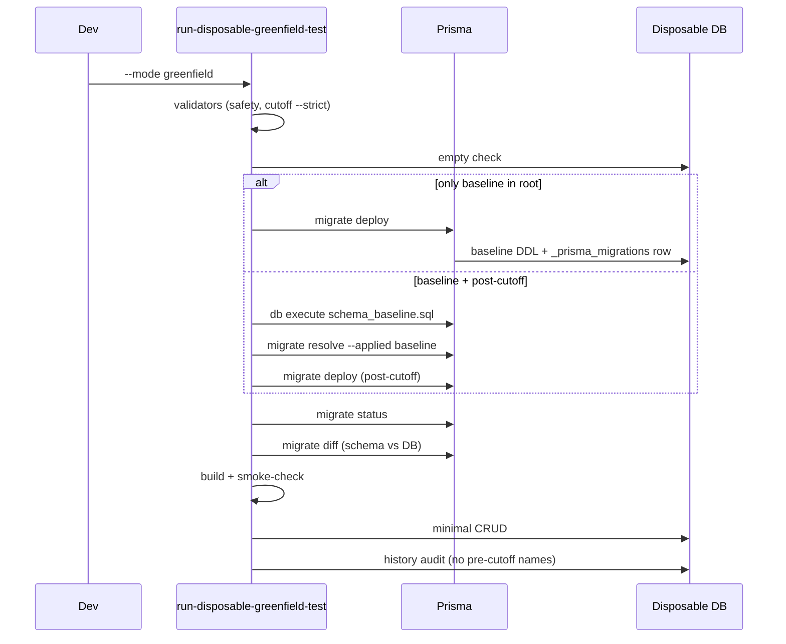

# Phase 9B — Greenfield Bootstrap Flow

**Baseline:** `20260714_greenfield_current_state_baseline`  
**Staging:** `prisma/baseline-staging/20260713_current_state/`  
**Script:** `scripts/run-disposable-greenfield-test.ts`

---

## Preconditions

1. Archive promote voltooid (0 pre-cutoff in `prisma/migrations/`)
2. Baseline folder actief: `prisma/migrations/20260714_greenfield_current_state_baseline/`
3. Disposable Neon database — **leeg** (geen public tables)
4. Env:
   - `GREENFIELD_DATABASE_URL`
   - `GREENFIELD_TEST_ACK=I_UNDERSTAND_DISPOSABLE`
5. URL **niet** `ep-summer-darkness-a2l0745u` / `homecheff.eu`

---

## Flow (12 stappen)

| Stap | Actie | Officieel Prisma |
|------|-------|------------------|
| 1 | Identity / blocked hosts | — |
| 2 | Empty DB assert | `$queryRaw` information_schema |
| 3 | Migration root check | lokaal |
| 4 | Baseline DDL | `migrate deploy` **of** `db execute` |
| 5 | Baseline registratie | automatisch (deploy) **of** `migrate resolve --applied` |
| 6 | `migrate status` | moet “up to date” |
| 7 | Post-cutoff `migrate deploy` | alleen folders > baseline |
| 8 | `prisma generate` | — |
| 9 | Schema diff | `migrate diff` — leeg ± `HcpCarouselSlide.updatedAt` |
| 10 | build + smoke-check | npm |
| 11 | Minimal CRUD | Prisma Client |
| 12 | History audit | geen `migration_name` < baseline |

---

## Modi

| Mode | Commando | Muterend |
|------|----------|----------|
| **dry-run** (default) | `npm run db:greenfield:bootstrap` | ❌ |
| **greenfield** | `npm run db:greenfield:test` + env | ✅ disposable only |

---

## Migration root rapportage

Dry-run en execute schrijven naar `docs/audits/greenfield-test-plan-*.json`:

- `migration_root`
- `active_migration_folders`
- `archive_dir`

---

## Post-promote migratie-herschikking

| Huidige folder | Na promote |
|----------------|------------|
| 61 pre-cutoff | → `migrations-archive/` |
| `20260713_dish_status_*` | In baseline SQL opgenomen → archive |
| `add_dish_reviews` | Hernoem naar `20260715_add_dish_reviews` (post-cutoff) of opnemen in baseline |
| `20260714_greenfield_*` | Actieve root |

---

## Niet uitgevoerd in Phase 9B

`--mode greenfield` met echte DB — alleen dry-run.
