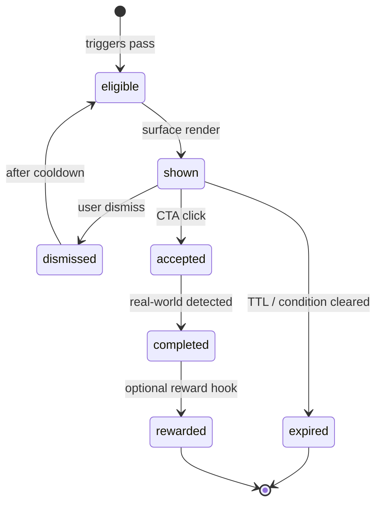

# Discovery Activation — Phase 3C

**Status:** Architecture complete (no implementation)  
**Last updated:** 2026-07-06  
**Depends on:** Activity Cards 3B (`de031b3`)

---

## Goal

Turn Activity Cards into a **complete Activation System** oriented toward **Digital → Real World** — community, local economy, and human interaction — not more scrolling or screen time.

---

## Deliverables (documentation only)

| Document | Content |
|----------|---------|
| [ACTIVATION_SYSTEM_VISION.md](../architecture/ACTIVATION_SYSTEM_VISION.md) | North star, principles, layers, boundaries |
| [ACTIVATION_TAXONOMY.md](../architecture/ACTIVATION_TAXONOMY.md) | 10 categories + 3B mapping |
| [ACTIVATION_LIBRARY_100.md](../audits/ACTIVATION_LIBRARY_100.md) | 100 activation concepts |
| [VIRAL_ACTIVATION_CONCEPTS.md](../audits/VIRAL_ACTIVATION_CONCEPTS.md) | Talkable, safe viral tier |
| [REAL_WORLD_ACTIVATION_ENGINE.md](../audits/REAL_WORLD_ACTIVATION_ENGINE.md) | Triggers, pipeline, boosts |
| This file | Phase summary |

---

## Requirements coverage

| # | Requirement | Status |
|---|-------------|--------|
| 1 | Activation taxonomy (10 categories) | ✅ ACTIVATION_TAXONOMY.md |
| 2 | 100 activation concepts | ✅ ACTIVATION_LIBRARY_100.md |
| 3 | Viral concepts (legal, safe, voluntary) | ✅ VIRAL_ACTIVATION_CONCEPTS.md |
| 4 | Real-world engine triggers | ✅ REAL_WORLD_ACTIVATION_ENGINE.md |
| 5 | Partner activations | ✅ P01–P10 + B01–B10 in library |
| 6 | Activation lifecycle | ✅ Below |
| 7 | Activation rewards architecture | ✅ Below |
| 8 | Output docs | ✅ All six files |

---

## Activation lifecycle (architecture)

| State | Meaning | Analytics event (3B+) |
|-------|---------|------------------------|
| `eligible` | Engine selected, not yet rendered | — |
| `shown` | Card visible | `ACTIVITY_CARD_SHOWN` |
| `dismissed` | User closed | `ACTIVITY_CARD_DISMISSED` |
| `accepted` | CTA clicked / flow opened | `ACTIVITY_CARD_CLICKED` |
| `completed` | Outcome verified or self-reported | `ACTIVITY_CARD_COMPLETED` |
| `expired` | Trigger false or TTL passed | `ACTIVATION_EXPIRED` (3D) |
| `rewarded` | Optional recognition issued | `ACTIVATION_REWARDED` (3D) |

**Storage (3D proposal):** extend `UserActivityCardState` or `ActivationInstance` table — cross-device dismiss, completion sync.

---

## Activation rewards (architecture evaluation)

Rewards acknowledge **real-world completion** — never gate activation eligibility.

| Reward type | Fit | Notes |
|-------------|-----|-------|
| **Trust badges** | ✅ Strong | “First local sale”, “Helpful neighbour” — profile display, not feed rank |
| **Recognition copy** | ✅ Strong | Thank-you message, community highlight (opt-in) |
| **Social rewards** | ✅ Medium | Fan milestone offline; no public shaming |
| **Community rewards** | ✅ Strong | Featured in local digest (editorial, not algorithmic) |
| **Badges (gamification)** | ⚠️ Careful | Cosmetic only; no pay-to-win |
| **HCP** | ⚠️ Restricted | **Never** as prompt trigger; optional small grant **after** verified completion if product approves |
| **Discounts / money** | ❌ Avoid | Blurs marketplace / promotional lines |

### Recommended reward policy

1. **Default:** recognition + trust badge + lifecycle completion only.
2. **HCP:** post-completion optional, capped, audited — separate from discovery ranking.
3. **No reward** for dismiss or click without completion.
4. Partner activations: institutional recognition (certificate, listing badge), not cash lottery.

---

## Partner activation summary

| Activation | Library ID | Category |
|------------|------------|----------|
| Become Partner | P04 | PARTNER |
| Become Courier | P01 | PARTNER |
| Become Workshop Host | P02 | PARTNER |
| Become Ambassador | P03 | PARTNER |
| Invite Local Business | P05, B01–B02 | PARTNER / BUSINESS |
| Invite Municipality | P06, B05 | PARTNER / BUSINESS |
| Invite School | P07, B04 | PARTNER / BUSINESS |
| Invite Sports Club | P08, B03 | PARTNER / BUSINESS |

---

## Explicitly out of scope (3C)

- Implementation (code, API, schema)
- Recommendations engine
- Sponsored placements
- Ranking / trust engine changes
- Feed listing reorder based on activations

---

## Suggested next phase (3D — implementation, not started)

1. `ActivationInstance` lifecycle store
2. Expand engine from 11 → staged library rollout (20, 50, 100)
3. Sidebar `ActivityCardSidebarStack`
4. Post-order / post-workshop lifecycle surfaces
5. Reward evaluator (trust badges first)
6. `scripts/validate-activation-library.ts`

---

## References

- 3B implementation: [DISCOVERY_ACTIVITY_CARDS_PHASE3B.md](./DISCOVERY_ACTIVITY_CARDS_PHASE3B.md)
- Feed slot: [ACTIVITY_CARD_INSERTION.md](../audits/ACTIVITY_CARD_INSERTION.md)
